# **KS4007 KS4008 Keyestudio Complete Starter for BBC Micro:bit**

****

## 1. Description：

Micro:bit, half the size of a credit card, is a micro controller with ARM structure designed by BBC. It is mainly applied to programming education of teenagers, coming with an on-board Bluetooth, an accelerator, 3 buttons, an electronic compass and a 5 x 5 LED dot matrix.

To make starters grasp how to program by micro:bit boards, we launch this kit for them. Moreover, this kit consists of the commonly used resistors, LEDs, digital tubes, sensors and modules. A numerous of experimental courses are provided to guide you as well. We believe that you will enjoy playing with this micro:bit kit.

## 2. Kit List：

When we get the keyestudio Micro:bit premium learning kit, please check whether the listed components are all included.

(Note:kit KS4007 isn’t inclusive of a micro:bit board while kit KS4008 contains one)

|  #   |                       Name                       |              QTY               |                           Picture                            |
| :--: | :----------------------------------------------: | :----------------------------: | :----------------------------------------------------------: |
|  0   |            Micro:bit Main Board V2.0             | 0 for KS4007 1 for KS4008 |              |
|  1   |             Micro:bit T Type Shield              |               1                |                                      |
|  2   |                     Red LED                      |               10               |              |
|  3   |                    Yellow LED                    |               10               |              |
|  4   |                    Green LED                     |               10               |              |
|  5   |                       RGB                        |               1                |                                      |
|  6   |             Adjustable Potentiometer             |               1                |                                      |
|  7   |                  Photoresistor                   |               3                |    |
|  8   | Flame Sensor （Infrared receiving triode）  |               1                |                                      |
|  9   |            LM35DZ Temperature Sensor             |               1                |                                      |
|  10  |                   S8050 Triode                   |               1                |                                      |
|  11  |                   Tilt Switch                    |               2                |              |
|  12  |                  220Ω Resistor                   |               10               |                                      |
|  13  |                   1KΩ Resistor                   |               10               |                                      |
|  14  |                  10 KΩ Resistor                  |               10               |                                      |
|  15  |                  2.4KΩ Resistor                  |               8                |                                      |
|  16  |                   51Ω Resistor                   |               5                |                                      |
|  17  |                  Active Buzzer                   |               1                |                                      |
|  18  |                  Passive Buzzer                  |               1                |                                      |
|  19  |                  Button Module                   |               4                |  |
|  20  |               1-Digit Tube Module                |               1                |                                      |
|  21  |               4-Digit Tube Module                |               1                |                                      |
|  22  |                  8*8 Dot matrix                  |               1                |                                      |
|  23  |                  74HC595N Chip                   |               1                |                                      |
|  24  |                   IR Receiver                    |               1                |                                      |
|  25  |                IR Remote Control                 |               1                |                                      |
|  26  |             L293D Motor Driver Chip              |               1                |                                      |
|  27  |        ULN2003 Stepper Motor Drive Module        |               1                |                                      |
|  28  |                Water Level Sensor                |               1                |                                      |
|  29  |               Soil Humidity Sensor               |               1                |                                      |
|  30  |                 MQ-2 Gas Sensor                  |               1                |                                      |
|  31  |               5-wire Stepper Motor               |               1                |                                      |
|  32  |               DS1302 Clock Module                |               1                |                                      |
|  33  |   DHT11 Temperature  and Humidity Sensor    |               1                |                                      |
|  34  |                PIR Motion Sensor                 |               1                |                                      |
|  35  |               OLED Display Module                |               1                |                                      |
|  36  |            HC-SR04 Ultrasonic Sensor             |               1                |                                      |
|  37  |                 Joystick Module                  |               1                |                                      |
|  38  |                   Micro Servo                    |               1                |                                      |
|  39  |              1-channel Relay Module              |               1                |                                      |
|  40  |                   Sound Sensor                   |               1                |                                      |
|  41  |     Specialized Power Module for Breadboard      |               1                |                                      |
|  42  |    DC Motor （with 2 breadboard lines）     |               1                |                                      |
|  43  |               6 AA Battery holder                |               1                |                                      |
|  44  |                    Breadboard                    |               1                |                                      |
|  45  |                 Breadboard Wire                  |               30               |                                      |
|  46  |              40pins M-F DuPont Line              |               1                |                                      |
|  47  | DC 5V Water Pump  (with 2 breadboard wires) |               1                |                                      |
|  48  |               Resistor Color Chart               |               1                |                                      |
|  49  |                       Fan                        |               1                |                                      |
|  50  |                Plastic Water Pipe                |               1                |                                      |
|  51  |               2 AA Battery Holder                |               1                |                                      |
|  52  |       1.5V AA Battery (not included)        |               8                |                                      |
|  53  |                    USB cable                     |               1                |                                       |

## 3.Introduction

**( 1 )What is Micro:bit?**

Designed by BBC, Micro:bit main board aims to help children aged above 10 years old to have a better learning of programming.

It is equipped with loads of components,including a 5\*5 LED dot matrix, 2 programmable buttons, an electronic compass, a Micro USB interface and a Bluetooth module and others. Though it is just the size of a credit card, it boasts multiple functions. To name just a few, it can be applied in programming video games, making interactions between light and sound, controlling a robot,
conducting scientific experiments, developing wearable devices and make some cool inventions like robots and musical instruments, basically everything imaginable.

This new version, that’s version 2.0, of Micro:bit main board has a touch-sensitive logo and a MEMS microphone. And there is a buzzer built in the other side of the board which makes playing all kinds of sound possible without any external equipment. The golden fingers and gears added provide a better fixing of crocodile clips. Moreover, this board has a sleeping mode to lower the
power consumption of battery and it can be entered if users long press the Reset & Power button on the back of it. More importantly, the CPU capacity of this version is much better than that of the V1.5 and the V2 has more RMA.

In final analysis, the V2 Micro:bit main board can allow customers to explore more functions so as to make more innovative products.

**( 2 ) Comparison between V2.0 & V1.5**

**Micro:bit main board V2.0**

**Micro:bit main board V1.5**

**More details:**

For the Micro: Bit main board V2, pressing the Reset & Power button , it will reset the Micro: Bit and rerun the program.If you hold it tight, the red LED will slowly get darker.When the power indicator flickers to darkness, releasing the button and your Micro: Bit board will enter sleep mode for power saving. This will make your battery more durable. And you could press this button again to ‘wake up’ your Micro:bit.

For more information,please resort to following links：

<https://tech.microbit.org/hardware/>

https://microbit.org/new-microbit/

https://www.microbit.org/get-started/user-guide/overview/

<https://microbit.org/get-started/user-guide/features-in-depth/>

**( 3 ) Pinout**

Micro:bit main board V2.0 VS V1.5

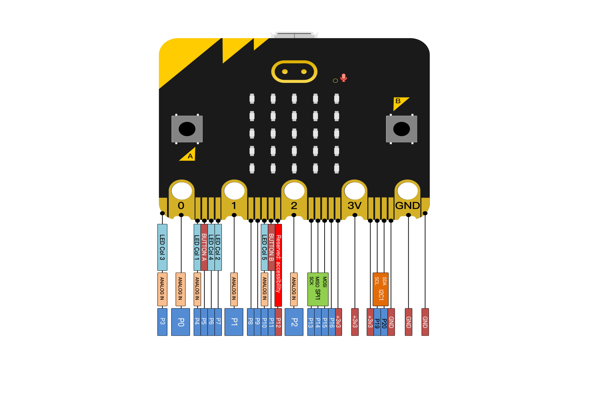

Browse the official website for more details:

<https://tech.microbit.org/hardware/edgeconnector/>

<https://microbit.org/guide/hardware/pins/>

**( 4 )Notes for the application of Micro:bit main board V2.0**

1.  it is recommended to cover it with a silicone protector to prevent short circuit for it has a lot of sophisticated electronic components.
2.  its IO port is very weak in driving since it can merely handle current less than 300mA. Therefore, do not connect it with devices operating in large current,such as servo MG995 and DC motor or it will get burnt. Furthermore, you must figure out the current requirements of the devices before you use them and it is generally recommended to use the board together with a Micro:bit shield.
3.  It is recommended to power the main board via the USB interface or via the battery of 3V. The IO port of this board is 3V, so it does not support sensors of 5V. If you need to connect sensors of 5 V, a Micro: Bit expansion board is required.
3.  When using pins(P3、P4、P6、P7、P10)shared with the LED dot matrix, blocking them from the matrix or the LEDs may display randomly and the data about sensors maybe wrong.
3.  The battery port of 3V cannot be connected with battery more than 3.3V or the main board will be damaged.
3.  Forbid to use it on metal products to avoid short circuit.

To put it simple, Micro:bit V2 main board is like a micro computer which has made programming at our fingertips and enhanced digital innovation. And about programming environment, BBC provides a website: <https://microbit.org/code/,> which has a graphical MakeCode program easy for use.

## 4.Install Micro:bit driver

If you have downloaded micro:bit driver, then no need to download it again. If it is you first time to use micro:bit main board, then you will have to download the driver.

First of all, connect the micro:bit to your computer using a USB cable.

And enter website <https://www.dropbox.com/sh/w5mv8mvvufti0uj/AADTFPTV8NBN0IxQj_3TZ8ETa?dl=0> todownload the driver file of micro:bit.

## 5.Instructions

The following instructions are applied for Windows system but can also serve as a reference if you are using a different system.

5.1 Write code and program

This chapter describes how to write program with the App Micro: Bit and load the program to the Micro: Bit main board V2.

You are recommended to browse the official website of Micro:bit for more details, and the link is attached below:

[https://microbit.org/guide/quick/](Https://microbit.org/guide/quick/)

**Step 1: connect the Micro: Bit main board V2 with your computer**

Firstly, link the Micro: Bit main board V2 with your computer via the USB cable.Macs, PCs, Chromebooks and Linux （including Raspberry Pi）systems are all compatible with the Micro: Bit main board V2.

Note that if you are about to pair the board with your phone or tablet, please refer to this link: <https://microbit.org/get-started/user-guide/mobile/>

Secondly, if the red LED on the back of the board is on, that means the board is powered. Then Micro: Bit main board V2 will appear on your computer as a driver named 'MICROBIT'. Please note that it is not an ordinary USB disk as shown below.

**Step 2: write programs**

View the link https://makecode.microbit.org/ in your browser;

Click ‘New Project’;

The dialog box‘Create a Project’ appears, fill it with ‘heartbeat’ and click‘Create √’to edit.

(If you are running Windows 10 system, it is also viable to edit on the APP MakeCode for micro:bit , which is exactly like editing in the website. And the link to the APP is :https://www.microsoft.com/zh-cn/p/makecode-for-micro-bit/9pjc7sv48lcx?ocid=badgep&rtc=1&activetab=pivot:overviewtab)

Write a set of micro:bit code. You can drag some modules in the Blocks to the editing area and then run your program in Simulator of MakeCode editor as shown in the picture below which demonstrates how to edit ‘heartbeat’ program .

**Step 3: download test code**

If your computer is Windows 10 and you have downloaded the APP MakeCode for micro:bit to write program, what you will have to do to download the program to your Micro: Bit main board V2 is merely clicking the ‘Download’ button, then all
is done.

If you are writing programs through the website, following these steps:

Click the ‘Download’ in the editor to download a "hex" file, which is a compact program format that the Micro: Bit main board can read.Once the hexadecimal file is downloaded, copy it to your board V2 just like the process that you copy the file to the USB driver. If you are running Windows system, you can also right-click and select ‘Send to → MICROBIT (E:) ‘to copy the hex file to the
Micro: Bit main board V2.

You can also directly drag the "hex" file onto the MICROBIT (E:) disk.

During the process of copying the downloaded hex file to the Micro: Bit main board V2, the yellow signal light on the back side of the board flashes. When the copy is completed, the yellow signal light will stop flashing and remain on.

**Step 4: run the program**

After the program is uploaded to the Micro: Bit main board V2, you could still power it via the USB cable or change to via an external power. The 5 x 5 LED dot matrix on the board displays the heartbeat pattern.

Power via micro USB cable

Power via external power（3V）

**Step 5：know about other programming languages**

This chapter has described how to use the Micro: Bit main board V2.

But except for the Makecode graphical programming introduced you can also write Micro: Bit programs in other languages. Go to the link: <https://microbit.org/code/> to know about other programming languages , or view the link: <https://microbit.org/projects/>, to find something you want to have a go.

5.2 Makecode：

Browse <https://makecode.microbit.org/> and enter Makecode online editor or open the APP MakeCode for micro:bit of Windows 10.

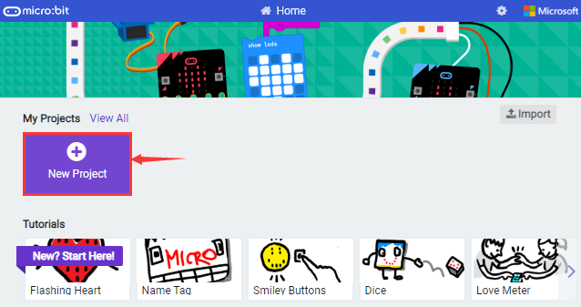

Click“New Project”, and input“heartbeat”，then enter Makecode editor, as shown below:

There are blocks“on start”and“forever”in the code editing area.

When the power is plugged or reset,“on start”means that the code in the block only executes once, while“forever”implies that the code runs cyclically.

5.3.Quick Download

As mentioned before, if your computer is Windows 10 and you have downloaded the APP MakeCode for micro:bit to write programs, the program written can be quickly downloaded to the Micro: Bit main board V2 by selecting ‘Download’.

While it is a little more trickier if you are using a browser to enter makecode.However, if you use Google Chrome, suitable for Linux，macOS and Windows 10, the process can be quicker too.

We use the webUSB function of Chrome to allow the internet page to access the hardware device connected USB.

You could refer to the following steps to connect and pair devices.

**Device pairing**

Connect micro:bit to your computer by USB cable. Click“...”beside“Download”and click“Pair device”.

Then click another“Pair device”as shown below.

Then select ‘’BBC micro:bit CMSIS-DPA” and click “Connect”. If ‘’BBC micro:bit
CMSIS-DPA”does not show up for selection, please refer to:[https://makecode.microbit.org/device/usb/webusb/troubleshoot](https://makecode.microbit.org/device/usb/webusb/troubleshoot%20)

We also provide in the resource link <https://fs.keyestudio.com/KS4007-4008>

What’s more, if you don’t know how to update the firmware of micro:bit, refer to the link: [https://microbit.org/guide/firmware/](https://microbit.org/guide/firmware/%20) or browse folderwe provide.

Then click”Download”. The program is directly downloaded to Micro: Bit main board V2 and the sentence “Download completed!” appears.

5.4 Resources and test code

Tools ,test code and other resources can be downloaded via the link <https://fs.keyestudio.com/KS4007-4008> and it contains following files:

5.5 Input test code

We provide hexadecimal code files (project files) for each project.The file contains all the contents of the project and can be imported directly, or you can manually drag the code blocks to complete the program for each project. 

For simple projects, dragging a block of code to complete the program is recommended. For complex projects, it is recommended to conduct the program by importing the hexadecimal code file we provide.

Let's take the "Heatbeat" project as an example to show how to load the code.

Open the Web version of Makecode or the Windows 10 App version of Makecode.

Click “Import File”;

Select“ ../Makecode Code/Project 1\_ Heart beat/Project 1\_ Heart beat.hex” . Then click “Go ahead”.

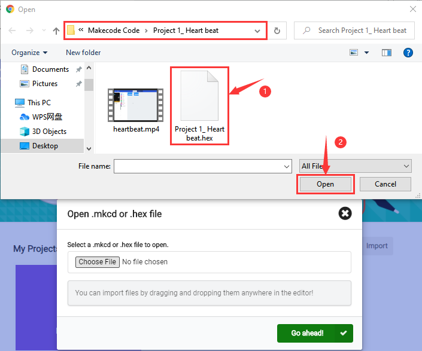

In addition to importing the test code file provided into the Makecode compiler above, you can also drag the the test code file provided into the code editing area of the Makecode compiler, as shown in the figure below:

After a few seconds, it is done.

Note: if your computer system is Windows7 or 8 instead of Windows 10, the pairing cannot be done via Google Chrome. Therefore, digital signal or analog signal of sensors and modules cannot be shown on the serial port simulator.

However, you need to read the corresponding digital signal or analog signal. So what can we do? You can use the CoolTerm software to read the serial port data of the micro:bit. Next chapter is about how to install CoolTerm.

5.6 CoolTerm Installation

CoolTerm program is used to read the data on serial port.

Download CoolTerm program:

<https://freeware.the-meiers.org/>

1.  After the download, we need to install CoolTerm program file, below is Window system taken as an example.
    
2.  Choose“win”to download the zip file of CoolTerm

3.  Unzip file and open it. (also suitable for Mac and Linux system)

（2）Double-click .

The functions of each button on the Toolbar are listed below:

<http://wiki.keyestudio.com/index.php/File:IDE.png>

|                      ICON                       | FUNCTION                                        |
| :---------------------------------------------: | ----------------------------------------------- |
|  | Open up a new Terminal                          |
|  | Open a saved Connection                         |
|  | Save the current Connection to disk             |
|  | Open the Serial Connection                      |
|  | Close the Serial Connection                     |
|  | Clear the Received Data                         |
|  | Open the Connection Options Dialog              |
|  | Display the Terminal Data in Hexadecimal Format |
|  | Display the Help Window                         |

## 6. Projects

(Note: project 1 to 12 will be conducted with the built-in sensors and LED dot matrix of the Micro:bit main board V2)

### Project 1: Heartbeat

**( 1 )Project Description**

This project is easy to conduct with a micro:bit V2 main board, a Micro USB cable and a computer. The micro:bit LED dot matrix will display a relatively big heart-shaped pattern and then a smaller one. This alternative change of this pattern is like heart beating. This experiment serves as a starter for your entry to the programming world.

**( 2 )Components Needed:**

-   Micro:bit main board V2 \*1

-   Micro USB cable\*1

**( 3)Test Code:**

Attach the Micro:bit main board V2 to your computer via the Micro USB cable and begin editing.

Firstly, click”basic”module and find and drag the block “show icon “ to module “forever”;

Secondly, click”basic”module again and find and drag the block “show icon  “ to module “forever”and click the little triangle to select “show icon ”;

Secondly, click”basic”module and find and drag the block””to the code block and click the littler triangle to select 500;

Complete Program:

Note: The “on start”means that the code in the block only executes once, while“forever”implies that the code runs cyclically.

Click“JS JavaScript”, you will find the corresponding programming languages.

Click the little triangle”of JS JavaScript”to choose “Python”, you will find the corresponding Python programming languages.

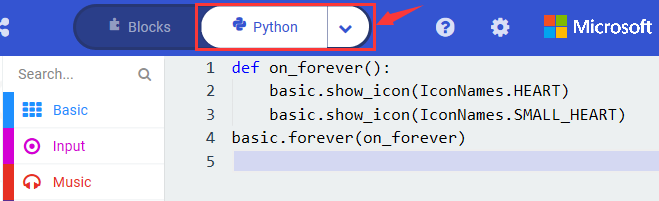

**( 4 )Test Results:**

After uploading test code to micro:bit main board V2 and keeping the connection with the computer to power the main board, the LED dot matrix shows pattern “”and then“”alternatively.

( Please refer to chapter 5.3 to know how to download test code quickly.)

If the downloading is not smooth, please remove the micro USB from the main board and then reconnect them and reopen Makecode to try again.

### Project 2: Light A Single LED

**( 1 )Project Description:**

In this project, we intend to control a certain LED of the micro:bit main board V2 to shine.

The LED dot matrix consists of 25 LEDs arranged in a 5 by 5 square. In order to locate these LEDs quickly, as the figure shown below, we can regarded this matrix as a coordinate system and create two aces by marking those in rows from 0 to 4 from top to bottom, and the ones in columns from 0 to 4 from the left to the right. Therefore, the LED sat in the second of the first line is (1,0）and the LED positioned in the fifth of the fourth column is (3,4）and others likewise.

**( 2 )Components Needed:**

-   Micro:bit main board V2 \*1

-   Micro USB cable\*1

**( 3 )Test Code:**

Attach the Micro:bit main board V2 to your computer via the Micro USB cable and begin editing.

Firstly, click”Led”module and then the”more”module to find and drag the block “led enable false “ to block“on start”; click the little triangle of “led enable false “ to select”true”;

Secondly, click”Led”module and to find and drag the block “toggle x 0 y 0“ to block“forever”and alter “x0” to”x1”;

Thirdly, click”Basic”module to find and drag the block”pause(ms)100”to “forever” block and set pause to 500;

Fourthly, copy the block 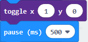 and place it into forever” block;

Fifthly, click”Led”module to find and drag the block”plot x 0 y 0”to “forever” block and change the “x 0 y 0” to “x 3 y 4”;

Sixthly, copy the block“pause(ms)500”and place it into forever”block;

Lastly, click”Led”module to find and drag the block”unplot x 0 y 0”to “forever” block and change “x 0 y 0” to “x 3 y 4”;and copy and place the block“pause(ms)500”to block “forever”;

Complete Program:

Click”JS JavaScript”, you will find the corresponding programming languages.

Click the little triangle”of JS JavaScript”to choose “Python”, you will find the corresponding Python programming languages.

**( 4)Test Results**

After uploading test code to micro:bit main board V2 and powering the main board via the USB cable, the LED in (1,0) lights up for 0.5s and the one in (3,4) shines for 0.5s and repeat this sequence.

### Project 3: LED Dot Matrix

**( 1 )Project Description:**

Dot matrices are very commonplace in daily life. They have found wild applications in LED advertisement screens, elevator floor display, bus stop announcement and so on.

The LED dot matrix of Micro: Bit main board V2 contains 25 LEDs in a grid. Previously, we have succeeded in controlling a certain LED to light by integrating its position value into the test code. Supported by the same theory, we can turn on many LEDs at the same time to showcase patterns, digits and characters.

What’s more, we can also click”show icon“ to choose the pattern we like to display. Last but not the least, we can our design patterns by ourselves.

**( 2 )Components Needed:**

-   Micro:bit main board V2 \*1

-   Micro USB cable\*1

**( 3 )Test Code 1：**

Link computer with micro:bit board by micro USB cable, and program in MakeCode editor.

1.  A. Enter“Led”→“more”→“led enable false”

2.  Click the drop-down triangle button to select“true”
    

3.  Combine it with “on start” block

\*\*\*\*\*\*\*\*\*\*\*\*\*\*\*\*\*\*\*\*\*\*\*\*\*\*\*\*\*\*\*\*\*\*\*\*\*\*\*\*\*\*\*\*\*\*\*\*\*\*\*\*\*\*\*\*\*\*\*\*\*\*\*\*\*

Click“Led”to move“plot x 0 y 0”into“forever”，then replicate“plot x 0 y 0”for 8 times, respectively set to“x 2”y 0”,“x 2”y 1”,“x 2”y 2”,“x 2”y 3”,“x 2”y 4”,“x 1”y 3”“x 0”y 2”,“x 3”y 3”,“x 4”y 2”.

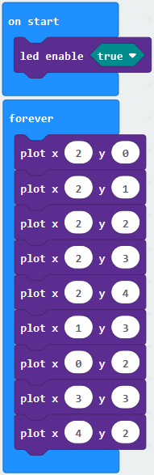

Complete Program：

|  | “on start”: command block only runs once to start program.  Turn on LED dot matrix.   The program under the block “forever” runs cyclically.  Toggle the LED brightness at coordinate point  “x 2，y 0”, “x 2，y 1”, “x 2，y 2”, “x 2，y 3”,  “x 2，y 4”, “x 1，y 3”, “x 0，y 2”, “x 3，y 3” and“x 4，y 2” |
| ----------------------------------------------- | ------------------------------------------------------------ |
|                                                 |                                                 |

Select“JavaScript" and“Python”to switch into JavaScript and Python language code:

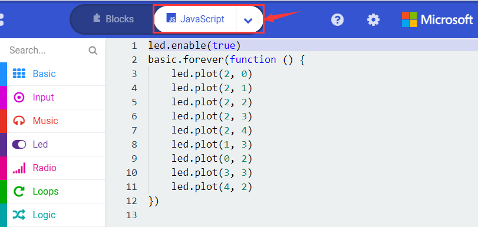

**( 4 )Test Results 1：**

Upload code 1 and power on , we will see the  icon.

**( 5 ) Test Code 2：**

Link computer with micro:bit board by micro USB cable, and program in MakeCode editor.

1.  A. Enter“Basic”→“show number 0”block,

2.  Duplicate it for 4 times, then separately set to“show number 1”,“show number 2”,“show number 3”,“show number 4”,“show number 5”.

\*\*\*\*\*\*\*\*\*\*\*\*\*\*\*\*\*\*\*\*\*\*\*\*\*\*\*\*\*\*\*\*\*\*\*\*\*\*\*\*\*\*\*\*\*\*\*\*\*\*\*\*\*\*\*\*\*\*\*\*\*\*\*\*\*

1.  Click“Basic”→“show leds”, then put it into“forever”block，tick blue boxes to light LED and generate“↓”pattern.

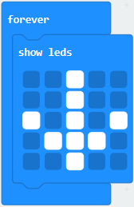

\*\*\*\*\*\*\*\*\*\*\*\*\*\*\*\*\*\*\*\*\*\*\*\*\*\*\*\*\*\*\*\*\*\*\*\*\*\*\*\*\*\*\*\*\*\*\*\*\*\*\*\*\*\*\*\*\*\*\*\*\*\*\*\*\*

2.  Move out the block“show string” from“Basic”block, and leave it beneath the“show leds” block

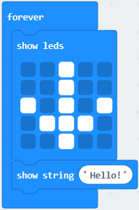

Choose“show icon”from“Basic”block, and leave it beneath the block“show string“Hello!”block

\*\*\*\*\*\*\*\*\*\*\*\*\*\*\*\*\*\*\*\*\*\*\*\*\*\*\*\*\*\*\*\*\*\*\*\*\*\*\*\*\*\*\*\*\*\*\*\*\*\*\*\*\*\*\*\*\*\*\*\*\*\*\*\*\*

A. Enter“Basic”→“show arrow North”;

B. Leave it into“forever”block，replicate“show arrow North”for 3 times，respectively set to“North East”,“South East”, “South West”,“North West”.

Click“Basic”to get block“clear screen”then remain it below the block “show arrow North West”。

\*\*\*\*\*\*\*\*\*\*\*\*\*\*\*\*\*\*\*\*\*\*\*\*\*\*\*\*\*\*\*\*\*\*\*\*\*\*\*\*\*\*\*\*\*\*\*\*\*\*\*\*\*\*\*\*\*\*\*\*\*\*\*\*\*

Drag“pause (ms) 100”block from“Basic”block and set to 500ms, then leave it below“clear screen”block.

Complete Program:

|  | “on start”: command block only runs once to start program.  LED dot matrix displays 1,2,3,4,5    Under the block “forever”，program runs cyclically.  Dot matrix shows the“↓” pattern  Dot matrix scrolls to show “Hello!”  “❤”is shown on dot matrix  LED dot matrix displays“North East”arrow.  The“South East”arrow shows up on LED dot matrix  The“South West”arrow appears up on LED dot matrix  The“North West”arrow is displayed on LED dot matrix  Clear the screen  Delay in 500ms |
| ----------------------------------------------- | ------------------------------------------------------------ |
|                                                 |                                                 |

Select“JavaScript" and“Python”to switch into JavaScript and Python language code:

**( 6 )Test Results 2：**

Upload code 2 and plug micro:bit to power. Micro: bit starts showing number 1, 2, 3, 4, and 5, then cyclically display,“Hello!”,,,, and patterns.

### Project 4: Programmable Buttons

**( 1 )Project Description:**

Buttons can be used to control circuits. In an integrated circuit with a button, the circuit is connected when pressing the button and it is open the other way around.

Micro: Bit main board V2 boasts three buttons, two are programmable buttons(marked with A and B), and the one on the other side is a reset button. By pressing the two programmable buttons can input three different signals. We can press button A or B alone or press them together and the LED dot matrix shows A,B and AB respectively. Let’s get started.

**( 2 )Components Needed:**

-   Micro:bit main board V2 \*1

-   Micro USB cable\*1

**( 3 )Test Code 1：**

Link computer with micro:bit board by micro USB cable, and program in MakeCode editor.

Delete“on start”and“forever”firstly，then click“Input”→“on button A pressed”

\*\*\*\*\*\*\*\*\*\*\*\*\*\*\*\*\*\*\*\*\*\*\*\*\*\*\*\*\*\*\*\*\*\*\*\*\*\*\*\*\*\*\*\*\*\*\*\*\*\*\*\*\*\*\*\*\*\*\*\*\*\*\*\*\*

A. Click“Basic”→“show string”;

B. Then place it into“on button A pressed”block, change “Hello!”into“A”.

Copy code stringonce, tap the drop-down button“A”to select“B”and modify character“A”into“B”.

\*\*\*\*\*\*\*\*\*\*\*\*\*\*\*\*\*\*\*\*\*\*\*\*\*\*\*\*\*\*\*\*\*\*\*\*\*\*\*\*\*\*\*\*\*\*\*\*\*\*\*\*\*\*\*\*\*\*\*\*\*\*\*\*\*

Copyonce，and set to“on button A+B pressed”and“show string “AB”

Complete Code:

|  | Press button A on Micro: bit main board  Show the character “A”   Press button B on Micro: bit main board  Show the character “B”   Press button A and B at same time   Display the character “AB” |
| ----------------------------------------------- | ------------------------------------------------------------ |
|                                                 |                                                 |

Select“JavaScript" and“Python”to switch into JavaScript and Python language code:

**( 4 )Test Results 1：**

After uploading test code 1 to micro:bit main board V2 and powering the main board via the USB cable, the 5\*5 LED dot matrix shows A if button A is pressed, B if button B pressed, and AB if button A and B pressed together.

**( 5 ) Test Code 2：**

A. Click“Led”→“more”→“led enable false”,

B. Put it into the block“on start”，click drop-down triangle button to select“true” .

\*\*\*\*\*\*\*\*\*\*\*\*\*\*\*\*\*\*\*\*\*\*\*\*\*\*\*\*\*\*\*\*\*\*\*\*\*\*\*\*\*\*\*\*\*\*\*\*\*\*\*\*\*\*\*\*\*\*\*\*\*\*\*\*\*

A. Tap“Variables”→“Make a Variable...”→“New variable name：”

B. Enter“item”in the dialog box and click“OK”，then variable“item”is produced. And move“set item to 0”into“on start”block

\*\*\*\*\*\*\*\*\*\*\*\*\*\*\*\*\*\*\*\*\*\*\*\*\*\*\*\*\*\*\*\*\*\*\*\*\*\*\*\*\*\*\*\*\*\*\*\*\*\*\*\*\*\*\*\*\*\*\*\*\*\*\*\*\*

A. Click“Input”→“on button A pressed”.

B. Go to“Variables”→“ change item by 1 ”

C. Place it into“on button A pressed”and 1 is modified into

\*\*\*\*\*\*\*\*\*\*\*\*\*\*\*\*\*\*\*\*\*\*\*\*\*\*\*\*\*\*\*\*\*\*\*\*\*\*\*\*\*\*\*\*\*\*\*\*\*\*\*\*\*\*\*\*\*\*\*\*\*\*\*\*\*

Duplicatecode string once，click the drop-down button to select“B”，then set“change item by\-5”.

\*\*\*\*\*\*\*\*\*\*\*\*\*\*\*\*\*\*\*\*\*\*\*\*\*\*\*\*\*\*\*\*\*\*\*\*\*\*\*\*\*\*\*\*\*\*\*\*\*\*\*\*\*\*\*\*\*\*\*\*\*\*\*\*\*

A. Enter“Led”→“plot bar graph of 0 up to 0”

B. Keep it into“forever”block

C. Go to“Variables”to move“item”into 0 box，change 0 into 25.

\*\*\*\*\*\*\*\*\*\*\*\*\*\*\*\*\*\*\*\*\*\*\*\*\*\*\*\*\*\*\*\*\*\*\*\*\*\*\*\*\*\*\*\*\*\*\*\*\*\*\*\*\*\*\*\*\*\*\*\*\*\*\*\*\*

A. Go to“Logic”to move out “if...true...then...”and “=”blocks，

B. Keep“=”into“true”box and set to “\>”

C. Select“item”in the“Variables”and lay it down at left box of “\>”，change 0 into 25；

D. Enter“Variables”to drag“set item to 0”block into“if...true..then...”, alter 0 into 25.

\*\*\*\*\*\*\*\*\*\*\*\*\*\*\*\*\*\*\*\*\*\*\*\*\*\*\*\*\*\*\*\*\*\*\*\*\*\*\*\*\*\*\*\*\*\*\*\*\*\*\*\*\*\*\*\*\*\*\*\*\*\*\*\*\*

A. Replicate code stringonce

B.“\>” is modified into “\<” and 25 is changed into 0

C. Leave it beneath code string.

Complete Program：

|  | “on start”:  command block runs once to start program.  Turn on LED dot matrix Set the initial value of item to 0   Press button A on Micro:bit board Change item by 5   Press button B on Micro:bit board Change item by -5   The program under the block “forever” runs cyclically.  Light on LED in dot matrix to draw bar graph,  light up up to 25 LED  If item is greater than 25 Then set item to 25  If item is less than 0 Then Set item to 0 |
| ----------------------------------------------- | ------------------------------------------------------------ |
|                                                 |                                                 |

Select“JavaScript" and“Python”to switch into JavaScript and Python language code:

**( 6 )Test Results 2：**

After uploading test code 2 to micro:bit main board V2 and powering the main board via the USB cable, when pressing the button A the LEDs turning red increase while when pressing the button B the LEDs turning red reduce.

### Project 5: Temperature Detection

**( 1 )Project Description:**

Actually ,the Micro:bit main board V2 is not equipped with a temperature sensor, but uses the temperature sensor built into NFR52833 chip for temperature detection. Therefore, the detected temperature is more closer to the temperature of the chip, and there maybe deviation from the ambient temperature.

**( 2 )Components Needed:**

-   Micro:bit main board V2 \*1

-   Micro USB cable\*

**( 3 )Test Code 1：**

Click“Advanced”→”Serial”→“serial redirect to USB”into“on start”

\*\*\*\*\*\*\*\*\*\*\*\*\*\*\*\*\*\*\*\*\*\*\*\*\*\*\*\*\*\*\*\*\*\*\*\*\*\*\*\*\*\*\*\*\*\*\*\*\*\*\*\*\*\*\*\*\*\*\*\*\*\*\*\*\*

Go to“Serial”→“serial write value“x”=0”into “forever”

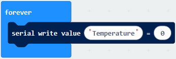

Click“Input” → “temperature(℃)” into“into serial write value“x”=0 and change”0”into “temperature”

\*\*\*\*\*\*\*\*\*\*\*\*\*\*\*\*\*\*\*\*\*\*\*\*\*\*\*\*\*\*\*\*\*\*\*\*\*\*\*\*\*\*\*\*\*\*\*\*\*\*\*\*\*\*\*\*\*\*\*\*\*\*\*\*\*

Go to“Basic”→“pause (ms) 100”into “forever”and set pause to 500

\*\*\*\*\*\*\*\*\*\*\*\*\*\*\*\*\*\*\*\*\*\*\*\*\*\*\*\*\*\*\*\*\*\*\*\*\*\*\*\*\*\*\*\*\*\*\*\*\*\*\*\*\*\*\*\*\*\*\*\*\*\*\*\*\*

Complete Program：

Select“JavaScript" and“Python”to switch into JavaScript and Python language code:

**( 4 )Test Results 1：**

After uploading test code 1 to micro:bit main board V2, powering the main board via the USB cable, and clicking “Show console Device”, the data of temperature shows in the serial monitor page as shown below.

If you're running Windows 7 or 8 instead of Windows 10, via Google Chrome won't be able to match devices. You'll need to use the CoolTerm serial monitor software to read data.

You could open CoolTerm software, click Options, select SerialPort, set COM port and baud rate to 115200 (after testing, the baud rate of USB SerialPort communication on Micro: Bit main board V2 is 115200), click OK, and Connect. 

The CoolTerm serial monitor shows the change of temperature in the current environment, as shown in the figures below :

**( 5 )Test Code 2：**

Link computer with micro:bit board by micro USB cable, and program in MakeCode editor.

A. Go to“Led”→“more”→“led enable false”block,

B. Keep it into the“on start”block，tap the triangle button to select“true”.

\*\*\*\*\*\*\*\*\*\*\*\*\*\*\*\*\*\*\*\*\*\*\*\*\*\*\*\*\*\*\*\*\*\*\*\*\*\*\*\*\*\*\*\*\*\*\*\*\*\*\*\*\*\*\*\*\*\*\*\*\*\*\*\*\*

Tap“Logic”and drag“if...then...else”into“forever”block; and then drag “=” into “true”.

Enter“Input”to move“temperature(℃)”into the left side of “=”; click the little triangle of “=”to choose “≥”,and change the “0”to “35”

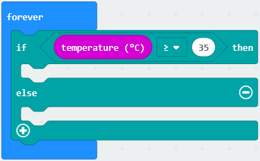

Click“Basic”to find out block“show icon”and move it into“then”; copy and place the block“show icon”to “else”and click the little triangle of “”to select“”

Complete Program：

Select“JavaScript" and“Python”to switch into JavaScript and Python language code:

**(6) Test Results 2：**

After uploading the code 2, when the ambient temperature is less than 35℃, 5\*5LED will show. When the temperature is equivalent to or greater than 35℃, the pattern will appear.

### Project 6: Geomagnetic Sensor

**( 1 )Project Description:**

This project aims to explain the use of the Micro: bit geomagnetic sensor, which can not only detect the strength of the geomagnetic field, but also be used as a compass to find bearings. 

It is also an important part of the navigation attitude reference system (AHRS). Micro: Bit main board V2 uses LSM303AGR geomagnetic sensor, and the dynamic range of magnetic field is ±50 gauss. In the board, the magnetometer module is used in both magnetic detection and compass.

In this experiment, the compass will be introduced first, and then the original data of the magnetometer will be checked. The main component of a common compass is a magnetic needle, which can be rotated by the geomagnetic field and point toward the geomagnetic North Pole (which is near the geographic South Pole) to determine direction.

**( 2 )Components Needed:**

-   Micro:bit main board V2 \*1

-   Micro USB cable\*1

**( 3 )Test Code 1：**

Link computer with micro:bit board by micro USB cable, and program in MakeCode editor.

A. Click“Input”→“more”→“calibrate compass”

B. Lay down it into block“on start”.

A. Go to“Input”→“on button A pressed”.

B. Enter“Basic”→“show number”, put it into“on button A pressed”block;

C. Tap“Input”→“compass heading(℃)”， and place it into“show number”

\*\*\*\*\*\*\*\*\*\*\*\*\*\*\*\*\*\*\*\*\*\*\*\*\*\*\*\*\*\*\*\*\*\*\*\*\*\*\*\*\*\*\*\*\*\*\*\*\*\*\*\*\*\*\*\*\*\*\*\*\*\*\*\*\*

Complete Program：

|  | ①“on start”: command block only runs once to start program.  ②Calibrate compass  ③Press button A on Micro:bit main board  ④Dot matrix shows the direction of compass heading |
| ----------------------------------------------- | ------------------------------------------------------------ |
|                                                 |                                                 |

Select“JavaScript" and“Python”to switch into JavaScript and Python language code:

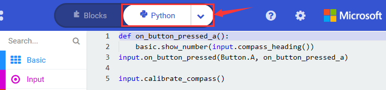

**( 4 )Test Results 1：**

After uploading test code to micro:bit main board V2 and powering the board via the USB cable, and pressing the button A, the board asks us to calibrate compass and the LED dot matrix shows “TILT TO FILL SCREEN”. Then enter the calibration page. Rotate the board until all 25 LEDs are on red as shown below.

After that, a smile pattern  appears, which implies the calibration is done. When the calibration process is completed, pressing the button A will make the magnetometer reading display directly on the screen. And the direction north, east, south and west correspond to 0°, 90°, 180° and 270°.

**( 5 ) Test Code 2：**

This module can keep readings to determine direction, so does point to the current magnetic North Pole by arrow.

For the above picture, the arrow pointing to the upper right when the value ranges from 292.5 to 337.5. 0.5 can’t be input in the code, thereby, the values we get are 293 and 338.

Link computer with micro:bit board by micro USB cable, and program in MakeCode editor.

Enter“Input”→ “more”→“calibrate compass”

Move“calibrate compass”into“on start”

\*\*\*\*\*\*\*\*\*\*\*\*\*\*\*\*\*\*\*\*\*\*\*\*\*\*\*\*\*\*\*\*\*\*\*\*\*\*\*\*\*\*\*\*\*\*\*\*\*\*\*\*\*\*\*\*\*\*\*\*\*\*\*\*\*

A. Click“Variables”→“Make a Variable...”→“New variable name：”

B. Input“x”in the blank box and click“OK”, and the variable “x” is generated.

C. Drag out“set x to”into“forever”block

A. Go to“Input”→“compass heading(℃)”, and keep it into“0”box

Tap“Logic”→“if...then...else”, leave it below block“sex x to compass heading”, then clickicon for 6 times.

\*\*\*\*\*\*\*\*\*\*\*\*\*\*\*\*\*\*\*\*\*\*\*\*\*\*\*\*\*\*\*\*\*\*\*\*\*\*\*\*\*\*\*\*\*\*\*\*\*\*\*\*\*\*\*\*\*\*\*\*\*\*\*\*\*

A. Place“and”into“true”block

B. Then move“=”block to the left box of “and”

C. Click“Variables”to drag“x”to the left “0”box, change 0 into 293 and set to “≥”;

D. Then copy“x≥293”once and leave it to the right “0”box and set to“x\<338”

\*\*\*\*\*\*\*\*\*\*\*\*\*\*\*\*\*\*\*\*\*\*\*\*\*\*\*\*\*\*\*\*\*\*\*\*\*\*\*\*\*\*\*\*\*\*\*\*\*\*\*\*\*\*\*\*\*\*\*\*\*\*\*\*\*

A. Go to“Basic”→“show leds”

B. Lay it down beneath block, then click“show leds”and the patternappears.

A. Duplicate for 6 times.

B. Separately leave them into the blank boxes behind “else if”.

C. Set to“x≥23 and x\<68”,“x≥68 and x\<113 ”,“x≥113 and x\<158 ”,“x≥158 and x\<203 ”,“x≥203 and x\<248 ”,“x≥248 and x\<293 ”respectively.

D. Then copy “show leds”for 7 times and keep them below the “else if.......then” block respectively.

E. Click the blue boxes to form the pattern“”, “”, “”, “”, “”, “”and “”.

\*\*\*\*\*\*\*\*\*\*\*\*\*\*\*\*\*\*\*\*\*\*\*\*\*\*\*\*\*\*\*\*\*\*\*\*\*\*\*\*\*\*\*\*\*\*\*\*\*\*\*\*\*\*\*\*\*\*\*\*\*\*\*\*\*

Complete Program：

|   | “on start”: command block only runs once to start program.  Calibrate compass   The program under the block “forever” runs cyclically.  Store the angle of the compass heading into the variable x  When 293≤x<338, the next program will be executed  appears on the dot matrix  When 23≤x<68, the next program will be executed is displayed on dot matrix  When 68≤x<113, the next program will be executed  is shown on dot matrix  When 113≤x<158, the next program will be executed pattern appears |
| ------------------------------------------------------------ | ------------------------------------------------------------ |
|                                                 |                                                 |

Select “JavaScript" and “Python” to switch into JavaScript and Python language code:

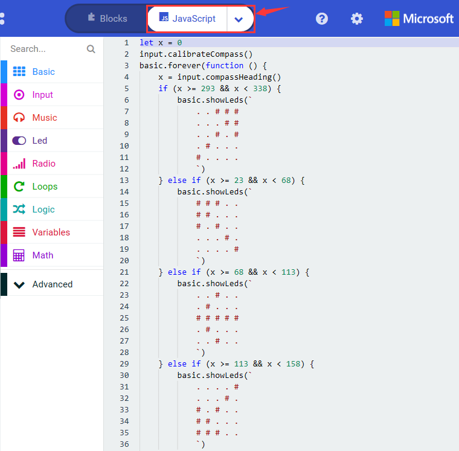

**( 6 ) Test Results 2**

Upload code 2 and plug micro:bit to power. After calibration, tilt micro:bit board, the LED dot matrix displays the direction signs.

### Project 7: Accelerometer

**( 1 )Project Description:**

The Micro: Bit main board V2 has a built-in LSM303AGR gravity acceleration sensor, also known as accelerometer, with a resolution of 8/10/12 bits. The code section sets the range to 1g, 2g, 4g, and 8g.

We often use accelerometer to detect the status of machines.

In this project, we will introduce how to measure the position of the board with the accelerometer. And then have a look at the original three-axis data output by the accelerometer.

**( 2 )Components Needed:**

-   Micro:bit main board V2 \*1

-   Micro USB cable\*1

**( 3 )Test Code 1：**

Link computer with micro:bit board by micro USB cable, and program in MakeCode editor,

(1) A. Enter“Input”→“on shake”，

B. Click“Basic”→“show number”, place it into“on shake”block, then change 0 into 1.

\*\*\*\*\*\*\*\*\*\*\*\*\*\*\*\*\*\*\*\*\*\*\*\*\*\*\*\*\*\*\*\*\*\*\*\*\*\*\*\*\*\*\*\*\*\*\*\*\*\*\*\*\*\*\*\*\*\*\*\*\*\*\*\*\*

(2) A. Copy code string for 7 times; separately click the triangle button to select“logo up”,“logo down”,“screen
up”,“screen down”,“tilt left”,“tilt right”and“free fall”, then respectively change 1 into 2, 3, 4, 5, 6, 7, 8.

\*\*\*\*\*\*\*\*\*\*\*\*\*\*\*\*\*\*\*\*\*\*\*\*\*\*\*\*\*\*\*\*\*\*\*\*\*\*\*\*\*\*\*\*\*\*\*\*\*\*\*\*\*\*\*\*\*\*\*\*\*\*\*\*\*

Complete Program：

|   | Shake the Micro:bit board LED dot matrix displays 1    The log is up   LED dot matrix displays 2   The logo is down   LED dot matrix displays 3   The screen is up LED dot matrix displays 4   The screen is down Number 5 is shown   The Micro:bit board is tilt to the left Number 6 is displayed   The Micro:bit board is tilt to the right Number7 is displayed   When the Micro:bit board is free fall LED dot matrix shows 8 |
| ------------------------------------------------------------ | ------------------------------------------------------------ |
|                                                 |                                                 |

Select “JavaScript" and “Python” to switch into JavaScript and Python language code:

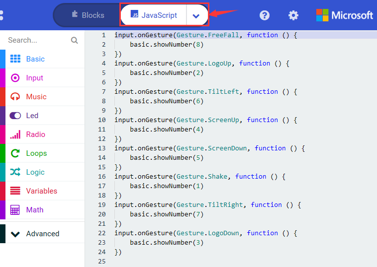

**( 4 )Test Results 1:**

After uploading the test code 1 to micro:bit main board V2 and powering the board via the USB cable, if we shake the Micro: Bit main board V2. no matter at any direction, the LED dot matrix displays the digit “1”.

When it is kept upright （its logo above the LED dot matrix）, the number 2 will show.

When it is kept upside down( its logo below the LED dot matrix) , it will show as below.

When it is placed still on the desk, showing its front side, the number 4 appears.

When it is placed still on the desk, showing its back side, the number 5 will exhibit.

When the board is tilted to the left , the LED dot matrix shows the number 6 as shown below.

When the board is tilted to the right , the LED dot matrix displays the number 7 as shown below

When the board is knocked to the floor, this process can be considered as a free fall and the LED dot matrix shows the number 8. (please note that this test is not recommended for it may damage the main board.)

Attention: if you’d like to try this function, you can also set the acceleration to 3g, 6g or 8g. But still ,we don not recommend.

**( 5 )Test Code 2：**

A. Go to“Advanced”→“Serial”→“serial redirect to USB”

B. Drag it into“on start”

\*\*\*\*\*\*\*\*\*\*\*\*\*\*\*\*\*\*\*\*\*\*\*\*\*\*\*\*\*\*\*\*\*\*\*\*\*\*\*\*\*\*\*\*\*\*\*\*\*\*\*\*\*\*\*\*\*\*\*\*\*\*\*\*\*

A. Enter“Serial”→“serial write value x =0”

B. Leave it into“forever”block

\*\*\*\*\*\*\*\*\*\*\*\*\*\*\*\*\*\*\*\*\*\*\*\*\*\*\*\*\*\*\*\*\*\*\*\*\*\*\*\*\*\*\*\*\*\*\*\*\*\*\*\*\*\*\*\*\*\*\*\*\*\*\*\*\*

A. Click“Input”→“acceleration(mg) x”；

B. Keep it into“0”box and capitalize the“x”

\*\*\*\*\*\*\*\*\*\*\*\*\*\*\*\*\*\*\*\*\*\*\*\*\*\*\*\*\*\*\*\*\*\*\*\*\*\*\*\*\*\*\*\*\*\*\*\*\*\*\*\*\*\*\*\*\*\*\*\*\*\*\*\*\*

Go to“Basic”and move out“pause (ms) 100”below the block, then set to 100ms.

\*\*\*\*\*\*\*\*\*\*\*\*\*\*\*\*\*\*\*\*\*\*\*\*\*\*\*\*\*\*\*\*\*\*\*\*\*\*\*\*\*\*\*\*\*\*\*\*\*\*\*\*\*\*\*\*\*\*\*\*\*\*\*\*\*

Replicate code string for 3 times and keep them into“forever”block，separately set the whole code string as follows:

Complete Program：

| 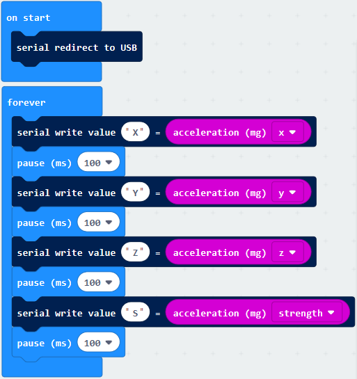 | “on start”: command block runs once to start program. Serial redirects to USB   The program under the block “forever” runs cyclically.  Serial write value “X”=acceleration value on x axis Delay 100ms Serial write value “Y”=acceleration value on y axis Delay 100ms Serial write value “Z”=acceleration value on z axis Delay 100ms Serial write value “S”=acceleration value on s axis Delay 100ms |
| ----------------------------------------------- | ------------------------------------------------------------ |
|                                                 |                                                 |

Select“JavaScript" and“Python”to switch into JavaScript and Python language code:

**( 6 ) Test Results 2**

Upload test code to micro:bit main board V2, power the main board via the USB cable, and click “Show console Device”.

After referring to the MMA8653FC data manual and the hardware schematic diagram of the Micro: Bit main board V2, the accelerometer coordinate of the Micro: Bit V2 motherboard are shown in the figure below:

The following interface shows the decomposition value of acceleration in X axis, Y axis and Z axis respectively, as well as acceleration synthesis (acceleration synthesis of gravity and other external forces).

If you're running Windows 7 or 8 instead of Windows 10, via Google Chrome won't be able to match devices. You'll need to use the CoolTerm serial monitor software to read data.

You could open CoolTerm software, click Options, select SerialPort, set COM port and baud rate to 115200 (after testing, the baud rate of USB SerialPort communication on Micro: Bit main board V2 is 115200), click OK, and Connect. The CoolTerm serial monitor shows the data of X axis, Y axis and Z axis , as shown in the figures below :

### Project 8: Light Detection

**( 1 )Project Description:**

In this project, we focus on the light detection function of the Micro: Bit main board V2. It is achieved by the LED dot matrix since the main board is not equipped with a photoresistor.

**( 2 )Components Needed:**

-   Micro:bit main board V2 \*1

-   Micro USB cable\*1

**( 3 )Test Code：**

Link computer with micro:bit board by micro USB cable, and program in MakeCode editor,

(1)A. Enter“Advanced”→“Serial”→“serial redirect to USB”;

B. Drag it into“on start”block.

\*\*\*\*\*\*\*\*\*\*\*\*\*\*\*\*\*\*\*\*\*\*\*\*\*\*\*\*\*\*\*\*\*\*\*\*\*\*\*\*\*\*\*\*\*\*\*\*\*\*\*\*\*\*\*\*\*\*\*\*\*\*\*\*\*

(2) A. Go to“Serial”→“serial write value x =0”;

B. Move it into“forever”

A. Click“Input”→“acceleration(mg) x”

B. Put“acceleration(mg) x”in the“0”box and change “x”into“Light intensity”.

\*\*\*\*\*\*\*\*\*\*\*\*\*\*\*\*\*\*\*\*\*\*\*\*\*\*\*\*\*\*\*\*\*\*\*\*\*\*\*\*\*\*\*\*\*\*\*\*\*\*\*\*\*\*\*\*\*\*\*\*\*\*\*\*\*

A. Click“Basic”→“pause (ms) 100”;

B. Lay it down into“forever”and set to 100ms.

\*\*\*\*\*\*\*\*\*\*\*\*\*\*\*\*\*\*\*\*\*\*\*\*\*\*\*\*\*\*\*\*\*\*\*\*\*\*\*\*\*\*\*\*\*\*\*\*\*\*\*\*\*\*\*\*\*\*\*\*\*\*\*\*\*

Complete Program：

|  | “on start”: command block runs once to start program. Serial redirects to USB   The program under the block “forever” runs cyclically.  Serial write value “Light intensity”= light level Delay in 100 ms |
| ----------------------------------------------- | ------------------------------------------------------------ |
|                                                 |                                                 |

Select“JavaScript" and“Python”to switch into JavaScript and Python language code:

**( 4 )Test Results:**

Upload the test code to micro:bit main board V2, power the board via the USB cable and click “Show console Device”.

When the LED dot matrix is covered by hand, the light intensity showed is approximately 0; when the LED dot matrix is exposed to light,the light intensity displayed gets stronger with the light as shown below.

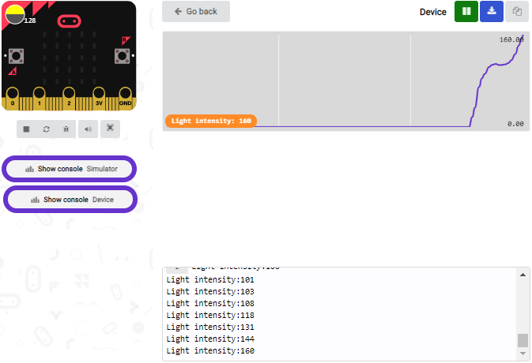

The 20 in the code is an arbitrary value of light intensity. If the current light level is less than or equal to 20, the moon will appear on the LED dot matrix. If it's bigger than 20, the sun will appear.

If you're running Windows 7 or 8 instead of Windows 10, via Google Chrome won't be able to match devices. You'll need to use the CoolTerm serial monitor software to read data.

You could open CoolTerm software, click Options, select SerialPort, set COM port and baud rate to 115200 (after testing, the baud rate of USB SerialPort communication on Micro: Bit main board V2 is 115200), click OK, and Connect. The CoolTerm serial monitor shows the value of light intensity , as shown in the figures below :

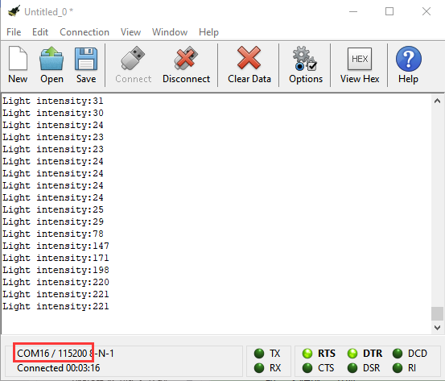

### Project 9: Speaker

**( 1 )Project Description:**

The Micro: Bit main board V2 has an built-in speaker, which makes adding sound to the programs easier. We can program the speaker to air all kinds of tones ,such as playing the song, "Ode to Joy" .

**( 2 )Components Needed:**

-   Micro:bit main board V2 \*1

-   Micro USB cable\*1

**( 3 )Test Code：**

Link computer with micro:bit board by micro USB cable, and program in MakeCode editor.

(1)  Enter“Basic”module to find “show icon”and drag it into “on start”block;

Click the little triangle to find “”

\*\*\*\*\*\*\*\*\*\*\*\*\*\*\*\*\*\*\*\*\*\*\*\*\*\*\*\*\*\*\*\*\*\*\*\*\*\*\*\*\*\*\*\*\*\*\*\*\*\*\*\*\*\*\*\*\*\*\*\*\*\*\*\*\*

(2) Enter“Music”module to find and drug“play sound giggle until done” into “forever”block;

Enter“Basic”module to find and drug“pause(ms) 100” into “forever” block ;

Change 100 into 1000;

( 3 ) Copy  three times and place it into “forever” block ;

Click the little triangle to select “happy”,”hello”,”yawn”;

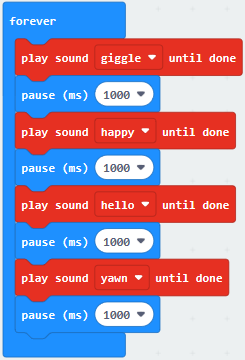

\*\*\*\*\*\*\*\*\*\*\*\*\*\*\*\*\*\*\*\*\*\*\*\*\*\*\*\*\*\*\*\*\*\*\*\*\*\*\*\*\*\*\*\*\*\*\*\*\*\*\*\*\*\*

Complete Program：

Select“JavaScript" and“Python”to switch into JavaScript and Python language code:

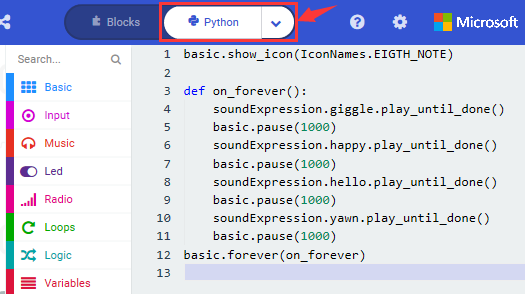

**( 4 )Test Results:**

After uploading the test code to micro:bit main board V2 and powering the board via the USB cable, the speaker utters sound and the LED dot matrix shows the logo of music.

### Project 10: Touch-sensitive Logo

**( 1 )Project Description:**

The Micro: Bit main board V2 is equipped with a golden touch-sensitive logo, which can act as an input component and function like an extra button.

It contains a capacitive touch sensor that senses small changes in the electric field when pressed (or touched), just like your phone or tablet screen do. When you press it , you can activate the program.

**( 2 )Components Needed:**

-   Micro:bit main board V2 \*1

-   Micro USB cable\*1

**( 3 )Test Code：**

Link computer with micro:bit board by micro USB cable, and program in MakeCode editor,

( 1 ) Delete block“on start”and“forever”;

( 2 )Enter“Input”module to find and drag“on logo pressed” ;

Click the little triangle to find “touched”’;

( 3 ) Enter module “Variables”→choose“Make a Variable”→input “start”→click “OK”

The variable“start”is established;

Enter“Variables”module to find and drag “set start to 0” into “on logo touched”block;

( 4 )Enter“Input”module →click “more”→ find and drag“running time(ms)” into the “0”of“set start to 0”block;

( 5 )Enter“Basic”module to find and drag“show icon” into “on logo touched”block;

( 6 )Enter“Input”module to find and drag“on logo pressed”→choose “released”→ establish variable “time”;

Enter“Variables”module to find and drag “set time to 0”into “on logo pressed”block;

Enter“Math”module to find and drag “0-0”into the “0”of“set start to 0”block;

( 7 )Enter“Input”module→ “more” → find and drag “running time(ms)” into “0”on the left side of “0-0”;

Enter“Variables”module to find and drag“start” into “0”on the right side of “0-0”;

( 8 )Enter“Basic”module to find and drag“show number” into “on logo released”block;

Enter“Math”module to find and drag“square root 0” into “0”; Click the little triangle to find”integer÷”;

( 9 ) Enter“Variables”module to find and drag“time” into “0”on the left side of “0-0”and change the “0”on the right side to”1000”;

Complete Program：

Select“JavaScript" and“Python”to switch into JavaScript and Python language code:

**( 4 )Test Results:**

After uploading the test code to micro:bit main board V2 and powering the board via the USB cable, the LED dot matrix exhibits the heart pattern when the touch-sensitive logo is pressed or touched and displays digit when the logo is released.

### Project 11: Microphone

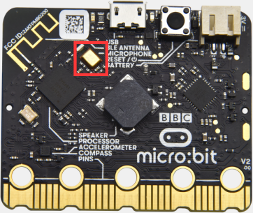

**( 1 )Project Description:**

The Micro: Bit main board V2 is built with a microphone which can test the volume of ambient environment. When you clap, the microphone LED indicator will turn on. Since it can measure the intensity of sound, you can make a noise scale or disco lighting changing with music. The microphone is placed on the opposite side of the microphone LED indicator and in proximity with holes that lets sound pass.When the board detects sound, the LED indicator lights up.

**( 2 )Components Needed:**

-   Micro:bit main board V2 \*1

-   Micro USB cable\*1

**( 3 )Test Code 1：**

Link computer with micro:bit board by micro USB cable, and program in MakeCode editor.

( 1 ) Delete block“on start”and“forever”;

( 2 ) Enter“Input”module to find and drag“on loud sound”;

Enter“Basic”module to find and drag “show number”into “on loud sound”block ;

( 3 )Copy  once;

Click the little triangle of “lond” to choose”quiet”;

Click the little triangle of “” to choose””;

Complete Program：

Select“JavaScript" and“Python”to switch into JavaScript and Python language code:

**( 4 )Test Results 1:**

After uploading test code to micro:bit main board V2 and powering the board via the USB cable, the LED dot matrix displays pattern“”when you claps and pattern  when it is quiet around.

**( 5 )Test Code 2:**

Link computer with micro:bit board by micro USB cable, and program in MakeCode editor.

( 1 )Enter“Advanced”module→ choose“Serial”to find and drag“serial redirect to USB ”into “on start”block ;

( 2 )Enter“Variables”module→ choose“Make a Variable”→ input “maxSound”→click “OK”,variable ”maxSound”is established;

Enter“Variables”module to find and drag“set maxSound to 0”into “on start”block ;

( 3 )Enter“Logic”module to find and drag“if true then...else”into “forever” block ;

Enter“Input”module to find and dragbutton A is pressed”into “then” ;

( 4 )Enter“Basic”module to find and drag“show number”into “then” ;

Enter“Variables”module to find and drag“maxSound”into “0” ;

( 5 )Establish variable“soundLevel”;

Enter“Variables”module to find and drag“set soundLevel to 0”into “else”;

Enter“Input”module to find and drag“sound level” into “0”;

( 6 )Enter“Led”module to find and drag“plot bar graph of 0 up to 0” into “else”;

Enter“Variables”module to find and drag“soundLevel”into the“0”behind “of”;

Change the “0”behind “up” to “255”;

( 7 )Enter“Logic”module to find and drag“if true then”into “else”block ;

Enter“Logic”module to find and drag“0 \> 0”into “then” ;

Enter“Variables”module to find and drag“soundLevel”into “0”on the left side of “0-0” ;

Enter“Variables”module to find and drag“maxSound” into “0” on the right side;

( 8 )Enter“Variables”module to find and drag“set maxSound to 0”into the second “then” ;

Enter“Variables”module to find and drag“soundLevel”into the “0” ;

Complete Program：

Select“JavaScript" and“Python”to switch into JavaScript and Python language code:

**( 6 )Test Results 2:**

Upload test code to micro:bit main board V2, power the board via the USB cable and click “Show console Device”as shown below.

When the sound is louder around, the sound value shows in the serial port is bigger as shown below.

What’s more, when pressing the button A, the LED dot matrix displays the value of the biggest volume( please note that the biggest volume can be reset via the Reset button on the other side of the board ) while when clapping, the LED dot matrix shows the pattern of the sound.

### Project 12: Bluetooth Data Reading

**( 1 )Project Description:**

The Micro: Bit main board V2 comes with a nRF52833 processor (with built-in Bluetooth 5.1 BLE(Bluetooth Low Energy) device) and a 2.4GHz antenna for Bluetooth wireless communication and 2.4GHz wireless communication. With the help of them, the board is able to communicate with a variety of Bluetooth devices, including smart phones and tablets.

In this project, we mainly concentrate on the Bluetooth wireless communication function of this main board. Linked with Bluetooth, it can transmit code or signals. To this end, we should connect an Apple device (a phone or an iPad) to the board.

Since setting up Android phones to achieve wireless transmission is similar to
that of Apple devices, no need to illustrate again.

**( 2 ) Preparation**

- Attach the Micro:bit main board V2 to your computer via the Micro USB cable.
- An Apple device (a phone or an iPad) or an Android device;

**( 3 ) Procedures:**

For Apple devices, enter this link <https://www.microbit.org/get-started/user-guide/ble-ios/> with your computer first, and then click “Download pairing HEX file”to download the Micro: Bit firmware to a folder or desk, and upload the downloaded firmware to the Micro: Bit main board V2.

Search “micro bit”in your App Store to download the APP micro:bit.

Connect your Apple device with Micro: Bit main board V2:

Firstly, turn on the Bluetooth of your Apple device and open the APP micro:bit to select item “Choose micro:bit” to start pairing Bluetooth.

Please make sure that the Micro: Bit main board V2 and your computer are still linked via the USB cable.

Secondly, click “Pair a new micro:bit”;

Following the instructions to press button A and B at the same time(do not release them until you are told to) and press Reset & Power button for a few seconds.

Release the Reset & Power button, you will see a password pattern shows on the LED dot matrix. Now , release buttons A and B and click Next.

Set the password pattern on your Apple device as the same pattern showed on the matrix and click Next.

Still click Next and a dialog box props up as shown below. Then click "Pair". A few seconds later, the match is done and the LED dot matrix displays the "√" pattern.

After the match with Bluetooth, write and upload code with the App.

Click “Create Code” to enter the programming page and write code.

Click  and the box  appears, and then select “Create √”.

Name the code as “1 “and click  to save it.

Click the third item“Flash”to enter the uploading page. The default code program for uploading is the one saved just now and named "1" and then click the other "Flash" to upload the code program "1".

If the code is uploaded successfully a few seconds later, the App will emerge as below and the LED dot matrix of the Micro: Bit main board V2 will exhibit a heart pattern.

Projects below all conduct with the built-in sensors and the LED dot matrix while the following ones will carry out with the help of external sensors.

 **(Attention: to avoid burning the the Micro:bit main board V2, please remove the USB cable and the external power from the board before fix it with a T-shaped shield; likewise, the USB cable and the external power should be cut from the main board before disconnect the shield from the board.)**

### Project 13：LED Blinks

1.  **Description：**

Making LED blink is one of the primary project. We used to control the LEDs of the dot matrix built in the micro:bit board to flash. But in this lesson, we plan to link the board with an external LED and control it. Thus, we also need to block the dot matrix when we conduct this experiment.

2.  **LED（light-emitting diode）：**

LED is a type of semiconductor called "Light Emitting Diode "which is an electronic device made of semiconductor materials (silicon, selenium, germanium, etc.). 

It features unidirectional conductivity, that is, the positive voltage is applied to the anode (long leg) and the cathode (short leg) of the diode. when the voltage of its anode is higher than the voltage of its cathode, thus, the diode is turned on(LED is on). When a reverse voltage is applied to the anode and cathode, the diode is disconnected(that is, the LED is off). 

Therefore, the disconnection and connection of the diode is equivalent to turning on and off LED. Light-emitting diodes have an anode (+) and a cathode (-), and they can only allow current to flow from one anode to the cathode. The components will be damaged if LED is directly connected to the power supply. It’s essential that a certain resistor must be connected in series in the LED circuit.

**3. Resistor**

Resistor is the electronic component in the circuit, which limits and regulates current flow. Its unit is (Ω). 1 mΩ= 1000 kΩ，1kΩ= 1000Ω.

It is used to protect the sensitive elements, like LED. The color ring on its body represents a number. You could follows the resistor color chart.

Under the same voltage, there are smaller or higher current.

The relationship between current, voltage, and resistor can be expressed by the formula: I=U/R. In the figure below, the current flowing through R1: I = U / R = 3 V / 10 KΩ = 0.000 3A = 0.3mA.

Don’t connect resistor with low resistance to the ends of power, which will damage electronic components due to high current. There is no difference of positive or negative poles for resistors.

**4. Breadboard**

Breadboard is the essential tool in building circuit. The reasonable use of breadboard highly boost the efficiency.

Firstly, let’s the basic knowledge of breadboard.

A breadboard is used to build and test circuits quickly before finalizing any circuit design. The breadboard has many holes into which circuit components like ICs and resistors can be inserted. A typical breadboard is shown below:

The bread board has strips of metal which run underneath the board and connect the holes on the top of the board.The metal strips are laid out as shown below. Note that the top and bottom rows of holes are connected horizontally while the remaining holes are connected vertically.

To use the bread board, the legs of components are placed in the holes. Each set of holes connected by a metal a strip underneath forms anode.

A node is a point in a circuit where two components are connected. Connections between different components are formed by putting their legs in a common node.

The long top and bottom row of holes are usually used for power supply connections. The rest of the circuit is built by placing components and connecting them together with jumper wires.

ICs are placed in the middle of the board so that half of the legs are on side of the middle line and half on the other.

**5. Components List:**

| Micro:bit Main board\*1                                      | keyestudio Micro:bit T type shield                           | Red LED\*1                                                   | Micro USB cable\*1                                           |
| ------------------------------------------------------------ | ------------------------------------------------------------ | ------------------------------------------------------------ | ------------------------------------------------------------ |
|  |  |  |  |
| 220Ω Resistor\*1                                             | Breadboard\*1                                                | Breadboard wire                                              |                                                              |
|  |  |  |                                                              |

6.  **Schematic Diagram：**

7.  **Wiring graph：**

8.  **Test Code：**

Wire up in the terms of the above graph, LED is linked with P9, and power on.

A. Click“Led”→“more”→“led enable false”;

B. Place it into“on start”block

\*\*\*\*\*\*\*\*\*\*\*\*\*\*\*\*\*\*\*\*\*\*\*\*\*\*\*\*\*\*\*\*\*\*\*\*\*\*\*\*\*\*\*\*\*\*\*\*\*\*\*\*\*\*\*\*\*\*\*\*\*\*\*\*\*

A. Enter“Advanced”→“Pins”，

B. Select“digital write pin P0 to 0”and leave it into“forever”block.

\*\*\*\*\*\*\*\*\*\*\*\*\*\*\*\*\*\*\*\*\*\*\*\*\*\*\*\*\*\*\*\*\*\*\*\*\*\*\*\*\*\*\*\*\*\*\*\*\*\*\*\*\*\*\*\*\*\*\*\*\*\*\*\*\*

Set P9 because LED is attached to P9, and change 0 into 1.

\*\*\*\*\*\*\*\*\*\*\*\*\*\*\*\*\*\*\*\*\*\*\*\*\*\*\*\*\*\*\*\*\*\*\*\*\*\*\*\*\*\*\*\*\*\*\*\*\*\*\*\*\*\*\*\*\*\*\*\*\*\*\*\*\*

A. Click“Basic”→“pause (ms) 100”;

B. Lay it down into“forever”block and set to 1000ms.

\*\*\*\*\*\*\*\*\*\*\*\*\*\*\*\*\*\*\*\*\*\*\*\*\*\*\*\*\*\*\*\*\*\*\*\*\*\*\*\*\*\*\*\*\*\*\*\*\*\*\*\*\*\*\*\*\*\*\*\*\*\*\*\*\*

Copyonce and alter 1 into 0(turn off LED). Then put it down below the“pause(ms)1000”.

Complete Program：

|  | “on start”: command block runs once to start program.  Turn off all LEDs dot matrix   The program under the block “forever” runs cyclically.  Set P9 to high level(1) to light on LED  Set P9 to low level(0) to go off LED  Delay in 1000ms |
| ----------------------------------------------- | ------------------------------------------------------------ |
|                                                 |                                                 |

Click“JavaScript", the corresponding JavaScript code is shown below:

Then click drop-down triangle button and select“Python”to view the Python language code.

9.  **Test Results：**

Upload code and power on, the external LED flashes at 1s interval.

10.  **Extension Project：**

Connect LED to P2 and make LED flicker at 0.5s interval.

### Project 14： Traffic Light

1.  **Description：**

Traffic lights are closely related to people's daily lives.    In the process of learning Micro:bit board, we often use three external red, green and yellow LED circuits to simulate the roadside traffic lights. They traffic light is generally composed of red, yellow, and green (green is blue and green) lights, which is used to govern the traffic. 

There are two types of traffic lights, the one is for motor vehicles are called motor vehicle lights. Another one is the pedestrian crossing lights.

When the green light is on, vehicles are allowed to pass. When the yellow light is flashing, which warns that the signal is about to change to red, with some jurisdictions requiring drivers to stop if it is safe to do so, and others allowing drivers to go through the intersection if safe to do so. When the red light is on, vehicles should stop then proceed when safe.

2.  **Components List:**

| Micro:bit Mainboard\*1                                       | keyestudio Micro:bit T type shield                           | Red LED\*1                                                   | Yellow LED\*1                                                | Green  LED\*1                                                |
| ------------------------------------------------------------ | ------------------------------------------------------------ | ------------------------------------------------------------ | ------------------------------------------------------------ | ------------------------------------------------------------ |
|  |  |  |  |  |
| 220ΩResistor\*3                                              | Breadboard\*1                                                | Breadboard wire                                              | Micro USB cable\*1                                           |                                                              |
|  |  |  |  |                                                              |

**3. Schematic Diagram：**

**4. Wiring Graph：**

**5. Test Code：**

Hook the components up in compliance with the above diagram, separately connect green LED, yellow LED and red LED to P6, P4 and P2.

Click “Led”→”more”→“led enable false”；

Combine it with“on start”.

\*\*\*\*\*\*\*\*\*\*\*\*\*\*\*\*\*\*\*\*\*\*\*\*\*\*\*\*\*\*\*\*\*\*\*\*\*\*\*\*\*\*\*\*\*\*\*\*\*\*\*\*\*\*\*\*\*\*\*\*\*\*\*\*\*

Enter“Advanced”→“Pins”→“digital write pin P0 to 0”into“forever”，and set to“digital write pin P6 to 1”.

\*\*\*\*\*\*\*\*\*\*\*\*\*\*\*\*\*\*\*\*\*\*\*\*\*\*\*\*\*\*\*\*\*\*\*\*\*\*\*\*\*\*\*\*\*\*\*\*\*\*\*\*\*\*\*\*\*\*\*\*\*\*\*\*\*

Go to“Basic”to drag out“pause (ms) 100”into“forever”block set to 500ms.

\*\*\*\*\*\*\*\*\*\*\*\*\*\*\*\*\*\*\*\*\*\*\*\*\*\*\*\*\*\*\*\*\*\*\*\*\*\*\*\*\*\*\*\*\*\*\*\*\*\*\*\*\*\*\*\*\*\*\*\*\*\*\*\*\*

Replicate“digital write pin P6 to 1”once and put it beneath the“pause(ms)5000”block，alter 1 into 0.

\*\*\*\*\*\*\*\*\*\*\*\*\*\*\*\*\*\*\*\*\*\*\*\*\*\*\*\*\*\*\*\*\*\*\*\*\*\*\*\*\*\*\*\*\*\*\*\*\*\*\*\*\*\*\*\*\*\*\*\*\*\*\*\*\*

Tap“Loops”to select“repeat 4 times do”and lay it down below the“digital write pin P6 to 0”block :

\*\*\*\*\*\*\*\*\*\*\*\*\*\*\*\*\*\*\*\*\*\*\*\*\*\*\*\*\*\*\*\*\*\*\*\*\*\*\*\*\*\*\*\*\*\*\*\*\*\*\*\*\*\*\*\*\*\*\*\*\*\*\*\*\*
Duplicate“pause (ms)5000”and 

once again and keep them into“repeat 4 times do”. Yellow LED is linked with P4 and blinks 3 times, so set code string as follows:

\*\*\*\*\*\*\*\*\*\*\*\*\*\*\*\*\*\*\*\*\*\*\*\*\*\*\*\*\*\*\*\*\*\*\*\*\*\*\*\*\*\*\*\*\*\*\*\*\*\*\*\*\*\*\*\*\*\*\*\*\*\*\*\*\*

Copy code string once, and set to P2, change the last 500 into 5000.

Complete Program：

|  | “on start”: command block runs once to start program. Turn off LED dot matrix   The program under the block “forever” runs cyclically.  Set P6 to high level(1), make green LED on Delay in 5000ms  Set P6 to low level(0), make green LED off Repeat 3 times under “do” block  Set P4 to high level(1), light on yellow LED Delay in 500ms  Set P4 to low level(0), turn off green LED  Set P2 to high level(1), turn on yellow LED Delay in 5000ms  Set P2 to low level(0), turn off red LED |
| ----------------------------------------------- | ------------------------------------------------------------ |
|                                                 |                                                 |

Click“JavaScript" to check the corresponding JavaScript code:

Then click drop-down triangle button and select“Python”to see the Python language code:

6.  **Test Results：**

Upload code and power on, the green LED is on for 5s then goes off, next, yellow LED blinks for 3 times and red LED lights up for 5s then goes off, cyclically.

7.  **Extension Project：**

Simulate the traffic light, make green LED light up for 5s, then flicker for 3s and finally light on red LED.

### Project 15：Flow Light

1.  **Description：**

Flow light, also called advertisement lights, emits light like flowing water.

In this project, we just need to add more LEDs and control the order and time to perform the phenomenon of flow light.

2.  **Component List:**

| Micro:bit Main board\*1  | keyestudio Micro:bit T Type Shield | Red LED\*6                                                   | Micro USB cable\*1       |
| ------------------------ | ---------------------------------- | ------------------------------------------------------------ | ------------------------ |
|  |            |                                      |  |
| 220Ω Resistor\*6         | Breadboard\*1                      | Breadboard wires                                             |                          |
|  |            |  |                          |

3.  **Schematic Diagram：**

4.  **Wiring Graph：**

**5. Test Code：**

According to the above graph, 6 red LEDs are respectively attached to P2, P3, P4, P5, P6 and P7, enter Micro: bit online programming too to design code:

1.  Click “Led”→”more”→“led enable false”;

2.  Combine it with “on start”

\*\*\*\*\*\*\*\*\*\*\*\*\*\*\*\*\*\*\*\*\*\*\*\*\*\*\*\*\*\*\*\*\*\*\*\*\*\*\*\*\*\*\*\*\*\*\*\*\*\*\*\*\*\*\*\*\*\*\*\*\*\*\*\*\*

A. Enter “Advanced”→“Pins”→“digital write pin P0 to 0”

B. Drag it into“forever”and set to “digital.....P7 ...to 1”.

\*\*\*\*\*\*\*\*\*\*\*\*\*\*\*\*\*\*\*\*\*\*\*\*\*\*\*\*\*\*\*\*\*\*\*\*\*\*\*\*\*\*\*\*\*\*\*\*\*\*\*\*\*\*\*\*\*\*\*\*\*\*\*\*\*

Go to“Basic”to drag out“pause (ms) 100”below the block digital.....P7 ...to 1”, then set to 500ms.

\*\*\*\*\*\*\*\*\*\*\*\*\*\*\*\*\*\*\*\*\*\*\*\*\*\*\*\*\*\*\*\*\*\*\*\*\*\*\*\*\*\*\*\*\*\*\*\*\*\*\*\*\*\*\*\*\*\*\*\*\*\*\*\*\*

Copy code stringfor 5 times and, put it down into“forever”，separately set to P6, P5, P4, P3 and P2.

Then duplicate code stringonce, change 1 into 0.

Complete Program：

|  | “on start”: command block runs once to start program.  Turn off LED dot matrix   The program under the block “forever” runs cyclically.  Set P7, P6, P5, P4, P3 and P2 to high level(1),  make 5 red LEDs on.  The delay time is 500ms.  And every LED lights turns on at interval of 500ms.  Set P7, P6, P5, P4, P3 and P2 to LOW level(0),  make 5 red LEDs OFF,  and every LED lights turns off at interval of 500ms. |
| ----------------------------------------------- | ------------------------------------------------------------ |
|                                                 |                                                 |

Click “JavaScript" to look through the corresponding JavaScript code:

Then click the triangle button and select“Python”and check the Python language code:

6.  **Test Results：**

Upload code and power on, the external LED lights up one by one, then gets dark orderly.

### Project 16： Breathing Light

1.  **Description：**

In the previous lesson, we control LEDs on and off and make them blink.

In this project, we will control LED brightness through PWM to simulate breathing effect. Similarly, you can change the step length and delay time in the code so as to demonstrate different breathing effect.

PWM is a means of controlling the analog output via digital means. Digital control is used to generate square waves with different duty cycles (a signal that constantly switches between high and low levels) to control the analog output. 

In general, the input voltage of port are 0V and 5V. What if the 3V is required? Or what if switch among 1V, 3V and 3.5V? We can’t change resistor constantly. For this situation, we need to control by PWM.

For the Arduino digital port voltage output, there are only LOW and HIGH, which correspond to the voltage output of 0V and 5V. You can define LOW as 0 and HIGH as 1, and let the Arduino output five hundred 0 or 1 signals within 1 second.

If output five hundred 1, that is 5V; if all of which is 1, that is 0V. If output 010101010101 in this way then the output port is 2.5V, which is like showing movie. The movie we watch are not completely continuous. It actually outputs 25 pictures per second. In this case, the human can’t tell it, neither does PWM. If want different voltage, need to control the ratio of 0 and 1. The more 0,1 signals output per unit time, the more accurately control.

Pulse width modulation (PWM) has many applications: lamp brightness adjustment, motor speed adjustment, sound generation, etc. The following are the three basic parameters of PMW:

(1) Amplitude of pulse width (minimum/maximum)  

(2) Pulse period (the reciprocal of pulse frequency within 1 second)  

(3) Voltage level (for example: 0V-3V)  

(4) Micro: There are 6 PMW interfaces , namely digital pins P0, P1, P2, P3, P4 and P10.

In this program, we connect red LED to P0 of micro:bit motherboard. And P0 can be input port as well. We could control LED brightness through P0 port. The LED will get bright gradually then dark, alternately, which looks like human breath.

2.  **Components List:**

| Micro:bit Main board\*1  | keyestudio Micro:bit T type shield | Red LED\*1               | Breadboard wire          |
| ------------------------ | ---------------------------------- | ------------------------ | ------------------------ |
|  |            |  |  |
| 220Ω Resistor\*1         | Breadboard\*1                      | Micro USB cable\*1       |                          |
|  |            |  |                          |

3.  **Schematic Diagram：**

4.  **Wiring Graph：**

**5. Test Code：**

From the above diagram, LED is connected to P0. Open the Micro:bit online programming tool.

(1)A. Click “Led”→”more”→“led enable false”;

B. Combine it with“on start”.

(2) Go to“Loops”to move “while..true...do”into block“forever”. Then click“Logic”to drag“=”into“true”box.

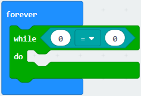

\*\*\*\*\*\*\*\*\*\*\*\*\*\*\*\*\*\*\*\*\*\*\*\*\*\*\*\*\*\*\*\*\*\*\*\*\*\*\*\*\*\*\*\*\*\*\*\*\*\*\*\*\*\*\*\*\*\*\*\*\*\*\*\*\*

(3) Click “Variables”→“Make a Variable...”→“New variable name：”box，input“brightness”in dialog box and tick“OK”，then the
variable“brightness”is produced. Lay down“brightness”to the left box of “=”，change “0”into “1024”，“=”into“\<”.

\*\*\*\*\*\*\*\*\*\*\*\*\*\*\*\*\*\*\*\*\*\*\*\*\*\*\*\*\*\*\*\*\*\*\*\*\*\*\*\*\*\*\*\*\*\*\*\*\*\*\*\*\*\*\*\*\*\*\*\*\*\*\*\*\*

(4) A. Follow the above method to create variable“set brightness to 0”, and put it down into“do”block.

B. Enter“Math”to get“+”block and move it into“0” box ，

C. Move out variable“brightness”again into the left“0” box of block “+”, then alter 0 into 1.

\*\*\*\*\*\*\*\*\*\*\*\*\*\*\*\*\*\*\*\*\*\*\*\*\*\*\*\*\*\*\*\*\*\*\*\*\*\*\*\*\*\*\*\*\*\*\*\*\*\*\*\*\*\*\*\*\*\*\*\*\*\*\*\*\*

(5) A. Go to“Advanced”→“Pins”→“analog write pin P0 to 1023”;

B. Keep it beneath the“set...brightness...1”block, then replace 1023 with“brightness”. 

\*\*\*\*\*\*\*\*\*\*\*\*\*\*\*\*\*\*\*\*\*\*\*\*\*\*\*\*\*\*\*\*\*\*\*\*\*\*\*\*\*\*\*\*\*\*\*\*\*\*\*\*\*\*\*\*\*\*\*\*\*\*\*\*\*

Go to “Basic” to drag out “pause (ms) 100”into“while...do”block set to 5ms.

\*\*\*\*\*\*\*\*\*\*\*\*\*\*\*\*\*\*\*\*\*\*\*\*\*\*\*\*\*\*\*\*\*\*\*\*\*\*\*\*\*\*\*\*\*\*\*\*\*\*\*\*\*\*\*\*\*\*\*\*\*\*\*\*\*

Copy the code stringonce and place it into “do” block. Change“\<”into“\>”, 1024 into 0，“+”into“-”.

Complete Program：

|  | “on start”: command block runs  once to start program.  Turn off LED dot matrix   The program under the block “forever”  runs cyclically.  When brightness<1024,  the program in the “do” block will be executed Delay in 5ms  When brightness>0,  the program in the “do” block will be executed Delay in 5ms |
| ----------------------------------------------- | ------------------------------------------------------------ |
|                                                 |                                                 |

Click“JavaScript", you will see the corresponding JavaScript code:

Then click drop-down triangle button and select“Python”to see the Python language code:

6.  **Test Results：**

Hook up via connection diagram, upload the code and plug in power. The external LED lights up gradually then gets dark, alternately, which looks like human breath.

7.  **Extension Project：**

The some LED on 5\*5 dot matrix shows the breathing light effect.

### Project 17： RGB

1.  **Description：**

The RGB color mode is a color standard in the industry. It obtains various colors by changing the three color channels of red (R), green (G), and blue (B) and integrating them. RGB denotes the three colors of red, green and blue.  

The monitors mostly adopt the RGB color standard, and all the colors on the computer screen are composed of the three colors of red, green and blue mixed in different proportions. A group of red, green and blue is the smallest display unit. Any color on the screen can be recorded and expressed by a set of RGB values.

Each of the three color channels of red, green, and blue is divided into 256 levels of brightness. At 0, the "light" is the weakest-it is turned off, and at 255, the "light" is the brightest. When the three-color gray values are the same, the gray tones with different gray values are produced, that is, when the three-color gray is 0, the darkest black is generated; when the three-color gray is 255, it is the brightest white tone .

RGB is inclusive of two types. In this project, we adopt a common cathode RGB module and connect it to P4, P3 and P3 of Micro:bit board. The distinct color can be produced and displayed on RGB by changing the input values of P4, P3 and P2.

2.  **Component List：**

| Micro:bit Main Board\*1  | Keyestudio Micro:bit T Type Shield | RGB\*1                                                       | Micro USB Aable\*1       |
| ------------------------ | ---------------------------------- | ------------------------------------------------------------ | ------------------------ |
|  |            |                                      |  |
| 220Ω Resistor\*3         | Breadboard\*1                      | Breadboard Wire                                              |                          |
|  |            |  |                          |

3.  **Schematic Diagram：**

    

4.  **Wiring Graph：**

**5. Test Code：**

Wiring according to the above diagram. The pins of RGB are linked with P4, P3 and P2. Connect computer to Micro:bit motherboard with USB cable. Then enable Micro: bit online programming tool to design the code:

A. Click“Led”→“more”→“led enable false”

B. Drag “led enable false”into “on start”

\*\*\*\*\*\*\*\*\*\*\*\*\*\*\*\*\*\*\*\*\*\*\*\*\*\*\*\*\*\*\*\*\*\*\*\*\*\*\*\*\*\*\*\*\*\*\*\*\*\*\*\*\*\*\*\*\*\*\*\*\*\*\*\*\*

A. Click “Advanced”→“Pins”→“analog write pin P0 to 1023 ”

B. Move it into“on start”block, and copy for 2 times.

C. The pins of RGB are separately connected to P4, P3 and P2. Therefore set to P2, P3 and P4. Then the RGB will show white light.

\*\*\*\*\*\*\*\*\*\*\*\*\*\*\*\*\*\*\*\*\*\*\*\*\*\*\*\*\*\*\*\*\*\*\*\*\*\*\*\*\*\*\*\*\*\*\*\*\*\*\*\*\*\*\*\*\*\*\*\*\*\*\*\*\*

Copy“analog write pin P2 to 1023 ” once and leave it into “forever”, then change 1023 into 0.

\*\*\*\*\*\*\*\*\*\*\*\*\*\*\*\*\*\*\*\*\*\*\*\*\*\*\*\*\*\*\*\*\*\*\*\*\*\*\*\*\*\*\*\*\*\*\*\*\*\*\*\*\*\*\*\*\*\*\*\*\*\*\*\*\*

A. Enter“Basic”→“pause (ms) 100”

B. Put“pause (ms) 100”below the block“analog write pin P2 to 0”block, and set to 1000ms.

\*\*\*\*\*\*\*\*\*\*\*\*\*\*\*\*\*\*\*\*\*\*\*\*\*\*\*\*\*\*\*\*\*\*\*\*\*\*\*\*\*\*\*\*\*\*\*\*\*\*\*\*\*\*\*\*\*\*\*\*\*\*\*\*\*

Duplicate“analog write pin P2 to 1023”again, and place it as follows:

\*\*\*\*\*\*\*\*\*\*\*\*\*\*\*\*\*\*\*\*\*\*\*\*\*\*\*\*\*\*\*\*\*\*\*\*\*\*\*\*\*\*\*\*\*\*\*\*\*\*\*\*\*\*\*\*\*\*\*\*\*\*\*\*\*

Replicate code string for 2 times, respectively set to P3 and P4. Then combine these code strings as shown below:

\*\*\*\*\*\*\*\*\*\*\*\*\*\*\*\*\*\*\*\*\*\*\*\*\*\*\*\*\*\*\*\*\*\*\*\*\*\*\*\*\*\*\*\*\*\*\*\*\*\*\*\*\*\*\*\*\*\*\*\*\*\*\*\*\*

A. Click“Loops”→“repeat 4 times do”

B. Place it into “forever” block.

C. Then drag out the block“for index from 0 to 4...do”from“Loops”, and move it into“repeat 4 times do”block

\*\*\*\*\*\*\*\*\*\*\*\*\*\*\*\*\*\*\*\*\*\*\*\*\*\*\*\*\*\*\*\*\*\*\*\*\*\*\*\*\*\*\*\*\*\*\*\*\*\*\*\*\*\*\*\*\*\*\*\*\*\*\*\*\*

A. Copy“analog write pin P2 to 1023 ”once and leave it into“for index from 0 to 4...do”block.

B. Enter“Variables”→“index”；

C. Put it into“1023” box of“analog write pin P2 to 1023 ”block

\*\*\*\*\*\*\*\*\*\*\*\*\*\*\*\*\*\*\*\*\*\*\*\*\*\*\*\*\*\*\*\*\*\*\*\*\*\*\*\*\*\*\*\*\*\*\*\*\*\*\*\*\*\*\*\*\*\*\*\*\*\*\*\*\*

A. Copy block“analog write pin P2 to index”once;

B. Set to P3 and delete the variable“index”

C. Go to“Math”→ “-”block

D. Leave it into“1023”box, and change left 0 into 1023

E. Move variable“index into right“0”box

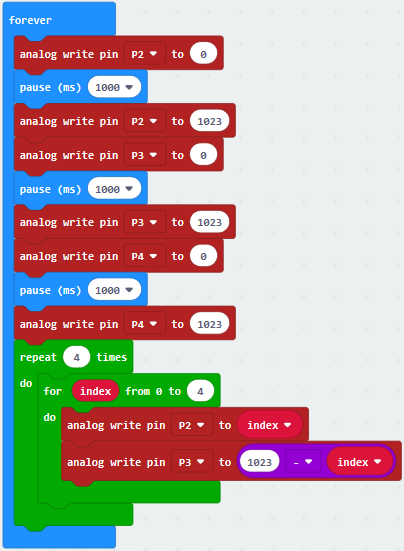

\*\*\*\*\*\*\*\*\*\*\*\*\*\*\*\*\*\*\*\*\*\*\*\*\*\*\*\*\*\*\*\*\*\*\*\*\*\*\*\*\*\*\*\*\*\*\*\*\*\*\*\*\*\*\*\*\*\*\*\*\*\*\*\*\*

A. Copy“analog write pin P3 to 1023-index”once

B. Click the triangle button to set P4

C. Change 1023 into 512.

\*\*\*\*\*\*\*\*\*\*\*\*\*\*\*\*\*\*\*\*\*\*\*\*\*\*\*\*\*\*\*\*\*\*\*\*\*\*\*\*\*\*\*\*\*\*\*\*\*\*\*\*\*\*\*\*\*\*\*\*\*\*\*\*\*

A. Click“Basic”to drag out“pause (ms) 100”, then leave it below “analog write..P4.512...index”block. And set to 1ms.

B. Change“repeat 4 times”into“repeat 1 times”, “for index from 0 to 4”into“for index from 0 to 513”

\*\*\*\*\*\*\*\*\*\*\*\*\*\*\*\*\*\*\*\*\*\*\*\*\*\*\*\*\*\*\*\*\*\*\*\*\*\*\*\*\*\*\*\*\*\*\*\*\*\*\*\*\*\*\*\*\*\*\*\*\*\*\*\*\*

A. Duplicate code stringonce and leave it into“repeat 1 times do”block

Remove“index”behind P2,“1023-index”behind P3 and “512-index”behind P4.

Then respectively put down“index”into 1023 box behind P3, “512-index”into 1023 box behind P2 and“1023-index”into 1023 box behind P4.

\*\*\*\*\*\*\*\*\*\*\*\*\*\*\*\*\*\*\*\*\*\*\*\*\*\*\*\*\*\*\*\*\*\*\*\*\*\*\*\*\*\*\*\*\*\*\*\*\*\*\*\*\*\*\*\*\*\*\*\*\*\*\*\*\*

A. Replicate code stringonce and place it into“repeat 1 times do”;

Remove“index”behind P2 , “1023-index”behind P3 and “512-index”behind P4.

Respectively drag them into 1023 boxes behind P4, P3 and P2.

\*\*\*\*\*\*\*\*\*\*\*\*\*\*\*\*\*\*\*\*\*\*\*\*\*\*\*\*\*\*\*\*\*\*\*\*\*\*\*\*\*\*\*\*\*\*\*\*\*\*\*\*\*\*\*\*\*\*\*\*\*\*\*\*\*

Copy code stringonce and move into“forever”block

Complete Program：

|   | “on start”: command block runs once to start program.  Turn off LED dot matrix  Set the analog value of P2, P3 and P4 to 1023    The program under the block “forever” runs cyclically.  Set analog value of P2, P3 and P4 to 0 and 1023. Delay in 1000ms.  Repeat the program in the “do” block once.  When index is in the range of 0-513,  the program in the “do”block will be executed. Set the analog value of P2 and P3 to index and “1023-index” Set P4 to 512-index Delay in 1ms  When index value is in the range of 0-513,  the next program will be executed Respectively set P2, P3 and P4 to 512-index, index and 1023-index. Delay in 1ms  When index value is in the range of 0-513,  the next program will be executed Respectively set P2, P3 and P4 to 023-index, 512-index and index Delay in 1ms  Set P2, P3 and P4 to 1023 |
| ------------------------------------------------------------ | ------------------------------------------------------------ |
|                                                 |                                                 |

Click“JavaScript", you will view the corresponding JavaScript code:

Then click the triangle button and select“Python”to see the Python language code:

**6. Test Results：**

Wire up, upload the code and power on. The RGB begins to show white, blue, green and red color, alternately.

**7. Extension Project：**

Make RGB display blue, green, red, yellow, purple and white color at the interval of 0.5s, alternately.

### Project 18：Active Buzzer

1.  **Description：**

We can use Micro:bit to make many interactive works of which the most commonly used is acoustic-optic display. All the previous projects have something to do with LED. However, the circuit in this experiment can produce sound. Normally, the experiment is done with a buzzer or a speaker because buzzer is more simpler and easier to use.   

The buzzer we introduced here is a passive buzzer. It cannot be actuated by itself, but by external pulse frequencies. Different frequencies produce different sounds. We can use Micro:bit to code the melody of a song, which is quite fun and simple.

There are two kinds of buzzer, active buzzer and passive buzzer. In this lesson, we will use Micro:bit to drive an active buzzer. The active buzzer inside has a simple oscillator circuit which can convert constant direct current into a certain frequency pulse signal. Once active buzzer receives a high level, it will produce an audible beep.

**Triode:**

Triode, also known as semiconductor triode, bipolar transistor and crystal triode, is a kind of current-controlled semiconductor device. Its function is to amplify weak signals into larger amplitude electrical signals, and also to be used as contactless switches. Crystal triode is one of the basic components of semiconductor. It has the function of current amplification and is the core component of electronic circuit.

The triode is made of two PN junctions which are very close to each other on a semiconductor substrate. The two PN junctions divide the whole semiconductor into three parts, the middle part is the base area, the two sides are the emitter area and collector area, and the arrangement is PNP and NPN.

The NPN triode is composed of 2 N-type and P-type semiconductors, two of which are the launch area and the collect area. And the three pins are called E(Emitter), B (Base) and C (Collector).

The commonly used triodes are divided into PNP and NPN triodes.

The S8050 transistor is a low-power NPN silicon tube. The collector-base (Vcbo) voltage can be up to 40V, and the collector current is (Ic) 0.5A.

Its three pins are E(Emitter), B (Base) and C (Collector).

2.  **Components List**

|              |              |  |  |
| ------------------------------------ | ------------------------------------ | ------------------------ | ------------------------ |
| Micro:bit Main Board*1               | Keyestudio Micro:bit T Type Shield*1 | Active Buzzer*1          | 2.4KΩ Resistor*1         |
|              |              |  |  |
| S8050 Triode*1                       | Breadboard*1                         | Breadboard Wire          | Micro USB Cable*1        |
|              |              |  |                          |
| Keyestudio Breadboard Power Module*1 | AA Battery Holder*6                  | 5 AA Battery*6           |                          |

3.  **Schematic Diagram：**

    

4.  **Wiring Graph：**

5.  **Test Code：**

Wiring through the above graph, active buzzer is linked with P2. Link computer with micro:bit board. Then enable the online programming tool to design the code.

(1) 1.  Click “Led”→”more”→“led enable false”

2.  Combine it with “on start”.

\*\*\*\*\*\*\*\*\*\*\*\*\*\*\*\*\*\*\*\*\*\*\*\*\*\*\*\*\*\*\*\*\*\*\*\*\*\*\*\*\*\*\*\*\*\*\*\*\*\*\*\*\*\*\*\*\*\*\*\*\*\*\*\*\*

(2) A. Go to“Advanced”→“Pins”→“digital write pin P0 to 0 ”;

B. Leave it into“forever” , and active buzzer is connected to P2, so set to P2, change o into 1.

\*\*\*\*\*\*\*\*\*\*\*\*\*\*\*\*\*\*\*\*\*\*\*\*\*\*\*\*\*\*\*\*\*\*\*\*\*\*\*\*\*\*\*\*\*\*\*\*\*\*\*\*\*\*\*\*\*\*\*\*\*\*\*\*\*

(3) Click“Basic”to move“pause (ms) 100”block below “digital write...P2 to 1”block, set to 500ms.

\*\*\*\*\*\*\*\*\*\*\*\*\*\*\*\*\*\*\*\*\*\*\*\*\*\*\*\*\*\*\*\*\*\*\*\*\*\*\*\*\*\*\*\*\*\*\*\*\*\*\*\*\*\*\*\*\*\*\*\*\*\*\*\*\*

(4) Duplicate the code string once and move it below “pause(ms)500”block. Then change 1 into 0.

\*\*\*\*\*\*\*\*\*\*\*\*\*\*\*\*\*\*\*\*\*\*\*\*\*\*\*\*\*\*\*\*\*\*\*\*\*\*\*\*\*\*\*\*\*\*\*\*\*\*\*\*\*\*\*\*\*\*\*\*\*\*\*\*\*

Complete Program：

|  | “on start”: command block runs once to start program. Turn off LED dot matrix   The program under the block “forever” runs cyclically  Set P2 to high level(1) to make active buzzer emit sound Delay in 500ms  Set P2 to low level(0) to make active buzzer stop sound Delay in 500ms |
| ----------------------------------------------- | ------------------------------------------------------------ |
|                                                 |                                                 |

Click“JavaScript", you will view the corresponding JavaScript code:

Then click drop-down triangle button and select“Python”to see the Python language code:

**5. Test Results：**

Upload program and plug in power. Active buzzer emits sound for 0.5s, and stops for 0.5s.

**6. Extension Project：**

Shift the IO port of active buzzer, it makes sound for 0.2s alternately.

### Project 19：Passive Buzzer

1.  **Description：**

We can use Micro:bit board to make many interactive works of which the most commonly used is acoustic-optic display. The previous lessons are related to LED. However, we will elaborate the Sound in this lesson.

Buzzer is inclusive of active buzzer and passive buzzer.

The passive buzzer doesn’t carry with vibrator inside, so it need external sine or square wave to drive. It can produce slight sound when connecting directly to power supply. It features controlling sound frequency and producing the sound of “do re mi fa so la si”.

A diode should be connected in reverse when driving by the square wave signal source, which will hinder the high-voltage generated to damage other components or service life when the power breaks down.

Frequency is made of a series of pitch names in English letters and Numbers. You can choose different frequencies, that is, tone. The frequency of sound is called pitch.

It involves music knowledge. In music lesson, our teacher taught“1（Do）, 2（Re）, 3(Mi), 4(Fa) , 5(Sol), 6(La), 7(Si)”

| 1（Do） | 2（Re） | 3(Mi) | 4(Fa) | 5(Sol) | 6(La) | 7(Si) |
| :-----: | :-----: | :---: | :---: | :----: | :---: | :---: |
|    C    |    D    |   E   |   F   |   G    |   A   |   B   |

The number depends on high or low tone. The larger the number, the higher the tone. When the number is same, the frequency (tone) is getting higher and higher from C to \_B.

Beats are the time delay for each note. The larger the number, the longer the delay time. A note without a line in the spectrum is a beat, with a delay of 1000 milliseconds. while a beat with an underline is 1/2 of a beat without a line, and a beat with two underlines is 1/4 of a beat without a line.

Here is the notation of Ode to Joy.

**2. Components List:**

|  |                  |  |  |
| ------------------------ | ---------------------------------------- | ------------------------ | ------------------------ |
| Micro:bit motherboard*1  | keyestudio Micro:bitT Type Shield*1      | Passive Buzzer*1         | 2.4KΩResistor*1          |
|  |                  |  |  |
| S8050Triode*1            | AA Battery Holder*6                      | Breadboard wire          | Micro USB cable*1        |
|  |                  |  |  |
| Breadboard*1             | Keyestudio Power module for breadboard*1 | 51ΩResistor*1            | AA Battery*6             |

**3. Schematic Diagram：**

**（Note: On Micro:bit motherboard，Passive Buzzer is only connected to P0）**

**Wiring Graph:（Note： On Micro: bit mainboard，Passive Buzzer is only connected to P0）**

**4. Test Code：**

Wiring through the above graph, passive buzzer is linked with P0. Link computer with micro:bit board. Then enable the online programming tool to design the code.

Click “Led”→”more”→“led enable false”, combine it with “on start”.

\*\*\*\*\*\*\*\*\*\*\*\*\*\*\*\*\*\*\*\*\*\*\*\*\*\*\*\*\*\*\*\*\*\*\*\*\*\*\*\*\*\*\*\*\*\*\*\*\*\*\*\*\*\*\*\*\*\*\*\*\*\*\*\*\*

Enter“Music”→“play tone Middle C for 1 beat”， leave it into“forever”block，then tap “Middle C”, then appearcode.

Choose“High E”and set to “1 beat”.

\*\*\*\*\*\*\*\*\*\*\*\*\*\*\*\*\*\*\*\*\*\*\*\*\*\*\*\*\*\*\*\*\*\*\*\*\*\*\*\*\*\*\*\*\*\*\*\*\*\*\*\*\*\*\*\*\*\*\*\*\*\*\*\*\*

According to the above music score, copy“play tone High E for 1 beat”124 times, separately change “High E”of“play tone High E for 1 beat”into“High E”,“High F”,“High G”,“High G”,“High F”,“High E”,“High D”,“High C”,“High C”,“High D”,“High E”,“High E”,“High D”,“High D”,“High E”,“High E”,“High F”,“High G”,“High G”,“High F”,“High E”,“High D”,“High C”,“High C”,“High D”,“High E”,“High D”,“High C”,“High C”,“High D”,“High D”,“High E”,“High C”,“High D”,“High E”,“High F”,“High E”,“High C”,“High D”,“High E”,“High F”,“High E”,“High D”,“High C”,“High D”,“Middle G ”,“High E”,“High E”,“High E”,“High F”,“High G”,“High G”,“High F”,“High E”,“High D”,“High C”,“High C”,“High D”,“High E”,“High D”,“High C”,“High C”,“High D”,“High D”,“High E”,“High C”,“High D”,“High E”,“High F”,“High E”,“High C”,“High D”,“High E”,“High F”,“High E”,“High D”,“High C”,“High D”,“Middle G”,“High E”,“High E”,“High E”,“High F”,“High G”,“High G”,“High F”,“High E”,“High C”,“High C”,“High C”,“High D”,“High E”,“High D”,“High C”,“High C”,“High D”,“High C”,“High C”,“High G”,“High F”,“High E”,“High E”,“High C”,“High B”,“High A”,“High A”,“High F”,“High D”,“High C”,“Middle B”,“High D”,“Middle B”,“Middle A”,“Middle G”,“Middle A”,“Middle B”,“High C”,“High E”,“High D”,“Middle B”,“High C”,“High C”,“High C”,“High C”.

Then set beat to: “1”,“1”,“1”,“1”,“1”,“1”,“1”,“1”,“1”,“1”,“1”,“1”,“1/2”,“1”,“1”,“1”,“1”,“1”,“1”,“1”,“1”,“1”,“1”,“1”,“1”,“1”,“1”,“1/2”,“1”,“1”,“1”,“1”,“1”,“1”,“1/2”,“1/2”,“1”,“1”,“1”,“1/2”,“1/2”,“1”,“1”,“1”,“1”,“1”,“1”,“1”,“1”,“1”,“1”,“1”,“1”,“1”,“1”,“1”,“1”,“1”,“1”,“1”,“1/2”,“1”,“1”,“1”,“1”,“1”,“1”,“1/2”,“1/2”,“1”,“1”,“1”,“1/2”,“1/2”,“1”,“1”,“1”,“1”,“1”,“1”,“1”,“1”,“1”,“1”,“1”,“1”,“1”,“1”,“1”,“1”,“1”,“1”,“1”,“1/2”,“1”,“1”,“1/2”,“1”,“1”,“1”,“1/2”,“1”,“1”,“1”,“1/2”,“1”,“1/2”,“1/2”,“1/2”,“1/2”,“1/2”,“1/2”,“1/2”,“1/2”,“1/2”,“1/2”,“1/2”,“1/2”,“1/2”,“1/2”,“1”,“1/2”,“1/4”,“1”.

Complete Program：

|   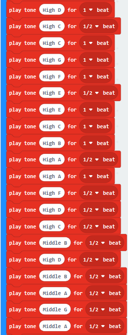  |
| ------------------------------------------------------------ |
|                                                 |

Click“JavaScript", you will view the corresponding JavaScript code:

Then click drop-down triangle button and select“Python”to see the Python language code:

**5. Test Results：**

Wire up through the above graph and plug in power. The “Ode to Joy” is played by passive buzzer.

**6. Extension Project：**

Make passive buzzer emit two kind sounds.

### Project 20：1-digit Tube Module

1.  **Description：**

LED segment display is a semiconductor light-emitting device. Its basic unit is a light-emitting diode (LED). LED segment display can be divided into 7-segment display and 8-segment display according to the number of segments. 8-segment display has one more LED unit ( for decimal point display) than 7-segment one.

In this experiment, we use a 8-segment display. According to the wiring method of LED units, LED segment displays can be divided into display with common anode and display with common cathode. Common anode display refers to the one that
combine all the anodes of LED units into one common anode (COM).  

For the common anode display, connect the common anode (COM) to +3V. When the cathode level of a certain segment is low, the segment is on; when the cathode level of a certain segment is high, the segment is off. For the common cathode display, connect the common cathode (COM) to GND. When the anode level of a certain segment is high, the segment is on; when the anode level of a certain segment is low, the segment is off.

The anodes of each LED are a,b,c,d,e,f,g and dp((decimal point). There are 2 segments to show number and one segment to display decimal point. In this project, we use a common anode 8-segment display. The each pin of anode must be connected to 220Ω resistor.

1-digit tube module has 8 light-emitting diodes (LED) corresponding to 8 pins. As shown below, light emitting diode a equals to pin a, LED b is equivalent to pin b, and so on. Connect pin a to P13 on the Micro:bit motherboard, pin b to P14, pin c to P8, pin d to P9, pin e to P10, pin f to P12, and pin g to P11, pin dp to P7, as long as you control the high and low level of the corresponding interface, you can control the display of the digital tube. In the experiment, we let the digital tube gradually display 10 numbers from 0-9.

**2.Components needed:**

|  |              |  |  |
| ------------------------ | ------------------------------------ | ------------------------ | ------------------------ |
| Micro:bit mainboard*1    | keyestudio Micro:bit T Type Shield*1 | 1 digit tube module*1    | 2.4KΩ Resistor*1         |
|  |              |  |                          |
| Micro USB cable*1        | Breadboard*1                         | Breadboard wires         |                          |

**3. Schematic Diagram：**

**4.Wiring Graph：**

**5.Test Code：**

Link computer with micro:bit board. Then enable the online programming tool to design the code.

A. Click“Led”→“more”→“led enable false”；

B. Place it into“on start”

\*\*\*\*\*\*\*\*\*\*\*\*\*\*\*\*\*\*\*\*\*\*\*\*\*\*\*\*\*\*\*\*\*\*\*\*\*\*\*\*\*\*\*\*\*\*\*\*\*\*\*\*\*\*\*\*\*\*\*\*\*\*\*\*

A . Enter “Advanced”→“Functions”→“Make a Functions...”→“Edit Function”dialog box

B. For block, change“do something” into “0” and click “Done √”. Then“function 0”block is created.

\*\*\*\*\*\*\*\*\*\*\*\*\*\*\*\*\*\*\*\*\*\*\*\*\*\*\*\*\*\*\*\*\*\*\*\*\*\*\*\*\*\*\*\*\*\*\*\*\*\*\*\*\*\*\*\*\*\*\*\*\*\*\*\*

1.  A. Click“Advanced”→“Pins”→“digital write pin P0 to 0”，

2.  Copy it for 7 times and put these code string into“function 0”block.

3.  The pins of 1-digit tube module are connected to P13, P14, P8, P9, P10, P12, P11 and  P7 .
    
4.  Thereby, set to P13, P14, P8, P9, P10, P12, P11and P7 respectively. Then set to 1 from P13 to P12. And remain 0 for P11 and P7 .

\*\*\*\*\*\*\*\*\*\*\*\*\*\*\*\*\*\*\*\*\*\*\*\*\*\*\*\*\*\*\*\*\*\*\*\*\*\*\*\*\*\*\*\*\*\*\*\*\*\*\*\*\*\*\*\*\*\*\*\*\*\*\*\*

1.  Then replicate the code string for 9 times, and design the code as follows:

    
    
2.  Next click“Advanced”and enter“Functions”to find out function block“call 0”, and leave it into“forever”，block“call 0”equals to code string ，and “call 1”is equivalent to code string  and so on.
Move block“pause (ms) 100”from“Basic”and place it below the “call 0”, then set to 500ms.

\*\*\*\*\*\*\*\*\*\*\*\*\*\*\*\*\*\*\*\*\*\*\*\*\*\*\*\*\*\*\*\*\*\*\*\*\*\*\*\*\*\*\*\*\*\*\*\*\*\*\*\*\*\*\*\*\*\*\*\*\*\*\*\*

Enter“Advanced”and go to“Functions”, drag out the function block“call 1”,“call 2”,“call 3”,“call 4”,“call 5”,“call 6”,“call 7”,“call 8”and“call 9 beneath the block “pause(ms) 500”.

\*\*\*\*\*\*\*\*\*\*\*\*\*\*\*\*\*\*\*\*\*\*\*\*\*\*\*\*\*\*\*\*\*\*\*\*\*\*\*\*\*\*\*\*\*\*\*\*\*\*\*\*\*\*\*\*\*\*\*\*\*\*\*\*

Then replicate“pause (ms) 500 ”for 9 times and place them into every“call“block.

Complete Program：

|       |
| ------------------------------------------------------------ |
|                                                 |

Click“JavaScript", you will view the corresponding JavaScript code:

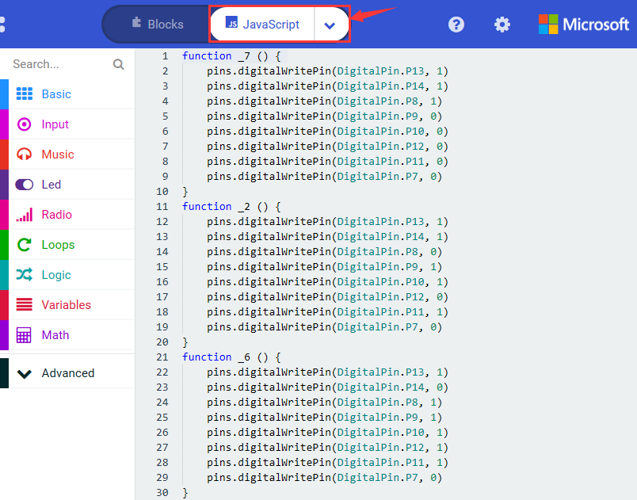

Then click drop-down triangle button and select“Python”to see the Python language code:

**6. Test Results：**

Hook up according to diagram, upload the code and power on, the digital tube displays from the number 0 to 9 cyclically.

### Project 21：4-digit Tube Module

1.  **Description:**

The 4-digit digital tube module is mainly composed of a 12pin 4-digit common anode digital tube with a score point. Its driver chip is TM1637.

When in use, we only to make the single-chip microcomputer control a 4-digit or 8-digital tube by 2 signal lines, which greatly saves the IO port resources of the control board.

The control terminal interface of the module is a 4pin header with a pitch of 2.54mm, which facilitates to link with the corresponding control microcontroller. What’s more, the 2 positioning holes of module make it easier to install on the other devices.

This module can be applied to time display, stopwatch display and other devices that need to display numbers.

In this project, we connect the keyestudio 4-digit digital tube module to the keyestudio Micro:bit T Type Shield through the Breadboard, and control the 4-digit digital tube module to display numbers through the Micro:bit motherboard and programming.

2.  **Component List:**

|  |             |  |
| ------------------------ | ----------------------------------- | ------------------------ |
| Micro:bit motherboard*1  | Keyestudio Micro:bit TType Shield*1 | M-F DuPont lines         |
|  |             |  |

**3. Schematic diagram**

**4.Wiring Graph：**

**5. Test Code：**

**Code 1：**

Wiring according to the above diagram, CLK and DIO pins of 4-digit tube module are respectively connected to P1 and P2.

Link computer with micro:bit board. Then enable the online programming tool to design the code.

**How to add the library file of 4-digit tube module:**

Enter the Micro:bit online programming page and click“Extensions”

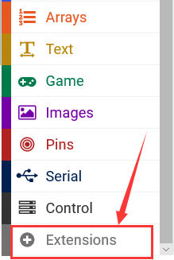

Input TM1637 to search, as shown below and click to download and install the library file.

After installing 4-digit library file successfully, then the corresponding code is shown in the editing area:

1.  Click “Variables”→“Make a Variable...”→“New variable name：”

2.  Enter“item”in the dialog box and click “OK”, then variable“item”is created

3.  Drag“set item to 0”from “Variable”into “on start”block.

\*\*\*\*\*\*\*\*\*\*\*\*\*\*\*\*\*\*\*\*\*\*\*\*\*\*\*\*\*\*\*\*\*\*\*\*\*\*\*\*\*\*\*\*\*\*\*\*\*\*\*\*\*\*\*\*\*\*\*\*\*\*\*\*

Click“8 TM1637”block and move“CLK P1 DIO P2 intensity 7 LED count 4”to the 0 box of“set item to 0”.

\*\*\*\*\*\*\*\*\*\*\*\*\*\*\*\*\*\*\*\*\*\*\*\*\*\*\*\*\*\*\*\*\*\*\*\*\*\*\*\*\*\*\*\*\*\*\*\*\*\*\*\*\*\*\*\*\*\*\*\*\*\*\*\*

Enter“8 TM1637”to select“turn on item”block, and place it into“forever”block

\*\*\*\*\*\*\*\*\*\*\*\*\*\*\*\*\*\*\*\*\*\*\*\*\*\*\*\*\*\*\*\*\*\*\*\*\*\*\*\*\*\*\*\*\*\*\*\*\*\*\*\*\*\*\*\*\*\*\*\*\*\*\*\*

Click“Basic”to move“pause (ms) 100”block below“turn on item”block and set to 200ms. Then copy it once.

\*\*\*\*\*\*\*\*\*\*\*\*\*\*\*\*\*\*\*\*\*\*\*\*\*\*\*\*\*\*\*\*\*\*\*\*\*\*\*\*\*\*\*\*\*\*\*\*\*\*\*\*\*\*\*\*\*\*\*\*\*\*\*\*

Go to“8 TM1637”to find out block“item show digit 5 at 0 ”, then place it between the two“pause (ms) 200”blocks“.

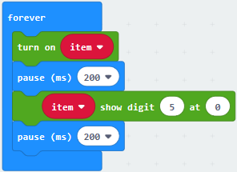

\*\*\*\*\*\*\*\*\*\*\*\*\*\*\*\*\*\*\*\*\*\*\*\*\*\*\*\*\*\*\*\*\*\*\*\*\*\*\*\*\*\*\*\*\*\*\*\*\*\*\*\*\*\*\*\*\*\*\*\*\*\*\*\*

Copy the code string for 3 times, and move them into“forever”block. Set to “at 1, at 2, at 3”, as shown: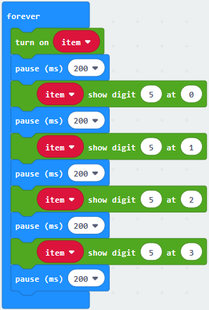

Drag“turn off item”from“8 TM1637 into“forever”block. Duplicate “pause (ms) 200”once and leave it beneath block “turn off item”.

Complete Program：

|  | “on start”: command block runs once to start program. Set item to “CLK P1 DIO P2 intensity 7 LED count 4”.   The program under the block “forever” runs cyclically.  Turn on variable “item” Delay in 200ms  Digital tube displays 5 at 0 bit Delay in 200ms  Digital tube displays 5 at 1 bit Delay in 200ms  Digital tube displays 5 at 2 bit Delay in 200ms  Digital tube displays 5 at 3 bit Delay in 200ms  Turn off variable “item” Delay in 200ms |
| ----------------------------------------------- | ------------------------------------------------------------ |
|                                                 |                                                 |

Click“JavaScript", you will view the corresponding JavaScript code:

Then click drop-down triangle button to select“Python”to see the Python language code:

**Code 2：**

Hook up in compliance with the above graph, the CLK and DIO pins of 4-digit tube module are linked with P1 and P2.

Link computer with micro:bit board. Then enable the online programming tool to design the code.

We’ve added the library file in “Code 1”part. Let’s get started.

1.  Click “Variables”→“Make a Variable...”→“New variable name：”

2.  Enter“item”in the dialog box and click “OK”, then variable“item”is created.

3.  Drag“set item to 0”from “Variable”into “on start” block.

\*\*\*\*\*\*\*\*\*\*\*\*\*\*\*\*\*\*\*\*\*\*\*\*\*\*\*\*\*\*\*\*\*\*\*\*\*\*\*\*\*\*\*\*\*\*\*\*\*\*\*\*\*\*\*\*\*\*\*\*\*\*\*\*

Click“8 TM1637”block and move“CLK P1 DIO P2 intensity 7 LED count 4”to the 0 box of“set item to 0”.

\*\*\*\*\*\*\*\*\*\*\*\*\*\*\*\*\*\*\*\*\*\*\*\*\*\*\*\*\*\*\*\*\*\*\*\*\*\*\*\*\*\*\*\*\*\*\*\*\*\*\*\*\*\*\*\*\*\*\*\*\*\*\*\*

Enter“8 TM1637”to select “item show number 0”block, and place it into“on start”block

Go to“8 TM1637”to move“item DotPoint at 1 true”into “forever”block

\*\*\*\*\*\*\*\*\*\*\*\*\*\*\*\*\*\*\*\*\*\*\*\*\*\*\*\*\*\*\*\*\*\*\*\*\*\*\*\*\*\*\*\*\*\*\*\*\*\*\*\*\*\*\*\*\*\*\*\*\*\*\*\*

Click“Basic”to drag“pause (ms) 100”block below the block “item DotPoint at 1 true”, then set to 200ms.

\*\*\*\*\*\*\*\*\*\*\*\*\*\*\*\*\*\*\*\*\*\*\*\*\*\*\*\*\*\*\*\*\*\*\*\*\*\*\*\*\*\*\*\*\*\*\*\*\*\*\*\*\*\*\*\*\*\*\*\*\*\*\*\*

Copy the code stringonce and leave it below the “pause(ms)200”, click the button next to“true”to select“false”.

\*\*\*\*\*\*\*\*\*\*\*\*\*\*\*\*\*\*\*\*\*\*\*\*\*\*\*\*\*\*\*\*\*\*\*\*\*\*\*\*\*\*\*\*\*\*\*\*\*\*\*\*\*\*\*\*\*\*\*\*\*\*\*\*

Complete Program：

|  | “on start”: command block runs once to start program.  Set item to “CLK P1 DIO P2 intensity 7 LED count 4”.  4-digit tube module shows 1234.   The program under the block “forever” runs cyclically.  Show “DotPoint”  Delay in 200ms  Hide DotPoint  Delay in 200ms |
| ----------------------------------------------- | ------------------------------------------------------------ |
|                                                 |                                                 |

Click“JavaScript", you will view the corresponding JavaScript code:

Then click drop-down triangle button to select“Python”to see the Python language code:

**6. Test Results：**

Wire up via diagram, upload code 1 and power on, the 4-digit tube module shows“5”from 0 bit to the third bit(From left to right are 0, 1, 2, and 3 bits). then the number“5555” flickers.

Upload code 2, the character string“13：14” is shown and the middle symbol ”:”flashes.

### Project 22：8\*8 Dot Matrix

1.  **Description：**

8\*8 Dot matrix module can be used as display screen, like bus station display, advertising screens and bulletin boards.

On the screen there are 64 circles. And inside each circle has an LED light. There are 64 LEDs, pins on the side, 8 on each. You can see other models like 16\*16 Dot matrix, 32\*32 Dot matrix.

These 64 LEDs can be lit separately, or lit together. Lighten different LED to show different icons.

The single 8\*8 dot matrix comes with 8 LEDs on each row and each cols. There are 16 pins on the side, 8 on each.

Connect all the positive pins or negative pins of 8 LEDs on each row, leading out a line; and the pins not connected on each cols also connect together, leading out a line; so the single dot matrix screen has 16 pins. In this lesson, we will make dot matrix show 11.

2.  **Components List:**

|  |              |  |  |
| ------------------------ | ------------------------------------ | ------------------------ | ------------------------ |
| Micro:bit motherboard*1  | keyestudio Micro:bit T Type Shield*1 | 8*8 Dot Matrix *1        | 220ΩResistor*8           |
|  |              |  |                          |
| Breadboard*1             | Micro USB cable*1                    | Breadboard wires         |                          |

3.  **Schematic Diagram：**

4.  **Wiring Graph：**

5.  **Test Code：**

Wiring according to the above connection diagram. Link computer with micro:bit board. Then enable the online programming tool to design the code.

A. Click “Led”→”more”→“led enable false”;

B. Combine it with “on start”.

\*\*\*\*\*\*\*\*\*\*\*\*\*\*\*\*\*\*\*\*\*\*\*\*\*\*\*\*\*\*\*\*\*\*\*\*\*\*\*\*\*\*\*\*\*\*\*\*\*\*\*\*\*\*\*\*\*\*\*\*\*\*\*\*

Enter “Advanced”→“Pins”→“digital write pin P0 to 0”, Then drag it into“forever”.

\*\*\*\*\*\*\*\*\*\*\*\*\*\*\*\*\*\*\*\*\*\*\*\*\*\*\*\*\*\*\*\*\*\*\*\*\*\*\*\*\*\*\*\*\*\*\*\*\*\*\*\*\*\*\*\*\*\*\*\*\*\*\*\*

Seen from the above the graph, the pin B of 8\*8 dot matrix is connected to P5, click the drop-down triangle to set P5.

\*\*\*\*\*\*\*\*\*\*\*\*\*\*\*\*\*\*\*\*\*\*\*\*\*\*\*\*\*\*\*\*\*\*\*\*\*\*\*\*\*\*\*\*\*\*\*\*\*\*\*\*\*\*\*\*\*\*\*\*\*\*\*\*

Copy“digital write pin P5 to 0”for 9 times. The pins of dot matrix are connected the corresponding ports are displayed as follows:

| Pins of dot matrix | Connected Pins |
| :----------------: | :------------: |
|         G          |      P14       |
|         7          |       P3       |
|         6          |       P6       |
|         5          |       P1       |
|         4          |       P7       |
|         3          |      P11       |
|         0          |       P8       |
|         1          |      P13       |
|         2          |       P0       |

Then respectively set to P14, P3, P6, P1.....P0. and remain 1 from P3 to P8(as shown below). 

Complete Program：

|  | “on start”: command block runs once to start program.  Turn off LED dot matrix   The program under the block “forever” runs cyclically.  Set p5 and P14 to low level(0)  Set to high level (1) from P3 to P8 |
| ----------------------------------------------- | ------------------------------------------------------------ |
|                                                 |                                                 |

Click“JavaScript", you will view the corresponding JavaScript code:

Then click drop-down triangle button and select“Python”to see the Python language code:

6.  **Test Results：**

Upload the entire program and power on, the number is displayed on dot matrix.

7.  **Extension Project：**

Change the above code to make 8\*8 Dot matrix display the Chinese“二”.

### Project 23：Control Flow Light by 74HC595N

1.  **Description：**

To put it simply, 74HC595 is a combination of 8-digit shifting register, memorizer and equipped with tri-state output. Here, we use it to control 8 LEDs.

You may wonder why use a 74HC595 to control LED? Well, think about how many I/O it takes for an Arduino to control 8 LEDs? Yes, 8.    For an Arduino, it has only 20 I/O including analog ports. So, to save port resources, we use 74HC595 to reduce the number of ports it needs. Using 74HC595 enables us to use 3 digital I/O port to control 8 LEDs!

The 74HC595 devices contain an 8-bit serial-in, parallel-out shift register that feeds an 8-bit D-type storage register. The storage register has parallel 3-state outputs. Separate clocks are provided for both the shift and storage register.  

The shift register has a direct overriding clear (SRCLR) input, serial (SER) input, and serial outputs for cascading. When the output-enable (OE) input is high, the outputs are in the high-impedance state. Both the shift register clock (SRCLK) and storage register clock (RCLK) are positive-edge triggered. If both clocks are connected together, the shift register always is one clock pulse ahead of the storage register.

**Pins Description：**

|     PIN     | FUNCTION                                                     |
| :---------: | ------------------------------------------------------------ |
|  13 pin OE  | The output Enable is used to turn off the outputs.  Must be held low for normal operation |
|  14 pin SI  | It it the pin receiving data of 74HC595.  Only 1 bit is input each time, therefore, a byte can be generated when inputting 8 times constantly |
| 10 pin SCLR | Clear all the data in the shift register. when it is low level.  This is generally not used, so it is directly connected to VCC, high level |
| 11 pin SCK  | This is the clock pin to which the clock signal has to be provided from MCU/MPU |
| 12 pin RCK  | The Latch pin is used to update the data to the output pins. It is active high |
|  9 pin SQH  | This pin is used to connect more than one 74hc595 as cascading |

2.  **Components List**

|  |              |  |  |
| ------------------------ | ------------------------------------ | ------------------------------------------------------------ | ------------------------ |
| Micro:bit motherboard*1  | keyestudio Micro:bit T Type Shield*1 | Red LED*8                                                    | 220ΩResistor*8           |
|  |              |                                      |  |
| 74HC595N chip*1          | Breadboard*1                         | Breadboard wires                                             | Micro USB cable*1        |

3.  **Schematic Diagram：**

4.  **Wiring Graph：**

5.  **Test Code：**

Wiring according to the above connection diagram. Therefore, SI, RCK, and SCK pins of 74HC595N are linked with P0, P1 and P2. Link computer with micro:bit board. Then enable the online programming tool to design the code.

**How to add the 74HC595N library file**

Enter the Micro:bit online programming page and click“Extensions”Click “Extensions”to add the library file.

Enter 74hc595 to search, as shown below. Click library file to download and install library file automatically.

The corresponding block appears in the code-editing area, after successful installation

A. Click “Led”→”more”→“led enable false”;

B. Combine it with “on start”.

\*\*\*\*\*\*\*\*\*\*\*\*\*\*\*\*\*\*\*\*\*\*\*\*\*\*\*\*\*\*\*\*\*\*\*\*\*\*\*\*\*\*\*\*\*\*\*\*\*\*\*\*\*\*\*\*\*\*\*\*\*\*\*\*

Click“Freenove”→“Shift Out”to drag“set 74hc595 data pin at P0 launch pin at P0 clock pin at P0”into“on start”.

Pin S1 of 74HC595N chip is connected to P0, RCK is linked with P1, SCK with P2. (Note: data pin equals to pin S1, launch pin is given to RCK, clock pin is SCK.)

Therefore, we set block to set 74hc595 data pin at P0 launch pin at P1 clock pin at P2.

\*\*\*\*\*\*\*\*\*\*\*\*\*\*\*\*\*\*\*\*\*\*\*\*\*\*\*\*\*\*\*\*\*\*\*\*\*\*\*\*\*\*\*\*\*\*\*\*\*\*\*\*\*\*\*\*\*\*\*\*\*\*\*\*

A. Go to“Freenove”→“Shift Out”→“write 0 from highest bit”；

B. Leave it into“forever”and change 0 into 255.

\*\*\*\*\*\*\*\*\*\*\*\*\*\*\*\*\*\*\*\*\*\*\*\*\*\*\*\*\*\*\*\*\*\*\*\*\*\*\*\*\*\*\*\*\*\*\*\*\*\*\*\*\*\*\*\*\*\*\*\*\*\*\*\*

Drag out “pause (ms) 100” from “Basic”block, then place it into “forever”and set to 300ms.

\*\*\*\*\*\*\*\*\*\*\*\*\*\*\*\*\*\*\*\*\*\*\*\*\*\*\*\*\*\*\*\*\*\*\*\*\*\*\*\*\*\*\*\*\*\*\*\*\*\*\*\*\*\*\*\*\*\*\*\*\*\*\*\*

Duplicate code stringfor 8 times. And separately alter 255 into 127, 63, 31, 15, 7, 3, 1 and 0.

Complete Program：

|  | “on start”: command block runs  once to start program.  Turn off LED dot matrix  Set the pin of 74HC595N chip.     The program under the block “forever” runs cyclically.   Write 255, 127, 63,31, 15, 7, 3, 1 and 0 from highest bit |
| ------------------------------------------------------------ | ------------------------------------------------------------ |
|                                                 |                                                 |

Click“JavaScript", you will view the corresponding JavaScript code:

Then click drop-down triangle button and select“Python”to see the Python language code:

6.  **Test Results：**

Upload the program and plug in power, 8 LEDs start lighting up together then go off one by one,alternately.

7.  **Extension Project：**

8 LEDs light up together then go off at same time.

### Project 24：A Desk Lamp

1.  **Description**

The button switch is the most universal component in the circuit. In the project 4, we have elaborated the working principle of the button switch. In this lesson, we will use an external button to control an external LED.

2.  **Components List:**

|  |             |  |  |  |
| ------------------------ | ----------------------------------- | ------------------------ | ------------------------ | ------------------------ |
| Micro:bit Main Board*1   | Keyestudio Micro:bitT Type Shield*1 | 10KΩResistor*1           | 220ΩResistor*1           | Red LED*1                |
|  |             |  |  |  |
| Micro USB Cable*1        | Breadboard*1                        | Breadboard Wire          | Button*1                 | Button Cap*1             |

**3. Schematic Diagram：**

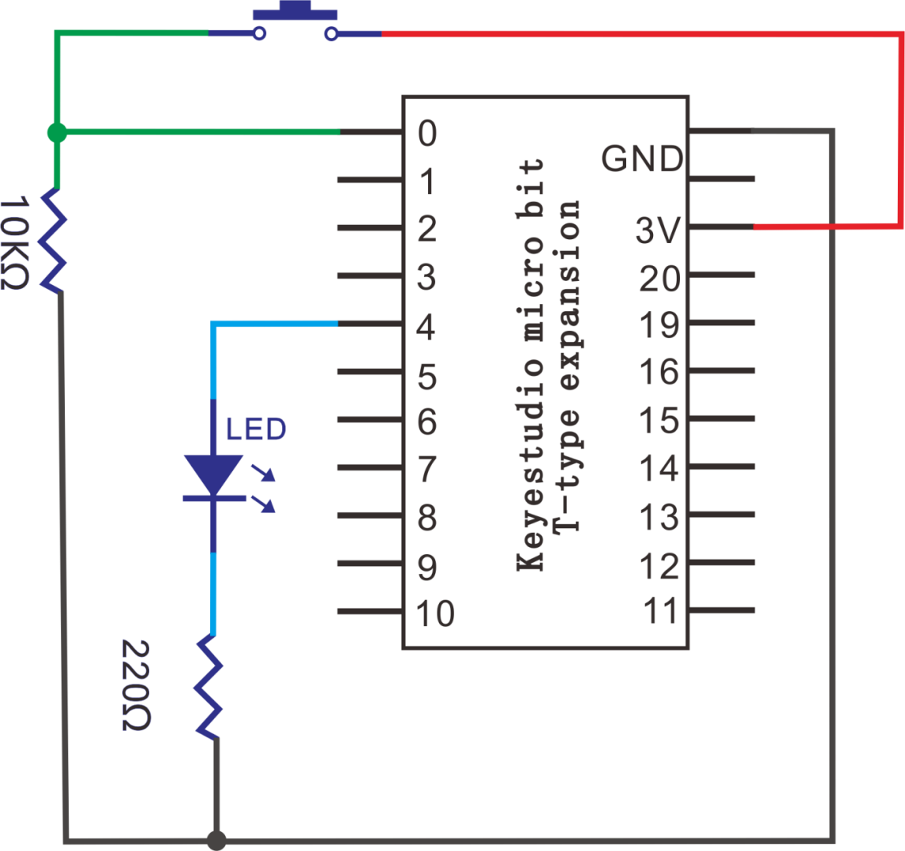

**4. Wiring Graph：**

5.  **Test Code：**

**Code 1：**

Wiring according to the above diagram. Button is connected to P0. Link computer with micro:bit board. Then enable the online programming tool to design the code.

A. Click“Basic”→“more”→“clear screen”;

B. Put it into the block“on start”.

\*\*\*\*\*\*\*\*\*\*\*\*\*\*\*\*\*\*\*\*\*\*\*\*\*\*\*\*\*\*\*\*\*\*\*\*\*\*\*\*\*\*\*\*\*\*\*\*\*\*\*\*\*\*\*\*\*\*\*\*\*\*\*\*

Drag“show number 0”from“Basic”and place it into“forever”block.

\*\*\*\*\*\*\*\*\*\*\*\*\*\*\*\*\*\*\*\*\*\*\*\*\*\*\*\*\*\*\*\*\*\*\*\*\*\*\*\*\*\*\*\*\*\*\*\*\*\*\*\*\*\*\*\*\*\*\*\*\*\*\*\*

Enter“Advanced”→“Pins”→“digital read pin P0 ”；B. Leave it into the 0 box.

Go to“Basic”to drag“pause (ms) 100”into“forever”, set to 100ms.

Click“Serial”under the“Advanced”block, and get“serial write value“x”=0”, leave it below the block“pause(ms)100”.

Change“x”into“digital signal”.

Copy“digital read pin P0”once and keep it into“0”box of “serial write value“x”=0”

Complete Program：

|  | “on start”: command block runs  once to start program. Clear screen   The program under the block “forever”  runs cyclically.  LED dot matrix shows the digital signal  read by P0（1/0） Delay in 100ms Serial write digital signal=digital signal  read by P0（1/0） |
| ----------------------------------------------- | ------------------------------------------------------------ |
|                                                 |                                                 |

Click“JavaScript", you will view the corresponding JavaScript code:

Then click drop-down triangle button and select“Python”to see the Python language code:

Wire up through the connection diagram, upload code, power on and open CoolTerm, click Options to select SerialPort. Set COM port and baud rate is 115200(the baud rate of USB serial communication of Micro:bit is 115200 through the test).

Click “OK” and “Connect”. When the button is pressed, button sends 1 and serial port and Micro:bit board display 1; when unpressed, the button sends 0, 0 are shown on serial port and Micro:bit board

**Code 2：**

Hook up according to the above connection diagram, red LED and button switch are connected to P4 and P0 respectively.

Link computer with micro:bit board. Then enable the online programming tool to design the code.

(1)) A. Click “Led”→”more”→“led enable false”,

B. Combine it with“on start”.

\*\*\*\*\*\*\*\*\*\*\*\*\*\*\*\*\*\*\*\*\*\*\*\*\*\*\*\*\*\*\*\*\*\*\*\*\*\*\*\*\*\*\*\*\*\*\*\*\*\*\*\*\*\*\*\*\*\*\*\*\*\*\*\*

(2) A. Enter “Variables”→“Make a Variable...”→“New variable name：”;

B. Then input“Push Counter”in the blank box and click “OK” to create variable“PushCounter”. In addition, both variables“State”and “Laststate” can be generated in same way.

C. Drag “set Laststate to 0”into“on start”and copy it twice. Respectively click drop-down triangle button to choose “PushCounter” and “State”. As shown below:

\*\*\*\*\*\*\*\*\*\*\*\*\*\*\*\*\*\*\*\*\*\*\*\*\*\*\*\*\*\*\*\*\*\*\*\*\*\*\*\*\*\*\*\*\*\*\*\*\*\*\*\*\*\*\*\*\*\*\*\*\*\*\*\*

(3) Click“Serial”under the block“Advanced”to drag“serial write value“x”=0” into “forever”. Then go to“Variables”to move “PushCounter” into 0 box.

\*\*\*\*\*\*\*\*\*\*\*\*\*\*\*\*\*\*\*\*\*\*\*\*\*\*\*\*\*\*\*\*\*\*\*\*\*\*\*\*\*\*\*\*\*\*\*\*\*\*\*\*\*\*\*\*\*\*\*\*\*\*\*\*

(4) A. Click“Variables”to move“set Laststate to 0”into “forever”.

B. Click the drop-down triangle button to select“State”;

C. Then enter“Advanced”→“Pins”→“digital read pin P0 ”

D. Place“digital read pin P0 ”into“0” box

\*\*\*\*\*\*\*\*\*\*\*\*\*\*\*\*\*\*\*\*\*\*\*\*\*\*\*\*\*\*\*\*\*\*\*\*\*\*\*\*\*\*\*\*\*\*\*\*\*\*\*\*\*\*\*\*\*\*\*\*\*\*\*\*

(5) A. Go to“Logic”→“if..true..then”block and“=”

B. Leave“if..true..then”beneath the“set..digital...pin P0” block . Then move out “=” into“true”box.

Click“Variables”to get“State”, then place it at the left “0” box. Then move out “Laststate” to right 0 box.

Then click the drop-down triangle button to set “≠”.

\*\*\*\*\*\*\*\*\*\*\*\*\*\*\*\*\*\*\*\*\*\*\*\*\*\*\*\*\*\*\*\*\*\*\*\*\*\*\*\*\*\*\*\*\*\*\*\*\*\*\*\*\*\*\*\*\*\*\*\*\*\*\*\*

Copy once and place it into“if State≠Laststate then”block, delete “Laststate”, change 0 into 1, click the drop-down triangle button to select “=”.

A. Replicate“set PushCounter to 0”once and put it into block“if State=1 then”block.

B. Then go to“Math”to drag out “+”

C. Click“Variables”to move out“PushCounter”to the left box 0 of “+”, and change right 0 into 1.

\*\*\*\*\*\*\*\*\*\*\*\*\*\*\*\*\*\*\*\*\*\*\*\*\*\*\*\*\*\*\*\*\*\*\*\*\*\*\*\*\*\*\*\*\*\*\*\*\*\*\*\*\*\*\*\*\*\*\*\*\*\*\*\*

A. Click“Basic”to drag out“pause (ms) 100”into“forever”;

B. Then copy“set Laststate to 0”once and leave it beneath the“pause (ms) 100”. Then drag out“State”to replace 0.

A. Go to“Logic”→“if..true...then...else”

B. Put it into“forever”. And move “=”block into“true”box.

(11) A. Click “Math”→“remainder of 0 ÷1”；

B. Leave it to the left 0 box.

C. Replicate the“PushCounter”once and remain it at the left 0 box of “÷”. Alter 1 into 2.

\*\*\*\*\*\*\*\*\*\*\*\*\*\*\*\*\*\*\*\*\*\*\*\*\*\*\*\*\*\*\*\*\*\*\*\*\*\*\*\*\*\*\*\*\*\*\*\*\*\*\*\*\*\*\*\*\*\*\*\*\*\*\*\*

Enter“Advanced”→“Pins”→ “digital write pin P0 to 0”, and place it below the block “if remainder...then”;

Red LED is connected to P4, therefore, click the drop-down triangle button to select P4.

Then copy“digital write pin P4 to 0”once and leave it beneath “else”block. Change 0 into 1.

Complete Program：

|   | “on start”: command block runs once  to start program. Turn off LED dot matrix Set “PushCounter”, “State” and “Laststate” to 0   The program under the block “forever”  runs cyclically.  The written value “x”=the value of PushCounter  Set State to digital signal (1/0) read by P0  When State≠Laststate,  the next program will be executed When State=1,  the next program will be executed Set PushCounter to PushCounter+1 Set variable “Laststate” to State  When the remainder of PushCounter  divided by 2 is equal to 0,  the the program under “remainder...then” will be executed. Set P4 to low level, Red LED goes off.  When the remainder of PushCounter  divided by 2 is not equal to 0,  the program under “else”will be executed. Set P4	to high level, Red LED lights up. |
| ------------------------------------------------------------ | ------------------------------------------------------------ |
|                                                 |                                                 |

Click“JavaScript", you will view the corresponding JavaScript code:

Then click the triangle button and select“Python”to see the Python language code：

**6. Test Results：**

Hook up, upload the code, plug in power and press the button. The external LED lights up, press the button again, the LED goes off, alternately.

**7. Extension Project：**

Press button, red LED gradually gets brighter.

### Project 25：PIR Motion Alarm

1.  **Description：**

In this lesson, we use the Keyestudio PIR motion sensor to detect if someone moves nearby. If it does, the signal terminal of sensor will output a high level 1, otherwise a low level 0 will be output. Pay attention that this sensor can only detect the human body in motion rather in static state. The detection distance is up to 3 meters.

In the project, we connect the Keyestudio PIR motion sensor to the Keyestudio Micro:bit T type shield through the breadboard to control the active buzzer.

2.  **Components List:**

|  |              |  |  |
| ------------------------ | ------------------------------------ | ------------------------ | ------------------------ |
| Micro:bit board*1        | keyestudio Micro:bit T Type Shield*1 | Active buzzer*1          | 2.4KΩResistor*1          |
|  |              |  |  |
| S8050 Triode*1           | Breadboard *1                        | Breadboard wire          | Dupont wire              |
|  |              |  |                          |
| AA Battery*6             | KeyestudioPIR motion sensor*1        | 6 AA battery holder*1    |                          |
|  |              |                          |                          |
| USB cable*1              | Specialized power module*1           |                          |                          |

3.  **Schematic Diagram：**

4.  **Wiring Graph**：

**(Note: the specialized power module should be connected to breadboard, and the DIP switch is dialed to +3V)**

**5. Test Code：**

**Code 1：**

Hook up according to the above graph. The S end of PIR motion sensor is connected to P1. Link computer with micro:bit board. Then enable the online programming tool to design the code.

(1) A. Go to “Basic”→“more”→“clear screen”;

B. Place it into “on start” block

(2) Enter“Basic”to move“show number 0”block into“forever”block.

\*\*\*\*\*\*\*\*\*\*\*\*\*\*\*\*\*\*\*\*\*\*\*\*\*\*\*\*\*\*\*\*\*\*\*\*\*\*\*\*\*\*\*\*\*\*\*\*\*\*\*\*\*\*\*\*\*\*\*\*\*\*\*\*

(3) A. Click “Advanced”→“Pins”→“digital read pin P0；

B. Drag it into 0 box, PIR motion sensor is attached to P1, so set to P1.

\*\*\*\*\*\*\*\*\*\*\*\*\*\*\*\*\*\*\*\*\*\*\*\*\*\*\*\*\*\*\*\*\*\*\*\*\*\*\*\*\*\*\*\*\*\*\*\*\*\*\*\*\*\*\*\*\*\*\*\*\*\*\*\*

(4) Click“Basic”to move“pause (ms) 100”block below “digital write...P2 to 1”block, set to 500ms.

\*\*\*\*\*\*\*\*\*\*\*\*\*\*\*\*\*\*\*\*\*\*\*\*\*\*\*\*\*\*\*\*\*\*\*\*\*\*\*\*\*\*\*\*\*\*\*\*\*\*\*\*\*\*\*\*\*\*\*\*\*\*\*\*

A. Enter“Advanced”→“Serial”→“serial write value “x”=0”；

B. Drag it into“forever”

C. Copy“digital read pin P1”and move it into 0 box

D. Change“X”into“digital signal”.

Complete Program：

|  | “on start”: command block runs  once to start program. Clear the screen  The program under the block  “forever” runs cyclically.  LED Dot matrix shows the digital  signal(1/0）read by P1.  Delay in 500ms  The digital signal serial writes=the digital  signal(1/0）read by P1. |
| ----------------------------------------------- | ------------------------------------------------------------ |
|                                                 |                                                 |

Click“JavaScript", you will view the corresponding JavaScript code:

Then click drop-down triangle button and select“Python”to see the Python language code

Hook up, upload code, power on and open CoolTerm, click Options to select SerialPort. Set COM port and baud rate(115200). Click“OK”and “Connect”

When the PIR motion sensor detects people around, serial monitor and Micro:bit board will show “1”; otherwise both of them display “0”

**Code 2：**

Hook up according to the above graph. The S end of PIR motion sensor is connected to P1 and active buzzer is linked with P2. Link computer with micro:bit board. Then enable the online programming tool to design the code.

A. Go to“Basic”→“more”→“clear screen”;

B. Place it into“on start”block

\*\*\*\*\*\*\*\*\*\*\*\*\*\*\*\*\*\*\*\*\*\*\*\*\*\*\*\*\*\*\*\*\*\*\*\*\*\*\*\*\*\*\*\*\*\*\*\*\*\*\*\*\*\*\*\*\*\*\*\*\*\*\*\*

A. Go to“Logic”→“if...true..then...else”.

B. Move it into“forever”

C. Drag out“=”block into“true”box

\*\*\*\*\*\*\*\*\*\*\*\*\*\*\*\*\*\*\*\*\*\*\*\*\*\*\*\*\*\*\*\*\*\*\*\*\*\*\*\*\*\*\*\*\*\*\*\*\*\*\*\*\*\*\*\*\*\*\*\*\*\*\*\*

A. Enter“Advanced”→“Pins”→“digital read pin P0”

B. Place it into left“0”box.

C. PIR motion sensor is connected to P1, so set to P1

D. Alter right 0 into 1.

\*\*\*\*\*\*\*\*\*\*\*\*\*\*\*\*\*\*\*\*\*\*\*\*\*\*\*\*\*\*\*\*\*\*\*\*\*\*\*\*\*\*\*\*\*\*\*\*\*\*\*\*\*\*\*\*\*\*\*\*\*\*\*\*

A. Enter“Advanced”→“Pins”→“digital write pin P0 to 0”

B. Place it below the“digital read pin...1..then”block

C. Active buzzer is connected to P2, so set to P2

D. Alter right 0 into 1.

\*\*\*\*\*\*\*\*\*\*\*\*\*\*\*\*\*\*\*\*\*\*\*\*\*\*\*\*\*\*\*\*\*\*\*\*\*\*\*\*\*\*\*\*\*\*\*\*\*\*\*\*\*\*\*\*\*\*\*\*\*\*\*\*

(5) Click“Basic”to move“show icon”below the block “digital write....P2..1”

\*\*\*\*\*\*\*\*\*\*\*\*\*\*\*\*\*\*\*\*\*\*\*\*\*\*\*\*\*\*\*\*\*\*\*\*\*\*\*\*\*\*\*\*\*\*\*\*\*\*\*\*\*\*\*\*\*\*\*\*\*\*\*\*

(6) A. Duplicate the code string once and move it below the“else”block.

B. Change 1 into 0. Click the drop-down triangle button to choose“”

Complete Program：

|  |
| ------------------------------------------------------------ |
| “on start”: command block runs once to start program.        |
| Clear the screen.                                            |
| The program under the block “forever” runs cyclically.       |
| When the digital signal read by P1 is 1, the program under “if digital read pin....then” will be executed. |
| Set P2 to high level(1), active buzzer emits sound.          |
| LED shows a heart pattern.                                   |
| When the digital signal read by P1 isn’t equal to 1, the program under “else” will be executed |
| Set P2 to low level(0), active buzzer doesn’t emit sound.    |
| Dot matrix shows“”. |

Click “JavaScript", you will view the corresponding JavaScript code:

Then click drop-down triangle button and select“Python”to see the Python language code：

**6. Test Results：**

Wire up, upload the code and power on. When PIR motion sensor detects people around, active buzzer will emit sound and Micro:bit will show pattern; otherwise, buzzer stops emitting sound and  appears on Micro:bit board.

7.  **Extension Project：**

When sensor detects people around, make Micro:bit cyclically shows the pattern and ; otherwise, the patterwill be displayed.

### Project 26： Flame Alarm

1.  **Description：**

There is inevitable accident in our life, like fire disaster. What should we do to avoid this grave incident?

The flame sensor can tackle this problem.

As it fairly sensitive to flame, flame sensor (IR receiving triode) is generally applied to search for fire sources. It utilizes specific infrared receive tube to detect flame, and then converts the brightness into changed level signal.

Therefore, when detecting the fire nearby, it will alarm to remind people to put out the fire in time. Moreover, it can control the fire extinguisher to quell the fire automatically as well when connected to fire annihilator.

Note: Flame sensor (IR receiver Triode) can detect flames or light sources with a wavelength in the range of 760nm to 1100 nm, and its detection angle is about 60 degrees.

**2. Components List:**

|               |              |  |               |
| ------------------------------------- | ------------------------------------ | ------------------------ | ------------------------------------- |
| Micro:bit motherboard*1               | keyestudio Micro:bit T Type Shield*1 | Passive Buzzer*1         | Flame sensor（IR receiving triode）*1 |
|               |              |  |               |
| S8050 Triode*1                        | Breadboard*1                         | Breadboard wire          | Red LED*1                             |
|               |              |  |               |
| Breadboard Specialized power module*1 | 6 AA Battery Holder*1                | Micro USB cable*1        | AA Battery Holder*6                   |
|               |              |  |               |
| 2.4KΩResistor*1                       | 220ΩResistor*1                       | 51ΩResistor*1            | 10KΩ Resistor*1                       |

**3. Schematic Diagram: **

**(Special note: both ends of breadboard specialized power module must be inserted into breadboard, and dial the DIP switch to +3V on power module )**

**4. Wiring Graph：**

 **(Special note: both ends of breadboard specialized power module must be inserted into breadboard, and dial the DIP switch to +3V on power module )**

**5. Test Code：**

**Code 1：**

Wire up according to the above diagram, flame sensor is connected to P2. Link computer with micro:bit board. Then enable the online programming tool to design the code.

A. Go to “Basic”→“more”→“clear screen”;

B. Place it into “on start” block

\*\*\*\*\*\*\*\*\*\*\*\*\*\*\*\*\*\*\*\*\*\*\*\*\*\*\*\*\*\*\*\*\*\*\*\*\*\*\*\*\*\*\*\*\*\*\*\*\*\*\*\*\*\*\*\*\*\*\*\*\*\*\*\*

Enter“Basic”to move“show number 0”block into“forever”block.

\*\*\*\*\*\*\*\*\*\*\*\*\*\*\*\*\*\*\*\*\*\*\*\*\*\*\*\*\*\*\*\*\*\*\*\*\*\*\*\*\*\*\*\*\*\*\*\*\*\*\*\*\*\*\*\*\*\*\*\*\*\*\*\*

A. Click “Advanced”→“Pins”→“digital read pin P0；

B. Drag it into“0” box. Flame sensor is attached to P2, so set to P2.

Click“Basic”to move“pause (ms) 100”block below “digital read...P2”block, set to 500ms.

\*\*\*\*\*\*\*\*\*\*\*\*\*\*\*\*\*\*\*\*\*\*\*\*\*\*\*\*\*\*\*\*\*\*\*\*\*\*\*\*\*\*\*\*\*\*\*\*\*\*\*\*\*\*\*\*\*\*\*\*\*\*\*\*

A. Enter“Advanced”→“Serial”→“serial write value “x”=0”；

B. Drag it into“forever”

C. Copy“digital read pin P2”and move it into 0 box

D. Change “X”into“digital signal”.

Complete Program：

|  | “on start”: command block runs  once to start program. Clear screen  Under the block“forever”， program runs cyclically.  LED Dot matrix shows the digital  signal(1/0）read by P2.  Delay in 500ms The digital signal serial writes=the  digital signal(1/0）read by P2. |
| ----------------------------------------------- | ------------------------------------------------------------ |
|                                                 |                                                 |

Click“JavaScript", you will view the corresponding JavaScript code:

Then click drop-down triangle button and select“Python”to see the Python language code:

Hook up, upload code, power on and open CoolTerm, click Options to select SerialPort. Set COM port and baud rate to 115200 (the baud rate of USB serial communication of Micro:bit is 115200 through the test). 

Click“OK”and “Connect”

When the flame sensor detects the flame, serial monitor and Micro:bit board will show “1”; otherwise both of them display “0”

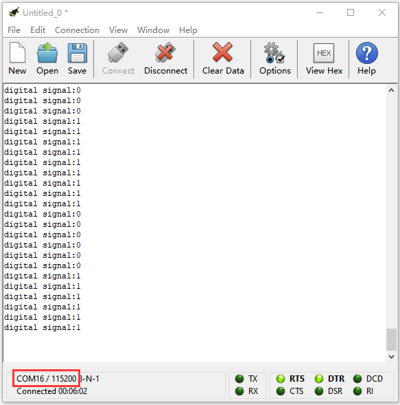

**Code 2：**

Hook up according to the above connection diagram, passive buzzer is linked with P0, red LED is connected to P1 and flame sensor is linked with P2. Link computer with micro:bit board. Then enable the online programming tool to design the code.

A. Go to “Basic”→“more”→“clear screen”;

B. Place it into “on start” block

\*\*\*\*\*\*\*\*\*\*\*\*\*\*\*\*\*\*\*\*\*\*\*\*\*\*\*\*\*\*\*\*\*\*\*\*\*\*\*\*\*\*\*\*\*\*\*\*\*\*\*\*\*\*\*\*\*\*\*\*\*\*\*\*

A. Go to“Logic”→“if...true..then...else”.

B. Move it into“forever”

C. Drag out“=”block into“true”box

\*\*\*\*\*\*\*\*\*\*\*\*\*\*\*\*\*\*\*\*\*\*\*\*\*\*\*\*\*\*\*\*\*\*\*\*\*\*\*\*\*\*\*\*\*\*\*\*\*\*\*\*\*\*\*\*\*\*\*\*\*\*\*\*

A. Enter“Advanced”→“Pins”→“digital read pin P0”

B. Place it into left o box

C. Flame sensor is connected to P2, so set to P2

D. Alter right 0 into 1.

\*\*\*\*\*\*\*\*\*\*\*\*\*\*\*\*\*\*\*\*\*\*\*\*\*\*\*\*\*\*\*\*\*\*\*\*\*\*\*\*\*\*\*\*\*\*\*\*\*\*\*\*\*\*\*\*\*\*\*\*\*\*\*\*

Click“Basic”to move“show icon”below the block “digital read P2..1...then”; then click the triangle button to select“”pattern

A. Enter“Music”→“play tone Middle C for 1 beat”

B. Place it beneath the“show icon” block

C. Separately click “Middle C”and“1 beat”to set“High C”and “1/4”

\*\*\*\*\*\*\*\*\*\*\*\*\*\*\*\*\*\*\*\*\*\*\*\*\*\*\*\*\*\*\*\*\*\*\*\*\*\*\*\*\*\*\*\*\*\*\*\*\*\*\*\*\*\*\*\*\*\*\*\*\*\*\*\*

A. Enter“Advanced”→“Pins”→“digital read pin P0 to 0”

B. Place it under the block“if digital read pin P2=1 then”

C. Red LED is connected to P1, so set to P1

D. Alter right 0 into 1.

Click“Basic”to move“pause (ms) 100”block below the“digital write...P1 to 1”block

\*\*\*\*\*\*\*\*\*\*\*\*\*\*\*\*\*\*\*\*\*\*\*\*\*\*\*\*\*\*\*\*\*\*\*\*\*\*\*\*\*\*\*\*\*\*\*\*\*\*\*\*\*\*\*\*\*\*\*\*\*\*\*\*

Duplicate code string once and place it beneath “pause(ms)100”block, then change 1 into 0.

Replicate code“digital write pin P1 to 0”twice and leave them below the “else”block.

Passive buzzer is linked with P0, so set to P0.

Click“Basic”to move“show icon”below“digital write pin P1 to 0”block.

Then click the triangle button to set“”.

Complete Program：

|  | “on start”: command block runs once to start program.  Clear screen   The program under the block “forever” runs cyclically.  When the digital signal read by P2 is 1,  the program under “if digital...then”will be executed. Dot matrix shows “ ” Play tone high c for 1/4 beatSet P1 to high level(1),  red LED lights up Set P1 to low level(0), red LED goes off  When the digital signal read by P2 isn’t 1,  the program under “else” will be executed. Set P0 to low level(0), passive buzzer doesn’t emit sound Set P1 to low level(0), red LED goes off Dot matrix shows“” |
| ----------------------------------------------- | ------------------------------------------------------------ |
|                                                 |                                                 |

Click“JavaScript", you will view the corresponding JavaScript code:

Then click drop-down triangle button to select “Python”to see the Python language code:

**6. Test Results：**

When the flame is detected, Micro:bit board displays , passive buzzer rings and red LED flashes simultaneously; otherwise,  appears, passive buzzer and red LED don’t response.

### Project 27：Seesaw Movement

1.  **Description：**

There are 2 tilt switches which adopt SW-200D vibration component in this kit.

The SW-200D vibration switch element adopted on this module is the ball type tilt induction unidirectional trigger switch, one end of which is gold-plated(trigger end), another one is silver-plated (conductive end). 

When the module is in the horizontal position or inclined to the conductive end (silver-plated), the switch element is in OFF state and the signal end outputs the high level; when the module is tilted to the trigger terminal (gold-plated), the switch element is ON state, and the signal terminal outputs the low level.

In the project, we connect tilt switch, breadboard and Micro:bit T type shield together. By reading the result on the serial monitor, we observe the two LED brightness.

**2. Components List:**

|              |  |  |  |  |
| ------------------------------------ | ------------------------ | ------------------------ | ------------------------ | ------------------------ |
| Micro:bit Main Board*1               | Breadboard*1             | Red LED*2                | Tilt Switch*2            | 10KΩResistor*2           |
|              |  |  |  |                          |
| Keyestudio Micro:bit T Type Shield*1 | Breadboard Wire          | 220ΩResistor*2           | Micro USB Cable*1        |                          |

**3. Schematic Diagram：**

**4. Wiring Graph：**

**5. Test Code：**

**Code 1：**

Hook up according to the above connection diagram, the two tilt switches are attached to P6 and P0.

Link computer with micro:bit board. Then enable the online programming tool to design the code.

Click “Led”→”more”→“led enable false”；

Combine it with “on start”.

\*\*\*\*\*\*\*\*\*\*\*\*\*\*\*\*\*\*\*\*\*\*\*\*\*\*\*\*\*\*\*\*\*\*\*\*\*\*\*\*\*\*\*\*\*\*\*\*\*\*\*\*\*\*\*\*\*\*\*\*\*\*\*\*

Click “Advanced” to go to “Serial”, and drag“serial write value “x”=0”into “forever”.

Enter “Advanced”→“Pins”→“digital read pin P0”

Keep it into 0 box.

The tilt switch is attached to P6, therefore, set to P6. And change“x”into“digital signal”.

\*\*\*\*\*\*\*\*\*\*\*\*\*\*\*\*\*\*\*\*\*\*\*\*\*\*\*\*\*\*\*\*\*\*\*\*\*\*\*\*\*\*\*\*\*\*\*\*\*\*\*\*\*\*\*\*\*\*\*\*\*\*\*\*

Click “Basic”to drag out“pause (ms) 100”, then leave it below “serial write.......P6”block. And set to 300ms.

Complete Program：

|  | “on start”: command block runs  once to start program. Turn off LED dot matrix  The program under the block  “forever” runs cyclically.  digital signal that serial writes equals  to the digital signal read by P6（1/0） Delay in 300ms |
| ----------------------------------------------- | ------------------------------------------------------------ |
|                                                 |                                                 |

Click“JavaScript", you will view the corresponding JavaScript code:

Then click drop-down triangle button to select “Python”to see the Python language code:

Hook up, upload code, power on and open CoolTerm, click Options to select SerialPort. Set COM port and baud rate to115200(the baud rate of USB serial communication of Micro:bit is 115200 through the test). Click“OK”and “Connect”.

When the tilt switch is inclined to the transmitting end, serial monitor will show “1”; when it tends to conductive end or in horizontal, the serial monitor will display “0”. As shown below:

**Code 2：**

Hook up according to the above connection diagram, the two tilt switches are attached to P6 and P0 and 2 LEDs are linked with P2 and P4.

Link computer with micro:bit board. Then enable the online programming tool to design the code.

1.  Click “Led”→”more”→“led enable false”; combine it with “on start”.

\*\*\*\*\*\*\*\*\*\*\*\*\*\*\*\*\*\*\*\*\*\*\*\*\*\*\*\*\*\*\*\*\*\*\*\*\*\*\*\*\*\*\*\*\*\*\*\*\*\*\*\*\*\*\*\*\*\*\*\*\*\*\*\*

2.  A. Click“logic”and move out “=”and“if.true..then”.

B. Lay down“if..true...then” into “forever”.

C. Then drag the“and”block into“true”box.

D. Copy “=”twice and leave them to the left and right boxes of “and”block.

\*\*\*\*\*\*\*\*\*\*\*\*\*\*\*\*\*\*\*\*\*\*\*\*\*\*\*\*\*\*\*\*\*\*\*\*\*\*\*\*\*\*\*\*\*\*\*\*\*\*\*\*\*\*\*\*\*\*\*\*\*\*\*\*

(3)

1.  Go to“Advanced”→“Pins”→“digital read pin P0”

2.  Place it at the first “0”box.

3.  The tilt switch is connected to P6, so set to P6.

4.  Change the second “0” into 1.

\*\*\*\*\*\*\*\*\*\*\*\*\*\*\*\*\*\*\*\*\*\*\*\*\*\*\*\*\*\*\*\*\*\*\*\*\*\*\*\*\*\*\*\*\*\*\*\*\*\*\*\*\*\*\*\*\*\*\*\*\*\*\*\*

(4)

1.  Click “Variables”→“Make a Variable...”→“New variable name：”.

2.  Enter“brightness1”in the blank box and click“OK”. Then the
    variable“brightness1”is generated.

3.  Move“brightness1”to the third“0”box. Click the button at the second “=”block to set“≠”.
    
4.  Finally, change 0 into 1023.

\*\*\*\*\*\*\*\*\*\*\*\*\*\*\*\*\*\*\*\*\*\*\*\*\*\*\*\*\*\*\*\*\*\*\*\*\*\*\*\*\*\*\*\*\*\*\*\*\*\*\*\*\*\*\*\*\*\*\*\*\*\*\*\*

(5) Go to“Variables”to get“set brightness1 to 0”, place it beneath the block“if digital read pin P6=1.......1023”

\*\*\*\*\*\*\*\*\*\*\*\*\*\*\*\*\*\*\*\*\*\*\*\*\*\*\*\*\*\*\*\*\*\*\*\*\*\*\*\*\*\*\*\*\*\*\*\*\*\*\*\*\*\*\*\*\*\*\*\*\*\*\*\*

(6) Click“Math”to move“+”block into 0 box.

Enter“Variables”to find out“brightness1”, then lay down it to the left“0”box and change right“0” into 1. 

\*\*\*\*\*\*\*\*\*\*\*\*\*\*\*\*\*\*\*\*\*\*\*\*\*\*\*\*\*\*\*\*\*\*\*\*\*\*\*\*\*\*\*\*\*\*\*\*\*\*\*\*\*\*\*\*\*\*\*\*\*\*\*\*

(7)

1.  Enter “Advanced” →“Pins”→“analog write pin P0 to 1023”；

2.  Keep it below the block“set brightness....1”

3.  Red LED is linked with P4, so set to P4

4.  Copy the“brightness1”once and drag it into 1023 box.
    

\*\*\*\*\*\*\*\*\*\*\*\*\*\*\*\*\*\*\*\*\*\*\*\*\*\*\*\*\*\*\*\*\*\*\*\*\*\*\*\*\*\*\*\*\*\*\*\*\*\*\*\*\*\*\*\*\*\*\*\*\*\*\*\*
(8)

1.  Click“Advanced”to enter“Control”and drag“wait (us) 4”beneath the block “analog..... to brightness 1”
    
2.  Change 4 into 10.

(9) Duplicate the code string once and put it into“forever”, and change“digital read pin6 1”into “digital read pin6 0”and 1023 into 0. Then set to .

\*\*\*\*\*\*\*\*\*\*\*\*\*\*\*\*\*\*\*\*\*\*\*\*\*\*\*\*\*\*\*\*\*\*\*\*\*\*\*\*\*\*\*\*\*\*\*\*\*\*\*\*\*\*\*\*\*\*\*\*\*\*\*\*

(10)

And let’s create the variable“brightness2”in same way.
Replicate the code string:  once and place it into “forever”block.

The tilt switch is attached to P0, and the red LED is linked with P2.

Set to“digital read pin P0=1”and “analog write pin P2”, change “brightness1” into “brightness2”.

\*\*\*\*\*\*\*\*\*\*\*\*\*\*\*\*\*\*\*\*\*\*\*\*\*\*\*\*\*\*\*\*\*\*\*\*\*\*\*\*\*\*\*\*\*\*\*\*\*\*\*\*\*\*\*\*\*\*\*\*\*\*\*\*

(11) Duplicate code string  once and keep it into“forever”. Change 0 into 1023.

Set to“digital read pin P0=0” and“set brightness2 to brightness+1”

Complete Program：

|  |
| ------------------------------------------------------------ |
| **“on start”: command block runs once to start program.**    |
| Turn off LED dot matrix                                      |
| **The program under the block“forever”runs cyclically.**     |
| When the digital signal read by P6 is 1 and brightness1 isn’t equal to 1023.  The program under“if..1..and.1023..then”block will be executed. |
| Set variable brightness1 to brightness1+1                    |
| Set the analog value of P4 to brightness1                    |
| Delay in 10us                                                |
| When the digital signal read by P6 is 0 and brightness1 isn’t equal to 0.  The program under “if..0..and.0..then”block will be executed. |
| Set variable brightness1 to brightness1-1                    |
| Set the analog value of P4 to brightness1                    |
| When the digital signal read by P0 is 1 and brightness2 isn’t equal to 0.  The program under“if..1..and.0..then”block will be executed. |
| Set variable brightness2 to brightness2-1                    |
| Set the analog value of P2 to brightness2                    |
| Delay in 10us                                                |
| When the digital signal read by P0 is 0 and brightness2 isn’t equal to 1023.  The program under“if..1..and.1023..then”block will be executed. |
| Set variable brightness2 to brightness2+1                    |
| Set the analog value of P2 to brightness2                    |
| Delay in 10us                                                |

Click“JavaScript", you will view the corresponding JavaScript code:

Then click drop-down triangle button to select“Python”to see the Python language code:

**6. Test Results：**

Hook up, upload the code and plug in power. When two tilt switches are inclined to one side, one LED gets dim gradually, another one get bright instead. And finally, one LED is off, and another one is brightest

**7. Extension Project：**

Two tilt switches control 2 LEDs. When they aren’t inclined. A LED lights up, and another one goes off. On the contrary, the LED that lights up will go off, and another one will be on.

### Project 28：Night Lamp

1.  **Description：**

In our daily life, we find that many lamps in the public automatically light up at night, and go off during the day.

Are these lights controlled by someone? In fact, they are are equipped with a photosensitive element, which can detect the brightness of the ambient light.

The photocell sensor (photoresistor) is a resistor made by the photoelectric effect of a semiconductor. It is very sensitive to ambient light, thus its resistance value vary with different light intensity.

We use its features to design a circuit and generate a photoresistor sensor module. The signal end of the module is connected to the analog port of the microcontroller. When the light intensity increases, the resistance decreases, and the voltage of the analog port rises, that is, the analog value of the microcontroller also goes up. Otherwise, when the light intensity decreases, the
resistance increases, and the voltage of the analog port declines. That is, the analog value of the microcontroller becomes smaller. Therefore, we can use the photoresistor sensor module to read the corresponding analog value and sense the light intensity in the environment.

It is widely applied to various light-controlled circuits, such as the control and adjustment of lights, as it is generally used for light measurement, light control and photoelectric conversion.

We connect photoresistor, keyestudio Micro:bit T Type shield and Breadboard together. The test results will be displayed on serial monitor or dot matrix.

2.  **Components List:**

|              |  |  |  |  |
| ------------------------------------ | ------------------------ | ------------------------ | ------------------------ | ------------------------ |
| Micro:bit motherboard*1              | Photoresistor*1          | Red LED*1                | 220ΩResistor*1           | 10KΩResistor*1           |
|              |  |  |  |                          |
| keyestudio Micro:bit T Type Shield*1 | Breadboard wire          | Micro USB cable*1        | Breadboard*1             |                          |

**3. Schematic Diagram：**

**4. Wiring Graph：**

5.  **Test Code：**

As we know, there are digital and analog ports in Arduino.

For Micro:bit board, there are some pins for reading analog vale. As shown below:

We measure the analog value of P2 by photoresistor, then change the ambient light intensity, the analog value is shown on serial monitor(CoolTerm). The LED brightness is controlled by photoresistor.

**Code 1：**

Hook up according to the above connection diagram, photoresistor is connected to P2. Link computer with micro:bit board. Then enable the online programming tool to design the code.

Click“Led”→“more”，and find out“led enable false”, then put it in the block“on start”

\*\*\*\*\*\*\*\*\*\*\*\*\*\*\*\*\*\*\*\*\*\*\*\*\*\*\*\*\*\*\*\*\*\*\*\*\*\*\*\*\*\*\*\*\*\*\*\*\*\*\*\*\*\*\*\*\*\*\*\*\*\*\*\*

Enter “Advanced”→“Serial”→“serial write value “x”=0”.

Move it into“forever”

\*\*\*\*\*\*\*\*\*\*\*\*\*\*\*\*\*\*\*\*\*\*\*\*\*\*\*\*\*\*\*\*\*\*\*\*\*\*\*\*\*\*\*\*\*\*\*\*\*\*\*\*\*\*\*\*\*\*\*\*\*\*\*\*

A. Click“Advanced”→“Pins”→“analog read pin P0”

B. Place it at the “0”box

C. The photoresistor is lined with P2, therefore, set to P2

D. The left “x” is changed into“analog signal”.

\*\*\*\*\*\*\*\*\*\*\*\*\*\*\*\*\*\*\*\*\*\*\*\*\*\*\*\*\*\*\*\*\*\*\*\*\*\*\*\*\*\*\*\*\*\*\*\*\*\*\*\*\*\*\*\*\*\*\*\*\*\*\*\*

A. Go to “Basic”→“pause (ms) 100”

B. Lay down it into“forever”, set to 200ms.

Complete Program：

|  | “on start”: command block runs once  to start program. Turn off LED dot matrix  forever: The program runs cyclically.  The analog signal that serial writes is  equivalent to the analog signal read  by P2.  Delay in 200ms |
| ----------------------------------------------- | ------------------------------------------------------------ |
|                                                 |                                                 |

Click“JavaScript", you will view the corresponding JavaScript code:

Then click drop-down triangle button and select“Python”to see the Python language code:

Hook up, upload code, power on and open CoolTerm, click Options to select SerialPort. Set COM port and baud rate is 115200(the baud rate of USB serial communication of Micro:bit is 115200 through the test). Click“OK”and “Connect”.

Serial monitor shows the corresponding value. The analog value increase gradually as the ambient light intensity gets weak slowly; otherwise, the analog value reduces bit by bit. As shown below:

**Code 2:**

Note: You could set the analog value through the test result.

Connect photoresistor to P2, red LED to P4. Link computer with Micro:bit board. Then enable the online programming tool to design the code.

（1）A. Click“Led”→“more”，and find out“led enable false”

B. Put it in the block“on start”

\*\*\*\*\*\*\*\*\*\*\*\*\*\*\*\*\*\*\*\*\*\*\*\*\*\*\*\*\*\*\*\*\*\*\*\*\*\*\*\*\*\*\*\*\*\*\*\*\*\*\*\*\*\*\*\*\*\*\*\*\*\*\*\*

(2)A. Enter“Logic”→“if...true...then...else”.

B. Move it into“forever”and drag “=”into“true”box

\*\*\*\*\*\*\*\*\*\*\*\*\*\*\*\*\*\*\*\*\*\*\*\*\*\*\*\*\*\*\*\*\*\*\*\*\*\*\*\*\*\*\*\*\*\*\*\*\*\*\*\*\*\*\*\*\*\*\*\*\*\*\*\*

(3) A. Go to“Advanced”→“Pins”→“analog read pin P0”，

B. Put it into the left “0”box

C. The photoresistor is attached to P2, then set to P2.

D. Click the drop-down triangle button of “=” to select “\>”, alter 0 into 400.

\*\*\*\*\*\*\*\*\*\*\*\*\*\*\*\*\*\*\*\*\*\*\*\*\*\*\*\*\*\*\*\*\*\*\*\*\*\*\*\*\*\*\*\*\*\*\*\*\*\*\*\*\*\*\*\*\*\*\*\*\*\*\*\*

A. Go to“Advanced”→“Pins”→“digital write pin P0 to 0”

B. Leave it beneath“analog .....P2\>400 then”block.

C. The red LED is attached to P4, then set to P4 and revise 0 into 1.

\*\*\*\*\*\*\*\*\*\*\*\*\*\*\*\*\*\*\*\*\*\*\*\*\*\*\*\*\*\*\*\*\*\*\*\*\*\*\*\*\*\*\*\*\*\*\*\*\*\*\*\*\*\*\*\*\*\*\*\*\*\*\*\*

(5) Duplicate“digital write pin P4 to 1”once, then keep it beneath “else” block. Change 0 into 1.

Complete Program：

|  | “on start”: command block runs once to start program. Turn off LED dot matrix   The program under the block “forever” runs cyclically.  When the signal read by P2 is greater than 400,  the next program will be executed. Set P4 to high level to turn on LED  When “the signal read by P2 is greater than 400” is not met,  the program below the else will be executed. Set P4 to low level to turn off red LED |
| ----------------------------------------------- | ------------------------------------------------------------ |
|                                                 |                                                 |

Click“JavaScript", you will view the corresponding JavaScript code:

Then click drop-down triangle button and select“Python”to see the Python language code：

6.  **Test Results：**

Hook up via connection diagram, upload the program and power on. When the ambient light intensity gets weak, the photoresistor’s input value is greater than or equal to 400, LED will be on; on the contrary, LED will go off.

7.  **Extension Project：**

Connect one more passive buzzer at P0. When the detected analog value of the light intensity is greater than 400, the LED light is on and the passive buzzer plays "1 (Do), 2 (Re ), 3(Mi), 4(Fa), 5(Sol), 6(La), 7(Si)”; when the analog value is greater than 100 and less than or equal to 400, the LED flashes and passive buzzer doesn’t work instead; when the analog value is greater than or equal to 100, the LED light and the passive buzzer don’t work.

### Project 29：DIY Voice-controlled Light

1.  **Description：**

The sound sensor mainly adopts a high-sensitivity microphone element and LM386 chip. High-sensitivity microphone components are used to detect external sounds. The LM386 chip can amplify the sound detected by the high-sensitivity microphone, and the maximum multiple is 200 times.

When in use, we can adjust the multiple of the sound by rotating the potentiometer on the sensor. When adjusting the potentiometer clockwise to the end, the magnification is maximized.

Therefore, it can be used to make voice-activated robots, switches and alarms, etc.

In this project, we connect the signal of the sound sensor to P0 of the Micro:bit board, and detect the magnitude of the external sound by reading the analog value of the P0 terminal. During the detection, the louder the external sound, the greater the analog value; the smaller the external sound, the smaller the analog value.

Simultaneously, we will display the measured analog value on the serial monitor and control LED brightness.

**2. Components List:**

|  |              |    |  |  |
| ------------------------ | ------------------------------------ | -------------------------- | ------------------------ | ------------------------ |
| Micro:bit motherboard*1  | keyestudio Micro:bit T Type Shield*1 | keyestudio  sound sensor*1 | Red LED*1                | 220ΩResistor*1           |
|  |              |    |  |                          |
| Breadboard*1             | Breadboard wire                      | Micro USB cable*1          | Breadboard wire          |                          |

**3. Schematic Diagram:**

**4. Wiring Graph：**

**5. Test Code：**

**Code 1：**

Hook up according to the above connection diagram, the S end of sound sensor is attached to P0. Link computer with micro:bit board. Then enable the online programming tool to design the code.

Click“Led”→“more”，and find out“led enable false”.

Put it in the block“on start”

\*\*\*\*\*\*\*\*\*\*\*\*\*\*\*\*\*\*\*\*\*\*\*\*\*\*\*\*\*\*\*\*\*\*\*\*\*\*\*\*\*\*\*\*\*\*\*\*\*\*\*\*\*\*\*\*\*\*\*\*\*\*\*\*

A. Enter “Advanced”→“Serial”→“serial write value “x”=0”.

B. Move it into“forever”

.

\*\*\*\*\*\*\*\*\*\*\*\*\*\*\*\*\*\*\*\*\*\*\*\*\*\*\*\*\*\*\*\*\*\*\*\*\*\*\*\*\*\*\*\*\*\*\*\*\*\*\*\*\*\*\*\*\*\*\*\*\*\*\*\*

A. Enter“Advanced”→“Pins”→“analog read pin P0”.

B. Place it at the “0”box

C. Change“x”into“Sound analog value”

\*\*\*\*\*\*\*\*\*\*\*\*\*\*\*\*\*\*\*\*\*\*\*\*\*\*\*\*\*\*\*\*\*\*\*\*\*\*\*\*\*\*\*\*\*\*\*\*\*\*\*\*\*\*\*\*\*\*\*\*\*\*\*\*

(3) A. Go to“Basic”→“pause (ms) 100”

B. Lay down it into“forever”block.

Complete Program：

|  | “on start”: command block runs  once to start program. Turn off LED dot matrix   Forever: The program runs cyclically.  The Sound analog value that serial  writes equals to the analog signal  read by P0. Delay in 100ms |
| ----------------------------------------------- | ------------------------------------------------------------ |
|                                                 |                                                 |

Click “JavaScript", you will view the corresponding JavaScript code:

Then click drop-down triangle button and select“Python”to see the Python language code:

Wire up, upload the program, power on and open CoolTerm, click Options to select SerialPort. Set COM port and baud rate is 115200 (the baud rate of USB serial communication of Micro:bit is 115200 through the test). Click“OK”and“Connect”.

Change the ambient sound intensity and the displayed result will be on the serial monitor, as shown below:

**Code 2:**

Note: You could set the analog value through the test result.

Connect sound sensor to P0, red LED to P2. Link computer with Micro:bit board. Then enable the online programming tool to design the code.

Click“Led”→“more”，and find out“led enable false”

Put it in the block“on start”

\*\*\*\*\*\*\*\*\*\*\*\*\*\*\*\*\*\*\*\*\*\*\*\*\*\*\*\*\*\*\*\*\*\*\*\*\*\*\*\*\*\*\*\*\*\*\*\*\*\*\*\*\*\*\*\*\*\*\*\*\*\*\*\*

Enter“Logic”→“if...true...then...else”.

Move it into“forever”and drag “=”into“true”box

\*\*\*\*\*\*\*\*\*\*\*\*\*\*\*\*\*\*\*\*\*\*\*\*\*\*\*\*\*\*\*\*\*\*\*\*\*\*\*\*\*\*\*\*\*\*\*\*\*\*\*\*\*\*\*\*\*\*\*\*\*\*\*\*

Go to“Advanced”→“Pins”→“analog read pin P0”，

Put it into the left“0”box

Click the drop-down triangle button of “=” to select “\>”, alter 0 into 100

\*\*\*\*\*\*\*\*\*\*\*\*\*\*\*\*\*\*\*\*\*\*\*\*\*\*\*\*\*\*\*\*\*\*\*\*\*\*\*\*\*\*\*\*\*\*\*\*\*\*\*\*\*\*\*\*\*\*\*\*\*\*\*\*

Go to“Advanced”→“Pins”→“digital write pin P0 to 0”，

Leave it beneath“analog.... P0\>100 then” block.

The red LED is attached to P2, then set to P2 and revise 0 into 1.

Go to “Basic”→“pause (ms) 100”

Lay down it beneath “digital write P2 to 1”, set to 1000ms.

\*\*\*\*\*\*\*\*\*\*\*\*\*\*\*\*\*\*\*\*\*\*\*\*\*\*\*\*\*\*\*\*\*\*\*\*\*\*\*\*\*\*\*\*\*\*\*\*\*\*\*\*\*\*\*\*\*\*\*\*\*\*\*\*

Replicate“digital write pin P2 to 1” once and leave it beneath “else”block, change 1 into 0.

Complete Program：

|  | “on start”: command block runs once to start program. Turn off LED dot matrix  The program under the block “forever” runs cyclically.  When the analog signal read by P0 is greater than 100,  the program under “if...P0..100..then” will be executed. Set P2 to high level(1), LED is on. Delay in 1000ms  When the analog signal read by P0 is not greater than 100,  the program under the “else” block will be executed.  Set P2 to low level(0), red LED will go off |
| ----------------------------------------------- | ------------------------------------------------------------ |
|                                                 |                                                 |

Click“JavaScript", you will view the corresponding JavaScript code:

Then click drop-down triangle button and select“Python”to see the Python language code:

**6. Test Results：**

Hook up, upload the program and plug in power. When the analog value of sound intensity is greater than 100. LED will be on 1s; otherwise, LED will go off.

**7. Extension Project：**

When the analog value of sound intensity is greater than 150,LED will light up for 5s and Micro:bit board shows；Otherwise，LED will go off and pattern  will appear on Micro:bit board.

### Project 30： Dim Lamp

1.  **Description：**

When we do the experiment, we often use the adjustable potentiometer which is equivalent to a 10K adjustable resistor. Rotating the potentiometer essentially changes its resistor value. Then the change of resistor value is converted into the change of voltage.

We connect the signal terminal of the adjustable potentiometer to P0 of the Micro:bit board. By reading the analog value of the P0 terminal and rotating the potentiometer, the measured analog value is displayed on the CoolTerm serial monitor.  

Next, we control the LED brightness by the potentiometer. When designing the code, we need to set up. The range of the analog value is 0-1023; the brightness of the LED is in the range of 0-255. In addition, we need to use the mapping function to map the values in the 0-1023 to 0-255.

After setting well, we can control the brightness of the LED by rotating the potentiometer.

2.  **Components List:**

|  |              |    |  |
| ------------------------ | ------------------------------------ | -------------------------- | ------------------------ |
| Micro:bit motherboard*1  | keyestudio Micro:bit T Type Shield*1 | Adjustable potentiometer*1 | Red LED*1                |
|  |              |    |  |
| 220ΩResistor*1           | Breadboard*1                         | Breadboard wire            | Micro USB cable*1        |

3.  **Schematic Diagram：**

4.  **Wiring Graph：**

**5. Test Code：**

**Code 1：**

Link adjustable potentiometer with P0, connect computer to Micro:bit board. Then enable the online programming tool to design the code.

(1)
1.  Click“Led”→“more”，and find out“led enable false”

2.  Put it in the block“on start”

\*\*\*\*\*\*\*\*\*\*\*\*\*\*\*\*\*\*\*\*\*\*\*\*\*\*\*\*\*\*\*\*\*\*\*\*\*\*\*\*\*\*\*\*\*\*\*\*\*\*\*\*\*\*\*\*\*\*\*\*\*\*\*\*

（2）

1.  Enter “Advanced”→“Serial”→“serial write value “x”=0”.

2.  Move it into“forever”

\*\*\*\*\*\*\*\*\*\*\*\*\*\*\*\*\*\*\*\*\*\*\*\*\*\*\*\*\*\*\*\*\*\*\*\*\*\*\*\*\*\*\*\*\*\*\*\*\*\*\*\*\*\*\*\*\*\*\*\*\*\*\*\*

(3)

1.  Click“Advanced”→“Pins”→“analog read pin P0”

2.  Place it at the “0”box.

3.  The left“x”is changed into “analog signal”.

\*\*\*\*\*\*\*\*\*\*\*\*\*\*\*\*\*\*\*\*\*\*\*\*\*\*\*\*\*\*\*\*\*\*\*\*\*\*\*\*\*\*\*\*\*\*\*\*\*\*\*\*\*\*\*\*\*\*\*\*\*\*\*\*

Click“Basic”to drag out“pause (ms) 100”, then leave it below“serial write.......P0”block. And set to 300ms.

\*\*\*\*\*\*\*\*\*\*\*\*\*\*\*\*\*\*\*\*\*\*\*\*\*\*\*\*\*\*\*\*\*\*\*\*\*\*\*\*\*\*\*\*\*\*\*\*\*\*\*\*\*\*\*\*\*\*\*\*\*\*\*\*

Complete Program：

|  | “on start”: command block runs  once to start program. Turn off LED dot matrix  The program under the block  “forever” runs cyclically.  The analog signal that serial writes  equals to the analog signal read by P0   Delay in 300ms |
| ----------------------------------------------- | ------------------------------------------------------------ |
|                                                 |                                                 |

Click“JavaScript", you will view the corresponding JavaScript code:

Then click drop-down triangle button and select“Python”to see the Python language code:

Hook up, upload code, power on and open CoolTerm, click Options to select SerialPort. Set COM port and baud rate is 115200(the baud rate of USB serial communication of Micro:bit is 115200 through the test). Click “OK” and “Connect”.

Serial monitor displays the corresponding value. When adjusting the potentiometer, the value changes from 1 to 1023. As shown below:

**Code 2：**

Through the above picture, we know that adjustable potentiometer is linked with P0, and red LED is attached to P4.

Link computer with micro:bit board. Then enable the online programming tool to design the code.

(1)

1.  Click“Led”→“more”→“led enable false”,

2.  Put it in the block“on start”.

\*\*\*\*\*\*\*\*\*\*\*\*\*\*\*\*\*\*\*\*\*\*\*\*\*\*\*\*\*\*\*\*\*\*\*\*\*\*\*\*\*\*\*\*\*\*\*\*\*\*\*\*\*\*\*\*\*\*\*\*\*\*\*\*

(2)

1.  Enter “Advanced”→“Pins”→“analog write pin P0 to 1023”

2.  Move it into“forever”block.

3.  Red LED is attached to P4, so set to P4.

\*\*\*\*\*\*\*\*\*\*\*\*\*\*\*\*\*\*\*\*\*\*\*\*\*\*\*\*\*\*\*\*\*\*\*\*\*\*\*\*\*\*\*\*\*\*\*\*\*\*\*\*\*\*\*\*\*\*\*\*\*\*\*\*

(3)

1.  Click “Math”→“map 0 from low 0 high 1023 to low 0 high 4”.

2.  Drag it into“1023”box

(4) A. Enter“Advanced”→“Pins”→ ”analog read pin P0 ”

B. Leave it at“0”box next to“map”

\*\*\*\*\*\*\*\*\*\*\*\*\*\*\*\*\*\*\*\*\*\*\*\*\*\*\*\*\*\*\*\*\*\*\*\*\*\*\*\*\*\*\*\*\*\*\*\*\*\*\*\*\*\*\*\*\*\*\*\*\*\*\*\*

(5)

1.  The the analog input signal is from 0 to 0123.

2.  The analog output (PWM) is 0-255, so change 4 into 255, as shown below

Complete Program：

|               |
| ------------------------------------------------------------ |
| “on start”: command block runs once to start program. Turn off LED dot matrix The program under the block “forever” runs cyclically. The input the analog signal 0-1023 is mapped to the analog output 0-255. |

Click“JavaScript", you will view the corresponding JavaScript code:

Then click drop-down triangle button and select“Python”to see the Python language code:

**6. Test Results：**

Wire up, upload the program and power on. When adjust the potentiometer, the LED light intensity changes as well

**7. Extension Project：**

Replace red LED with RGB, the pins of RGB are connected to P1, P2 and P3.

Potentiometer controls the lights with distinct light intensity.

### Project 31：Gas Alarm

1.  **Description：**

This gas sensor is used for household gas leak alarms, industrial combustible gas alarms and portable gas detection instruments. And it is suitable for the detection of liquefied gas, benzene, alkane, alcohol, hydrogen, etc., and widely used in various fire alarm systems. The MQ-2 smoke sensor can be accurately a multi-gas detector, and has the advantages of high sensitivity, fast response, good stability, long life, and simple drive circuit.

It can detect the concentration of flammable gas and smoke in the range of 300\~10000ppm. Meanwhile, it has high sensitivity to natural gas, liquefied petroleum gas and other smoke, especially to alkanes smoke.

It must be heated for a period of time before using the smoke sensor, otherwise the output resistance and voltage are not accurate. However, the heating voltage should not be too high, otherwise it will cause my internal signal line to blow.

It is belongs to the tin dioxide semiconductor gas-sensitive material, and belongs to the surface ion type N-type semiconductor. At a certain temperature, tin dioxide adsorbs oxygen in the air and forms negative ion adsorption of oxygen, reducing the electron density in the semiconductor, thereby increasing its resistance value. When in contact with flammable gas in the air and smog, if the potential barrier at the grain boundary is adjusted by the smog, it will cause the surface conductivity to change. 

With this, information about the presence of smoke or flammable gas can be obtained. The greater the concentration of smoke or flammable gas in the air, the greater the conductivity, and the lower the output resistance, the larger the analog signal output. The sensor comes with a positioning hole, which is convenient for you to fix the sensor to other devices. In addition, the sensitivity can be adjusted by rotating the potentiometer.

In this project, the signal terminal A0 of the MQ-2 gas sensor is connected to P0 of the Micro:bit board.

MQ-2 gas sensor detects the combustible gas in the air, then the CoolTerm serial monitor shows the analog value.

**2. Components List:**

|  |               |  |  |
| ------------------------ | ------------------------------------- | ------------------------ | ------------------------ |
| Micro:bit motherboard*1  | keyestudio Micro:bit T Type Shield*1  | Active buzzer1           | MQ-2 Gas sensor*1        |
|  |               |  |  |
| S8050 Triode*1           | Micro USB cable*1                     | Breadboard wire          | Red LED*1                |
|  |               |  |  |
| F-M dupont lines         | Breadboard Specialized power module*1 | 6 AA Battery Holder*1    | AA Battery Holder*6      |
|  |               |  |                          |
| 2.4 Ω Resistor*1         | 220ΩResistor*1                        | Breadboard*1             |                          |

**3. Schematic Diagram: **

**(Special note: both ends of breadboard specialized power module must be inserted into breadboard, and dial the DIP switch to +3V on power module )**

**4. Wiring Graph：**

**(Special note: both ends of breadboard specialized power module must be inserted into breadboard, and dial the DIP switch to +3V on power module )**

5.  **Test Code：**

**Code 1：**

Hook up according to the above connection diagram, the Ao of MQ-2Gas sensor is attached to P0. Link computer with micro:bit board. Then enable the online programming tool to design the code.

Click “Led”→”more”→ “led enable false”.

Combine “led enable false” with “on start”block.

\*\*\*\*\*\*\*\*\*\*\*\*\*\*\*\*\*\*\*\*\*\*\*\*\*\*\*\*\*\*\*\*\*\*\*\*\*\*\*\*\*\*\*\*\*\*\*\*\*\*\*\*\*\*\*\*\*\*\*\*\*\*\*\*

Enter“Advanced”→“Serial”→“serial write value “x”=0”.

Move“serial write value “x”=0”into “forever”.

\*\*\*\*\*\*\*\*\*\*\*\*\*\*\*\*\*\*\*\*\*\*\*\*\*\*\*\*\*\*\*\*\*\*\*\*\*\*\*\*\*\*\*\*\*\*\*\*\*\*\*\*\*\*\*\*\*\*\*\*\*\*\*\*

Go to“Advanced”→“Pins”→“analog read pin P0”

Place it to the 0 box

Next to change“x”into”analog signal”.

\*\*\*\*\*\*\*\*\*\*\*\*\*\*\*\*\*\*\*\*\*\*\*\*\*\*\*\*\*\*\*\*\*\*\*\*\*\*\*\*\*\*\*\*\*\*\*\*\*\*\*\*\*\*\*\*\*\*\*\*\*\*\*\*

Enter“Basic”to move out“pause (ms) 100”then leave it below “serial write.......P0”block. And set to 300ms.

\*\*\*\*\*\*\*\*\*\*\*\*\*\*\*\*\*\*\*\*\*\*\*\*\*\*\*\*\*\*\*\*\*\*\*\*\*\*\*\*\*\*\*\*\*\*\*\*\*\*\*\*\*\*\*\*\*\*\*\*\*\*\*\*

Complete Program：

|  | “on start”: command block runs  once to start program. Turn off LED dot matrix  The program under the block  “forever” runs cyclically.  The analog signal that serial writes  equals to the analog signal read by P0.  Delay in 300ms |
| ----------------------------------------------- | ------------------------------------------------------------ |
|                                                 |                                                 |

Click“JavaScript", you will view the corresponding JavaScript code:

Then click drop-down triangle button and select“Python”to see the Python language code:

Hook up according to the above connection diagram, upload the code and power on.

The LED 2 on the MQ-2 gas sensor lights up green, and you can also adjust the blue cube potentiometer to make the LED1 on the module between off and on When the critical point is the highest sensitivity.

Open CoolTerm, click“Options”and select“SerialPort”. Set COM port and baud rate is 115200(the baud rate of USB serial communication of Micro:bit is 115200 through the test). Click “OK” and “Connect”.

Point firelighter to MQ-2 gas sensor, the analog value on serial monitor gets bigger gradually, and LED1 is on.

**Code 2：**Note: you could set any analog value through the test result.

Connect A0 of MQ-2Gas sensor to P0, red LED to P9 and active buzzer to P3. Link computer with Micro:bit board. Then enable the online programming tool to design the code.

Click “Led”→”more”to get block“led enable false”, and combine it with“on start”

(1)

1.  Click “Led”→”more”→“led enable false”

2.  Combine it with “on start”.

\*\*\*\*\*\*\*\*\*\*\*\*\*\*\*\*\*\*\*\*\*\*\*\*\*\*\*\*\*\*\*\*\*\*\*\*\*\*\*\*\*\*\*\*\*\*\*\*\*\*\*\*\*\*\*\*\*\*\*\*\*\*\*\*

(2)

1.  Enter“Logic”→“if...true...then...else”.

2.  Move it into“forever”and drag “=”into“true”box

\*\*\*\*\*\*\*\*\*\*\*\*\*\*\*\*\*\*\*\*\*\*\*\*\*\*\*\*\*\*\*\*\*\*\*\*\*\*\*\*\*\*\*\*\*\*\*\*\*\*\*\*\*\*\*\*\*\*\*\*\*\*\*\*

(3) A. Click“Advanced”→“Pins”→“analog read pin P0”

B. Drag it to the left 0 box.

Click the drop-down triangle to set “\>” and change 0 into 600

\*\*\*\*\*\*\*\*\*\*\*\*\*\*\*\*\*\*\*\*\*\*\*\*\*\*\*\*\*\*\*\*\*\*\*\*\*\*\*\*\*\*\*\*\*\*\*\*\*\*\*\*\*\*\*\*\*\*\*\*\*\*\*\*

 (4)
A. Go to“Advanced”→“Pins”→“digital write pin P0 to 0”block.

B. Active buzzer is connected to P3, therefore set to P3 and change 0 into 1.

\*\*\*\*\*\*\*\*\*\*\*\*\*\*\*\*\*\*\*\*\*\*\*\*\*\*\*\*\*\*\*\*\*\*\*\*\*\*\*\*\*\*\*\*\*\*\*\*\*\*\*\*\*\*\*\*\*\*\*\*\*\*\*\*

(5)

1.  Duplicate“digital write pin P3 to 1”once

2.  Red LED is linked with P9, then click the drop-down button to set P9. As shown below:

\*\*\*\*\*\*\*\*\*\*\*\*\*\*\*\*\*\*\*\*\*\*\*\*\*\*\*\*\*\*\*\*\*\*\*\*\*\*\*\*\*\*\*\*\*\*\*\*\*\*\*\*\*\*\*\*\*\*\*\*\*\*\*\*

(6)A. Enter“Basic”→“pause (ms) 100”

B. Move it below“digital write pin P9 to 1”and set to 100ms.

(7) 
 A. Copy code string once and change 1 into 0.

B. Keep it below the“pause (ms) 100”block

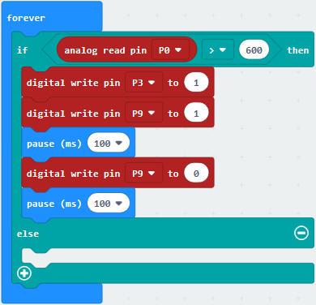

\*\*\*\*\*\*\*\*\*\*\*\*\*\*\*\*\*\*\*\*\*\*\*\*\*\*\*\*\*\*\*\*\*\*\*\*\*\*\*\*\*\*\*\*\*\*\*\*\*\*\*\*\*\*\*\*\*\*\*\*\*\*\*\*

(8) Replicate code string once and place it beneath “else”block, alter 1 into 0.

Complete Program：

Click“JavaScript", you will view the corresponding JavaScript code:

Then click drop-down triangle button and select“Python”to see the Python language code:

**6. Test Results：**

Wire up according to graph, upload the program and power on. Point fire lighter at MQ-2 gas sensor. When analog value is greater than 600, active buzzer sounds, LED blinks and LED1 is on simultaneously ; otherwise, the active buzzer doesn’t
emit sound, LED and LED1 go off.

### Project 32：Water Level Monitoring Alarm

1.  **Description：**

A surge in water level of river or dam will bring out the grave results when the pouring rain and rain storm comes. Nowadays, we could address this challenge by a special sensor--water level sensor to prevent the potential accident.

The water level sensor is analog input module. It is a simple, easy-to-use, compact, lightweight, and cost-effective.

Its principle is to detect the amount of water to determine the water level by bare printed parallel lines on the circuit board.

The conversion of water volume to analog signal and the output analog value can be directly applied by the function in the program.

In this project, we attach the water level sensor to P0 of micro:bit board. The water level can be detected by reading the analog value of P0. The higher the water level, the larger the analog value.

**2. Components List:**

|  |              |  |  |
| ------------------------ | ------------------------------------ | ------------------------ | ------------------------ |
| Micro:bit motherboard*1  | keyestudio Micro:bit T Type Shield*1 | Red LED*1                | Yellow LED*1             |
|  |              |  |  |
| 220Ω Resistor*3          | Breadboard*1                         | F-M dupont lines         | Breadboard wire          |
|  |              |  |                          |
| Green LED*1              | keyestudio Water Level Sensor*1      | Micro USB cable*1        |                          |

**3. Schematic Diagram：**

**4. Wiring Graph：**

**5. Test Code：**

**Code 1：**

Wire up according to Wiring Graph, water level sensor is linked with P0, Link computer with Micro:bit board. Then enable the online programming tool to design the code.

Click“Led”→“more”，and find out“led enable false”

Put it into the block“on start”

\*\*\*\*\*\*\*\*\*\*\*\*\*\*\*\*\*\*\*\*\*\*\*\*\*\*\*\*\*\*\*\*\*\*\*\*\*\*\*\*\*\*\*\*\*\*\*\*\*\*\*\*\*\*\*\*\*\*\*\*\*\*\*\*

Enter “Advanced”→“Serial”→“serial write value “x”=0”.

Move it into“forever”block

\*\*\*\*\*\*\*\*\*\*\*\*\*\*\*\*\*\*\*\*\*\*\*\*\*\*\*\*\*\*\*\*\*\*\*\*\*\*\*\*\*\*\*\*\*\*\*\*\*\*\*\*\*\*\*\*\*\*\*\*\*\*\*

Click“Advanced”→“Pins”→“analog read pin P0”

Place it at the right“0”box

The left “x” is changed into“analog signal”.

\*\*\*\*\*\*\*\*\*\*\*\*\*\*\*\*\*\*\*\*\*\*\*\*\*\*\*\*\*\*\*\*\*\*\*\*\*\*\*\*\*\*\*\*\*\*\*\*\*\*\*\*\*\*\*\*\*\*\*\*\*\*\*\*

Go to “Basic”→“pause (ms) 100”

Lay down it into“forever”and set to 200ms. As shown below

Complete Program：

Click“JavaScript", you will view the corresponding JavaScript code:

Then click drop-down triangle button and select“Python”to see the Python language code:

When water level sensor isn’t placed into water, the output value is 0. With the sensor submerging gradually into the water, analog value is getting larger; when emerging into the water completely, the output value is about 710. However, the analog value is getting smaller when taking it out of water.

When the sensor is kept from water, the output value is not 0 (the water on the sensor may affect). The value is 0, when the water is wiped off.

Hook up, upload code, power on and open CoolTerm, click Options to select SerialPort. Set COM port and baud rate is 115200 (the baud rate of USB serial communication of Micro:bit is 115200 through the test). Click“OK”and“Connect”.

**Code 2：**

Note: you could set the analog value through the test result.

Connect water level sensor to P0, yellow LED to P4, green LED to P6 and red LED to P9. Link computer with Micro:bit board. Then enable the online programming tool to design the code.

(1)
1.  A. Click“Led”→“more”，and find out“led enable false”

2.  Combine it with“on start”block.

\*\*\*\*\*\*\*\*\*\*\*\*\*\*\*\*\*\*\*\*\*\*\*\*\*\*\*\*\*\*\*\*\*\*\*\*\*\*\*\*\*\*\*\*\*\*\*\*\*\*\*\*\*\*\*\*\*\*\*\*\*\*\*\*

(2)

1.  Click“Logic”→“if...true....then...else”

2.  Put it down into“forever”and drag out“=”into “true”block

\*\*\*\*\*\*\*\*\*\*\*\*\*\*\*\*\*\*\*\*\*\*\*\*\*\*\*\*\*\*\*\*\*\*\*\*\*\*\*\*\*\*\*\*\*\*\*\*\*\*\*\*\*\*\*\*\*\*\*\*\*\*\*\*

(3) Click“Advanced”→“Pins”to find out“analog read pin P0” block , and keep it at the left 0 box. Water level sensor is linked with P0, keep P0 unchanged. Then set to“analog read pin P0 \< 100”

(3) A. Enter“Advanced”→“Pins”→“digital write pin P0 to 0”

B. Leave it beneath“if...P0..100”block and copy for 2 times.

C. Yellow, green and red LEDs are respectively linked with P4, P6 and P9. So set to P4, P6, P9

\*\*\*\*\*\*\*\*\*\*\*\*\*\*\*\*\*\*\*\*\*\*\*\*\*\*\*\*\*\*\*\*\*\*\*\*\*\*\*\*\*\*\*\*\*\*\*\*\*\*\*\*\*\*\*\*\*\*\*\*\*\*\*\*

(4)

A. Replicate code string once and place it into“forever”，

B. Remove the“analog read pin P0\<100”first.

1.  Go to“Logic”to drag out “and” block and keep it into “true”box.

2.  Place“analog read pin P0\<100”to the left blank box and change “\<” into “≥”；
    
3.  Copy“analog read pin P0\<100”once and set to“analog read pin P0\<200”then move it into right blank box
    
4.  Change 0 into 1 for P4.

*\*\*\*\*\*\*\*\*\*\*\*\*\*\*\*\*\*\*\*\*\*\*\*\*\*\*\*\*\*\*\*\*\*\*\*\*\*\*\*\*\*\*\*\*\*\*\*\*\*\*\*\*\*\*\*\*\*\*\*\*\*\*\*

(5) Duplicate code stringonce and place it into“forever”，alter 100 into 200, 200 into 300.

Change 1 into 0 for P4 and 0 into 1 for P6.

\*\*\*\*\*\*\*\*\*\*\*\*\*\*\*\*\*\*\*\*\*\*\*\*\*\*\*\*\*\*\*\*\*\*\*\*\*\*\*\*\*\*\*\*\*\*\*\*\*\*\*\*\*\*\*\*\*\*\*\*\*\*\*\*

(6)

Copy the code string again and leave it into “forever”. Change “\<” into “≥”， 100 into 400 and 0 into 1 for P9.

Complete Program:

|   |
| ------------------------------------------------------------ |
| “on start”: command block runs once to start program.        |
| Turn off LED dot matrix                                      |
| The program under the block “forever” runs cyclically.       |
| When the analog signal read by P0 is less than100, the next program will be executed. |
| Separately set P4, P6 and P9 to low level(0), yellow, green and red LEDs will go off. |
| When condition “100≤ the analog signal read by P0<200” is met, the next program will be executed. |
| Respectively set P6 and P9 to low level (0), green and red LEDs will be on. And set P4 to high level(1), yellow LED will light up. |
| When the condition“200≤the analog signal read by P0<400” is met, the next program will be executed. |
| Separately set P4 and P9 to low level(0), yellow and red LEDs will go off. Set P6 to high level(1), green LED will be on. |
| When the analog signal read by P0 is greater than or equal to 400, the next program will be executed. |
| Respectively set P4 and P6 to low level, green and yellow LEDs will be off. Set P9 to high level(1), red LED will light up. |

Click“JavaScript", you will view the corresponding JavaScript code:

Then click drop-down triangle button and select“Python”to see the Python language code:

6.  **Test Results：**

Wire up through the connection diagram, upload the code and power on. Insert the water level sensor into water, when the analog value is less than 100, all LEDs are off; when the value is greater than or equal to 100 and less than 200, yellow LED lights up; when the value is greater than or equal to 200 and less than 400, green light will be on. When it is greater than or equal to 400, red LED will light on.

### Project 33：Humidity Detection Device

1.  **Description：**

This is a simple soil humidity sensor aims to detect the soil humidity. If the soil is in lack of water, the analog value output by the sensor will decrease; otherwise, it will increase. If you use this sensor to make an automatic watering device, it can detect whether your botany is thirsty to prevent it from withering when you go out.   

Using the sensor with Arduino controller makes your plant more comfortable and your garden smarter. The soil humidity sensor module is not as complicated as you might think, and if you need to detect the soil in your project, it will be your best choice.

The sensor is set with two probes, when inserted into the soil, the sensor will get resistance value by reading the current changes between the two probes and convert such resistance value into moisture content. The higher moisture (less resistance), the higher conductivity the soil has.

Its service life extends by metallizing the surface,

Insert it into the soil and then use the AD converter to read it. With the help of this sensor, the plant can remind of you: I need water. It comes with 2 positioning holes for installing on other devices.

In this experiment, we connect soil humidity sensor to P10 of Micro:bit board and read the analog value of P10 then detect humidity. The larger the humidity, the larger the value. You could view the analog value on serial monitor

**2. Components List:**

|  |  |           |
| ---------------------------------------- | ---------------------------------------- | --------------------------------- |
| Micro:bit motherboard*1                  | keyestudio Micro:bit T Type Shield*1     | keyestudio Soil Humidity sensor*1 |
|                  |                  |           |
| Breadboard*1                             | Micro USB cable*1                        | F-M dupont lines                  |

**3. Schematic Diagram：**

**4. Wiring Graph：**

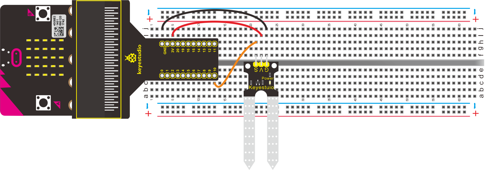

5.  **Test Code：**

**Code 1：**

Hook up according to the above connection diagram, s end of Soil Humidity sensor is attached to P10. Link computer with micro:bit board. Then enable the online programming tool to design the code.

(1) 

1.  Click“Led”→“more”→“led enable false”

2.  Put it into the block“on start”

\*\*\*\*\*\*\*\*\*\*\*\*\*\*\*\*\*\*\*\*\*\*\*\*\*\*\*\*\*\*\*\*\*\*\*\*\*\*\*\*\*\*\*\*\*\*\*\*\*\*\*\*\*\*\*\*\*\*\*\*\*\*\*\*

(2)

A. Click“Advanced”to go to“Serial”, and drag“serial write value “x”=0”into  “forever”.

B. Go to“Advanced”→“Serial”→“serial write value “x”=0”,

C. Leave it into“forever”.

\*\*\*\*\*\*\*\*\*\*\*\*\*\*\*\*\*\*\*\*\*\*\*\*\*\*\*\*\*\*\*\*\*\*\*\*\*\*\*\*\*\*\*\*\*\*\*\*\*\*\*\*\*\*\*\*\*\*\*\*\*\*\*\*

(3)

1.  Click“Advanced”→“Pins”→“analog read pin P0”

2.  Leave it into“0”box.

3.  The soil humidity sensor is connected to P10, so click the drop-down button to select P10. Modify the“x” into “analog signal”.

\*\*\*\*\*\*\*\*\*\*\*\*\*\*\*\*\*\*\*\*\*\*\*\*\*\*\*\*\*\*\*\*\*\*\*\*\*\*\*\*\*\*\*\*\*\*\*\*\*\*\*\*\*\*\*\*\*\*\*\*\*\*\*\*

(4)

Click“Basic”to drag out “pause (ms) 100”and put it into“forever”block, then set to 200ms.

Complete Program：

|               |
| ------------------------------------------------------------ |
| “on start”: command block runs once to start program. Turn off LED dot matrix The program under the block “forever” runs cyclically. The analog signal that serial writes is equal to the analog signal read by P10 Delay in 200ms |

Click“JavaScript", you will view the corresponding JavaScript code:

Then click drop-down triangle button and select“Python”to see the Python language code:

Hook up through the wiring graph, upload code, power on and open CoolTerm, click Options to select SerialPort. Set COM port and baud rate is 115200(the baud rate of USB serial communication of Micro:bit is 115200 through the test). Click “OK” and “Connect”.

Insert soil humidity sensor into soil. As the humidity grows gradually, the analog signal of soil humidity sensor will increase as well.

### Project 34：OLED Display

1.  **Description：**

The 12864 of the OLED module indicates that the screen resolution is 128\*64 pixels, that means that there are 128 columns and 64 rows of pixels on the screen.  

Pixel is px, which is the smallest point (unit color block) in the picture.   Resolution = pixel value in the horizontal direction of the screen \* pixel value in the vertical direction of the screen.

Compatible with the IIC (I2C) interface of the Micro:bit board, the OLED module communicates by IIC (I2C). Its interface is marked with V, G, SDA and SCL. SDA and SCL correspond to P20 and P19 separately.

**2. Components List:**

|  |              |          |
| ------------------------ | ------------------------------------ | -------------------------------- |
| Micro:bit motherboard*1  | keyestudio Micro:bit T Type Shield*1 | Keyestudio OLED Display module*1 |
|  |              |          |
| Breadboard*1             | Micro USB cable*1                    | Breadboard wire                  |

**3. Schematic Diagram：**

**4. Wiring Graph：**

**5. Test Code：**

Hook up according to the above connection diagram, the pin SDA and SCL of OLED are attached to P20 and P19. Link computer with micro:bit board. Then enable the online programming tool to design the code.

**How to add the library file of OLED:**

Enter the Micro:bit online programming page and click“Extensions”

Input OLED and search,as shown below. Select the first pattern, download and install library file automatically.

After installing successfully, and view the corresponding the module in the editing code.

Click “Led”→”more”→“led enable false”, combine it with“on start”.

\*\*\*\*\*\*\*\*\*\*\*\*\*\*\*\*\*\*\*\*\*\*\*\*\*\*\*\*\*\*\*\*\*\*\*\*\*\*\*\*\*\*\*\*\*\*\*\*\*\*\*\*\*\*\*\*\*\*\*\*\*\*\*\*

A. Click“OLED”→“initialize OLED with width 128 height 64”;

B. Keep it below“led enable false”block.

\*\*\*\*\*\*\*\*\*\*\*\*\*\*\*\*\*\*\*\*\*\*\*\*\*\*\*\*\*\*\*\*\*\*\*\*\*\*\*\*\*\*\*\*\*\*\*\*\*\*\*\*\*\*\*\*\*\*\*\*\*\*\*\*

A. Go to“Loops”→“repeat 4 times do”

B. Move it into“forever”block.

\*\*\*\*\*\*\*\*\*\*\*\*\*\*\*\*\*\*\*\*\*\*\*\*\*\*\*\*\*\*\*\*\*\*\*\*\*\*\*\*\*\*\*\*\*\*\*\*\*\*\*\*\*\*\*\*\*\*\*\*\*\*\*\*
A. Go to“OLED”→“show (without newline) string”””

B. Leave it into“repeat 4 times do”, then input “ABCDEFGHIJK”character string.

Move out“pause (ms) 100”from“Basic”and leave it into “repeat 4 times do”, then set to 500ms.

\*\*\*\*\*\*\*\*\*\*\*\*\*\*\*\*\*\*\*\*\*\*\*\*\*\*\*\*\*\*\*\*\*\*\*\*\*\*\*\*\*\*\*\*\*\*\*\*\*\*\*\*\*\*\*\*\*\*\*\*\*\*\*\*

Click“OLED”to find out“show string”””, and put it into “repeat 4 times do”.

Input“LMNOPQRST”character string, duplicate“pause (ms) 500”once and place it below“show string “LMNOPQRST”block.

\*\*\*\*\*\*\*\*\*\*\*\*\*\*\*\*\*\*\*\*\*\*\*\*\*\*\*\*\*\*\*\*\*\*\*\*\*\*\*\*\*\*\*\*\*\*\*\*\*\*\*\*\*\*\*\*\*\*\*\*\*\*\*\*

Enter“OLED”to drag“show (without newline) number””” into“repeat 4 times do”, input“123456789”, and duplicate “pause (ms) 500”once and keep it below “show..123435678”block

\*\*\*\*\*\*\*\*\*\*\*\*\*\*\*\*\*\*\*\*\*\*\*\*\*\*\*\*\*\*\*\*\*\*\*\*\*\*\*\*\*\*\*\*\*\*\*\*\*\*\*\*\*\*\*\*\*\*\*\*\*\*\*\*

Click“OLED”to move out“show number”into“repeat 4 times do”block.

Enter“10111213”and copy “pause (ms) 500” once, finally remain these blocks into“repeat 4 times do”block

Click “OLED” to find out “clear OLED display”, and place it into “forever”block.

\*\*\*\*\*\*\*\*\*\*\*\*\*\*\*\*\*\*\*\*\*\*\*\*\*\*\*\*\*\*\*\*\*\*\*\*\*\*\*\*\*\*\*\*\*\*\*\*\*\*\*\*\*\*\*\*\*\*\*\*\*\*\*\*

Go to“OLED”to get“draw rectangle from x: 0 y: 0 to x: 20 y: 20”, and leave it below“clear OLED display”block, alter 0 into 90. Then copy“clear OLED display1”once and move it into “forever”block.

Complete Program：

|   | “on start”: command block runs once to start program.  Turn off LED dot matrix  Initialize OLED, 128 in width and 64 height   The program under the block “forever” runs cyclically.  Repeat for 4 times  OLED shows“ABCDEFGHIJK”  Delay in 500ms  OLED displays“LMNOPQRST” Delay in 500ms  OLED displays“123456789” Delay in 500ms  OLED displays“10111213” Delay in 500ms  OLED shows numbers Delay in 500ms  Clear OLED display Draw a rectangle from the start point  x:90 y:90 to the end point x:20 y:20  Clear OLED display |
| ------------------------------------------------------------ | ------------------------------------------------------------ |
|                                                 |                                                 |

Click“JavaScript", you will view the corresponding JavaScript. code:

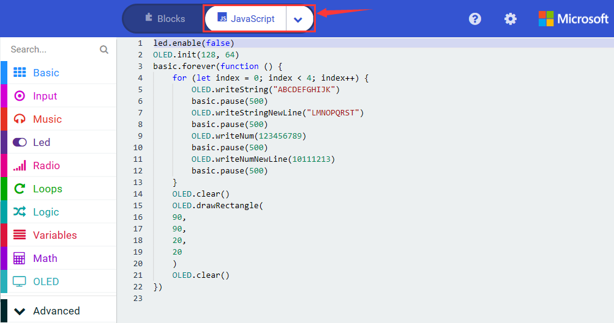

Then click drop-down triangle button to select“Python”to see the Python language code:

6.  **Test Results:**

Wire up through the connection diagram, upload code and plug in power. OLED displays the corresponding character strings and patterns.

7.  **Extension Project：**

OLED display shows some characters and patterns.

### Project 35： Servo Control

1.  **Description：**

When we make robot car, we often control doors and windows with servos. In this course, we’ll introduce its principle and how to use servo motors.

Servo motor is a position control rotary actuator. It mainly consists of housing, circuit board, core-less motor, gear and position sensor. Its working principle is that the servo receives the signal sent by MCU or receiver and produces a reference signal with a period of 20ms and width of 1.5ms, then compares the acquired DC bias voltage to the voltage of the potentiometer and obtain the voltage difference output.

The IC on the circuit board determines the direction of rotation, and drives the coreless motor to start rotating. The power is transmitted to the swing arm through the reduction gear. At the same time, the position detector sends back a signal to determine whether the positioning has been reached. It is suitable for those control systems that require constant change of angle and can be maintained.

When the motor speed is constant, the potentiometer is driven to rotate through the cascade reduction gear, which leads that the voltage difference is 0, and the motor stops rotating. Generally, the angle range of servo rotation is 0° -180 °

Servo motor has external 3pcs lines which are distinguished from brown, red and orange color. Brown line is grounded, red one is positive power line and the orange is signal line.

The rotation angle of servo motor is controlled by regulating the duty cycle of PWM (Pulse-Width Modulation) signal. The standard cycle of PWM signal is 20ms (50Hz). Theoretically, the width is distributed between 1ms-2ms, but in fact, it's between 0.5ms-2.5ms. The width corresponds the rotation angle from 0° to 180°. But note that for different brand motor, the same signal may have different rotation angle.

There are two ways to control servo motor by Micro:bit board.

One is to use a common digital sensor port of Micro:bit board to produce square wave with different duty cycle to simulate PWM signal and use that signal to control the positioning of the motor.

Another way is to directly use the servo function of the Micro:bit board to control the motor. However, you need to control more than one motor by external power as the drive capacity of micro:bit board is limited.

Note that don’t supply power through USB cable. There is possibility to damage the USB cable if the current demand is greater than 500MA. We recommend the external power.

**2. Components List:**

|                         |              |        |  |
| ----------------------------------------------- | ------------------------------------ | ------------------------------ | ------------------------ |
| Micro:bit motherboard*1                         | keyestudio Micro:bit T Type Shield*1 | keyestudio micro Servo motor*1 | AA Battery Holder*6      |
|                         | 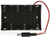             |        |  |
| Breadboard*1                                    | 6 AA Battery Holder*1                | Breadboard wire                | Micro USB cable*1        |
|                         |                                      |                                |                          |
| Keyestudio BreadboardSpecialized Power Module*1 |                                      |                                |                          |

**3. Schematic Diagram：**

(Note: wire up servo with breadboard with 3pcs dupont wires)

**4. Wiring Graph：**

(Note: wire up servo with breadboard with 3 pcs dupont wires)

**5. Test Code：**

Wire up through the connection diagram. Connect servo motor to P3, Link computer with Micro:bit board. Then enable the online programming tool to design the code.

1.  A. Click “Led”→”more”→“led enable false”,

​		B. Combine it with“on start”.

\*\*\*\*\*\*\*\*\*\*\*\*\*\*\*\*\*\*\*\*\*\*\*\*\*\*\*\*\*\*\*\*\*\*\*\*\*\*\*\*\*\*\*\*\*\*\*\*\*\*\*\*\*\*\*\*\*\*\*\*\*\*\*\*

2.  Drag out “servo write pin P0 to 180”from“Pins”block under the block“Advanced”. Keep it into“forever”. Servo motor is connected to P3, so set to P3 and change 180 into 0.

\*\*\*\*\*\*\*\*\*\*\*\*\*\*\*\*\*\*\*\*\*\*\*\*\*\*\*\*\*\*\*\*\*\*\*\*\*\*\*\*\*\*\*\*\*\*\*\*\*\*\*\*\*\*\*\*\*\*\*\*\*\*\*\*

3. Enter “Basic”to drag out “pause (ms) 100”into “on start”, set to 200ms.

\*\*\*\*\*\*\*\*\*\*\*\*\*\*\*\*\*\*\*\*\*\*\*\*\*\*\*\*\*\*\*\*\*\*\*\*\*\*\*\*\*\*\*\*\*\*\*\*\*\*\*\*\*\*\*\*\*\*\*\*\*\*\*\*

4. Copy for 5 times and place them into “forever”, separately set to 0, 45, 90, 135 and 180. Then change 200ms into 1000ms.

Complete Program：

| 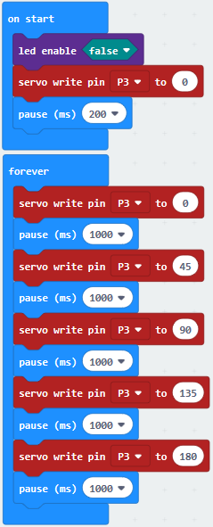 | “on start”: command block runs once to start program.  Turn off LED dot matrix  Rotate servo motor P3 to 0°  Delay in 200ms     The program under the block “forever” runs cyclically.  Respectively rotate servo motor P3 to 0°, 45°，90°，135° and 180°.  Delay in 1000ms respectively |
| ----------------------------------------------- | ------------------------------------------------------------ |
|                                                 |                                                 |

Click“JavaScript", you will view the corresponding JavaScript code:

Then click drop-down triangle button and select“Python”to see the Python language code：

6.  **Test Results：**

Wire up through the connection diagram, upload the program and power on. Servo motor swings to and fro in the range of 0°\~45°\~90°\~135°\~180°

7.  **Extension Project：**

Servo motor swings to and fro in the range of 0°\~90°

### Project 36：L293D Driver Motor

1.  **Description：**

L293D is a direct current drive IC, which can be used to drive DC motor or stepper motor in some robot projects.

It has a total of 16 pins and can drive two-channel DC motors at the same time.

Its Input voltage range is 4.5 V \~ 36 V, the output current of per channel is MAX 600mA, which can drive inductive loads. What’s more, its input end can be directly connected and controlled by the single-chip microcomputer.

When driving a small DC motor, the control of two-channel motors and the forward and reverse rotation can be realized by changing the high and low level of the input terminal. There are many motor drive boards using L293D chips on the market, of course, we can also use it via simply connecting.

2. **Pins Description**

|  No  |   Name    | Description                                 |
| :--: | :-------: | ------------------------------------------- |
|  1   | Enable1,2 | Enable pin Input 1(2)and Input 2(7)         |
|  2   |  Input1   | Directly input pin 1via digital circuit     |
|  3   |  Output1  | Connected to one end of motor1              |
|  4   |    GND    | Grounded(0V)                                |
|  5   |    GND    | Grounded(0V)                                |
|  6   |  Output2  | Connected to one end of motor1              |
|  7   |  Input2   | Directly output pin 2 via digital circuit   |
|  8   | Vcc2(Vss) | Connected to voltage pin of motor(4.5V-36V) |
|  9   | Enable3,4 | Enable pin 3(10)and 4(15)                   |
|  10  |  Input3   | Input3 pin, controlled by digital circuit   |
|  11  |  Output3  | Connected to one end of motor2              |
|  12  |    GND    | Grounded(0V)                                |
|  13  |    GND    | Grounded(0V)                                |
|  14  |  Output4  | Connected to one end of motor2              |
|  15  |  Input4   | Input4 pin, controlled by digital circuit   |
|  16  | Vcc1(Vss) | Connect + 5Vto enable IC function           |

3.  **Components List**

|                  |              |  |  |
| ---------------------------------------- | ------------------------------------ | ------------------------ | ------------------------ |
| Micro:bit motherboard*1                  | keyestudio Micro:bit T Type Shield*1 | L293D drive chip*1       | fan*1                    |
|                  |              |  |  |
| DC motor（with soldered dupont lines）*1 | Breadboard*1                         | 6 AA Battery Holder*1    | Micro USB cable*1        |
|                  |              |  |                          |
| Keyestudio Breadboard Power module *1    | AA Battery Holder*6                  | Breadboard wires         |                          |

**4. Schematic Diagram：**

**5. Wiring Graph：**

**6. Test Code：**

Hook up according to the above connection diagram, the ernable3 and 4, Input3 and Input4 of L293D drive chip are connected to P0, P1 and P2. What’s more, the red line and black line of motor are attached to Onput3 and Onput4. Link computer with micro:bit board. Then enable the online programming tool to design the code.

(1)

A.Click“Led”→“more”→“led enable false”

B. Put it into the block“on start”

\*\*\*\*\*\*\*\*\*\*\*\*\*\*\*\*\*\*\*\*\*\*\*\*\*\*\*\*\*\*\*\*\*\*\*\*\*\*\*\*\*\*\*\*\*\*\*\*\*\*\*\*\*\*\*\*\*\*\*\*\*\*\*\*

(2)

1.  Enter“Advanced”→“Pins”→“analog write pin P0 to 1023”

2.  Place it into“forever”block

3.  Change 1023 into 800

\*\*\*\*\*\*\*\*\*\*\*\*\*\*\*\*\*\*\*\*\*\*\*\*\*\*\*\*\*\*\*\*\*\*\*\*\*\*\*\*\*\*\*\*\*\*\*\*\*\*\*\*\*\*\*\*\*\*\*\*\*\*\*\*

(3)A. Go to“Advanced”→“Pins”→“digital write pin P0 to 0”

B. Place it into“forever”block

C. Copy“digital write pin P0 to 0”once

D. L293D is attached to P1 and P2, set to P1 and P2. And change 0 into 1 for P1

\*\*\*\*\*\*\*\*\*\*\*\*\*\*\*\*\*\*\*\*\*\*\*\*\*\*\*\*\*\*\*\*\*\*\*\*\*\*\*\*\*\*\*\*\*\*\*\*\*\*\*\*\*\*\*\*\*\*\*\*\*\*\*\*

(4)

1.  Go to“Basic”→“pause (ms) 100”

2.  Keep it below block “digital write pin P2 to 0”and set to 1000ms

\*\*\*\*\*\*\*\*\*\*\*\*\*\*\*\*\*\*\*\*\*\*\*\*\*\*\*\*\*\*\*\*\*\*\*\*\*\*\*\*\*\*\*\*\*\*\*\*\*\*\*\*\*\*\*\*\*\*\*\*\*\*\*\*

(5) Duplicate code string once and place it into “forever”, change 1 into 0 for P1, 0 into 1 for P2.

Complete Program：

|  | “on start”: command block runs once to start program.  Turn off LED dot matrix    The program under the block “forever” runs cyclically.  Set P0 to 800, set P1 to high level(1), P2 to low level(0) Delay in 1000ms  Set P0 to 800, set P2 to high level(1), P1 to low level(0) Delay in 1000ms  |
| ----------------------------------------------- | ------------------------------------------------------------ |
|                                                 |                                                 |

Click“JavaScript", you will view the corresponding JavaScript code:

Then click drop-down triangle button and select“Python”to see the Python language code:

**7. Test Results：**

Download the program and power on, the motor spins clockwise for 1s and anticlockwise for 1s, alternately.

### Project 37： Control Stepper Motor

1.  **Description：**

Stepper motor is an open-loop control element that converts electrical pulse signals into angular displacement or linear displacement. Under the condition of non-overload, the speed of the motor and the stop position are only tied to the
frequency and number of pulses of the pulse signal, not affected by load changes.  

It is a kind of induction motor. Its working principle is to convert direct current into time-sharing power supply by electronic circuit and multi-phase sequential control current. use this current to power stepper motor, stepper motor can work normally.  

Although widely applied, stepper motors cannot be operated under conventional conditions like ordinary DC motors and AC motors.

Involving with many professional knowledge such as machinery, electrical machinery, electronics and computers, it is not used easily.

As an executive element, stepping motor is one of the essential products of mechatronics and widely applied in various automation control systems.

**2. Features:**

1.  The rotation angle of the stepper motor is proportional to the input pulse; 
    

The stepper motor has full torque when it is stationary (if the winding is energized);  

Precise positioning and motion repeatability, the accuracy of a good stepper motor is -5% of one step, and the error from one step to the next step is not accumulated;

2.  There is an excellent response for start/stop/reverse;  

Very reliable, because there is no contact brush in the stepper motor. Therefore, the life of the stepper motor depends on the life of the bearing;

The stepper motor provides open-loop control in response to the digital input pulse, which makes the stepper motor simpler and lower control cost;  

A very low-speed synchronous rotation can be achieved through a load directly connected to the shaft; 

Since the speed is proportional to the frequency of the input pulse, a wide range of speed can be achieved;

**3. Components List:**

|            |              |                           |  |
| ---------------------------------- | ------------------------------------ | ------------------------------------------------- | ------------------------ |
| Micro:bit motherboard*1            | Keyestudio Micro:bit T Type Shield*1 | Keyestudio ULN 2003 Stepper motor driver module*1 | Micro USB cable*1        |
|            |              |                           |  |
| Keyestudio 5-wire stepper motor *1 | Breadboard*1                         | 6 AA Battery Holder*1                             | Breadboard wire          |
|            |              |                           |                          |
| Breadboard wire                    | 6 AA Battery *6                      | Keyestudio Breadboard Specialized power module*1  |                          |

**4. Schematic Diagram：**

**5. Wiring Graph：**

Wiring note: VCC and GND are linked with “+”and“-”of Breadboard, IN1, IN2, IN3 and IN4 correspond to P0, P1, P2 and P8 separately.

For the following code, IN0, IN1, 1N2 and IN3 denote 1N1, IN2, IN3 and IN4 of stepper motor module.

**6. Test Code：**

Wire up through the connection diagram. Connect Stepper motor driver module to P0, P1, P2 and P8. Link computer with Micro:bit board. Then enable the online programming tool to design the code.

**How to add the library file of stepper motor driver module**:

Enter the Micro:bit online programming page and click  “Extensions”

Enter the file link: <https://github.com/ckmaker-cckk/pxt-ckbase>and search, as shown below, click library file and automatically download and install library files.

After installing the library file successfully, you could check the corresponding blocks int the code editing area.

(1)

1.  Click“Led”→“more”，and find out“led enable false”

2.  Put it into the block“on start”.

\*\*\*\*\*\*\*\*\*\*\*\*\*\*\*\*\*\*\*\*\*\*\*\*\*\*\*\*\*\*\*\*\*\*\*\*\*\*\*\*\*\*\*\*\*\*\*\*\*\*\*\*\*\*\*\*\*\*\*\*\*\*\*\*

(2)

1.  Go to“Ckmake-Base”→“StepperMotor Init in0 P0 in1 P1 in2 P2 in3 P8”；

2.  Place it into“on start”block

3.  Stepper motor driver module is connected to P0, P1, P2, P8

4.  Then set code string as follows:

\*\*\*\*\*\*\*\*\*\*\*\*\*\*\*\*\*\*\*\*\*\*\*\*\*\*\*\*\*\*\*\*\*\*\*\*\*\*\*\*\*\*\*\*\*\*\*\*\*\*\*\*\*\*\*\*\*\*\*\*\*\*\*\*

(3)

Tap “Ckmake-Base”→“set stepper Speed SPEED1”

Move it into“on start”and set to SPEED3

\*\*\*\*\*\*\*\*\*\*\*\*\*\*\*\*\*\*\*\*\*\*\*\*\*\*\*\*\*\*\*\*\*\*\*\*\*\*\*\*\*\*\*\*\*\*\*\*\*\*\*\*\*\*\*\*\*\*\*\*\*\*\*\*

(4)A. Click“Ckmake-Base”→“stepper Turn 0”

B. Place it below“set stepper Speed SPEED3”

C. Copy“stepper Turn 0”once.

D. Change 0 into 3 and -3 respectively.

Complete Program：

|  | “on start”: command block runs once to start program.  Turn off LED dot matrix  Initialize the stepper motor  Set speed of stepper motor to SPEED3  Motor spins clockwise for 3 circles  Motor spins anticlockwise for 3 circles |
| ----------------------------------------------- | ------------------------------------------------------------ |
|                                                 |                                                 |

Click“JavaScript", you will view the corresponding JavaScript code:

Then click drop-down triangle button and select“Python”to see the Python language code:

**7. Test Results：**

Wire up through the connection diagram. Upload the program and power on, stepper motor spins anticlockwise for 3 circles at the fastest speed then rotates clockwise 3 circles and stops.

**8. Extension Project：**

Make stepper motor spin anticlockwise for 1 circle at the fastest speed then clockwise for 1 circle. Then let it turn anticlockwise 90°, rotate clockwise 180° and stop.

### Project 38：Automatic Watering System

1.  **Description：**

We’ve learned soil humidity sensor, ,OLED display module, L293D drive and motor. In this lesson, we will combine them to make an automatic watering system.

Under the control of Micro:bit board，the Micro:bit determines if value sent by soil humidity sensor is in the normal humidity range. If the value is less than the minimum, the command of watering will be sent, when the value is between the minimum and maximum vale, pump drains slightly; when it is higher than the maximum, water pump stops watering.

**2. Components List:**

|                          |              |           |  |
| ------------------------------------------------ | ------------------------------------ | --------------------------------- | ------------------------ |
| Micro:bit motherboard*1                          | keyestudio Micro:bit T Type Shield*1 | Keyestudio OLED Display module*1  | Water pump*1             |
|                          |              |           |  |
| AA Battery Holder*6                              | L293D Driver chip*1                  | Water pipe*1                      | 6 AA Battery Holder*1    |
|                          |              |           |  |
| Keyestudio Breadboard Specialized power module*1 | F-M dupont lines                     | keyestudio Soil Humidity sensor*1 | Breadboard*1             |
|                          |              |                                   |                          |
| Micro USB cable*1                                | Breadboard wires                     |                                   |                          |

**3. Schematic Diagram：**

**(Special note: both ends of breadboard specialized power module must be inserted into breadboard, and dial the DIP switch to +3V on power module)**

 

**4. Wiring Graph：**

**(Special note: both ends of breadboard specialized power module must be inserted into breadboard, and dial the DIP switch to +3V on power module )**

**5. Test Code** 

Note: you could set any analog value through the test result.

Hook up according to the above connection diagram, s end of soil humidity sensor is attached to P3, SDA and SCL pins are linked with P20 and P19; the ernable3 and 4, Input3 and Input4 of L293D drive chip are connected to P0, P1 and P2. And the red line and black line of water pump are attached to Onput3 and Onput4.

Link computer with micro:bit board. Then enable the online programming tool to design the code.

We’ve added the library file of OLED, so let’s get started.

(1)
1.  A. Click“Led”→“more”→“led enable false”

2.  Put it into the block“on start”.

\*\*\*\*\*\*\*\*\*\*\*\*\*\*\*\*\*\*\*\*\*\*\*\*\*\*\*\*\*\*\*\*\*\*\*\*\*\*\*\*\*\*\*\*\*\*\*\*\*\*\*\*\*\*\*\*\*\*\*\*\*\*\*\*

(2)  

1.  Click“OLED”→“initialize OLED with width 128 height 64”

2.  Put it into“on start”block

\*\*\*\*\*\*\*\*\*\*\*\*\*\*\*\*\*\*\*\*\*\*\*\*\*\*\*\*\*\*\*\*\*\*\*\*\*\*\*\*\*\*\*\*\*\*\*\*\*\*\*\*\*\*\*\*\*\*\*\*\*\*\*\*

(3)

1.  Enter“Logic”→“if..true..then...else”

2.  Move it into“forever”block

3.  Click“”and drag “=”block into  “true”block

\*\*\*\*\*\*\*\*\*\*\*\*\*\*\*\*\*\*\*\*\*\*\*\*\*\*\*\*\*\*\*\*\*\*\*\*\*\*\*\*\*\*\*\*\*\*\*\*\*\*\*\*\*\*\*\*\*\*\*\*\*\*\*\*

(4)

1.  Enter“Advanced”→“Pins”→“analog read pin P0”

2.  Drag it into left 0 box.

3.  Soil Humidity sensor is attached to P3, so set to P3.

4.  Change “=” into”\<”, 0 into 100

\*\*\*\*\*\*\*\*\*\*\*\*\*\*\*\*\*\*\*\*\*\*\*\*\*\*\*\*\*\*\*\*\*\*\*\*\*\*\*\*\*\*\*\*\*\*\*\*\*\*\*\*\*\*\*\*\*\*\*\*\*\*\*\*

(5) Click“OLED”and drag out“clear OLED display”to the below“if analog read pin...then”block

\*\*\*\*\*\*\*\*\*\*\*\*\*\*\*\*\*\*\*\*\*\*\*\*\*\*\*\*\*\*\*\*\*\*\*\*\*\*\*\*\*\*\*\*\*\*\*\*\*\*\*\*\*\*\*\*\*\*\*\*\*\*\*\*

(6)

1.  Go to“OLED”→“show number”

2.  Move it below“clear OLED display”block

3.  Replicate“analog read pin P3”once and place it into “show number”””block.

\*\*\*\*\*\*\*\*\*\*\*\*\*\*\*\*\*\*\*\*\*\*\*\*\*\*\*\*\*\*\*\*\*\*\*\*\*\*\*\*\*\*\*\*\*\*\*\*\*\*\*\*\*\*\*\*\*\*\*\*\*\*\*\*

(7)

1.  Enter“Advanced”→”Pins”→“analog write pin P0 to 1023”

2.  Place it below the“show number.....P3”block.

3.  Drag out“digital write pin P0 to 0”and copy once then leave them below the block “analog ...to 1023”.
    
4.  The driver chip of L293D is connected to P0, P1 and P2, so set to P1, P2 and P3.

\*\*\*\*\*\*\*\*\*\*\*\*\*\*\*\*\*\*\*\*\*\*\*\*\*\*\*\*\*\*\*\*\*\*\*\*\*\*\*\*\*\*\*\*\*\*\*\*\*\*\*\*\*\*\*\*\*\*\*\*\*\*\*\*

(8)

1.  Enter“Logic”to move out“and”block and leave it into the blank box behind“else if”.
    
2.  Copy“analog read pin P3\<100”for 2 times and place them to both sides of“and”block
    
3.  Set“as if analog read pin P3≥100 and analog read pin P3\<400”, as shown below:

\*\*\*\*\*\*\*\*\*\*\*\*\*\*\*\*\*\*\*\*\*\*\*\*\*\*\*\*\*\*\*\*\*\*\*\*\*\*\*\*\*\*\*\*\*\*\*\*\*\*\*\*\*\*\*\*\*\*\*\*\*\*\*\*

(9)Copy code string once and place it under the “as if....then” block, change 1023 into 900.

\*\*\*\*\*\*\*\*\*\*\*\*\*\*\*\*\*\*\*\*\*\*\*\*\*\*\*\*\*\*\*\*\*\*\*\*\*\*\*\*\*\*\*\*\*\*\*\*\*\*\*\*\*\*\*\*\*\*\*\*\*\*\*\*

Replicate code string once, and move it beneath “else” block, set P0 to 0 and change P1 to 1 into P1 to 0.

Complete Program：

Click“JavaScript", you will view the corresponding JavaScript code:

Then click drop-down triangle button and select“Python”to see the Python language code:

**6. Test Results：**

Wire up through the connection diagram, upload code and power on. Insert soil humidity sensor into soil . OLED shows the detected humidity value. When this value is less than 100, the water pump draws water at the fastest speed; As it is greater than or equal to 100 and less than 400, the speed of pumping water is slowest. However, when the value is greater than or equal to 400, the water pump stops working

7.  **Extension Project：**

Put soil humidity sensor into soil, OLED shows the detected humidity value. When this value is less than 300, the water pump draws water, otherwise, it will stop working.

### Project 39： Relay Module

1.  **Description：**

This module is an Arduino dedicated module, and compatible with arduino sensor expansion board. It has a control system (also called an input loop) and a controlled system (also called an output loop).

Commonly used in automatic control circuits, the relay module is an "automatic switch" that controls a larger current and a lower voltage with a smaller current and a lower voltage.

Therefore, it plays the role of automatic adjustment, safety protection and conversion circuit in the circuit. It allows Arduino to drive loads below 3A, such as LED light strips, DC motors, miniature water pumps, solenoid valve pluggable interface.

The main internal components of the relay module are electromagnet A, armature B, spring C, moving contact D, static contact (normally open contact) E, and static contact (normally closed contact) F, (as shown in the figure ).

As long as a certain voltage is applied to both ends of the coil, a certain current will flow through the coil to generate electromagnetic effects, and the armature will attract the iron core against the pulling force of the return spring under the action of electromagnetic force attraction, thereby driving the moving contact and the static contact (normally open contact) to attract. 

When the coil is disconnected, the electromagnetic suction will also disappear, and the armature will return to the original position under the reaction force of the spring, releasing the moving contact and the original static contact (normally closed contact). 

This pulls in and releases, thus achieving the purpose of turning on and off in the circuit. The "normally open and closed" contacts of the relay can be distinguished in this way: the static contacts on disconnected state when the relay coil is powered off are called "normally open contacts"; the static contacts on connected state are called "normally closed contact". The module comes with 2 positioning holes for you to fix the module to other equipment.

**2. Components List:**

|             |               |  |  |
| ----------------------------------- | ------------------------------------- | ------------------------ | ------------------------ |
| Micro:bit motherboard*1             | keyestudio Micro:bit T Type Shield*1  | Red LED*1                | Micro USB Cable*1        |
|             |               |  |  |
| keyestudio 1-channel Relay module*1 | Breadboard*1                          | 220ΩResistor*1           | F-M Dupont lines         |
|             |               |  |  |
| 6 AA Battery Holder*1               | Breadboard Specialized power module*1 | Breadboard wire          | AA Battery Holder*6      |

**3. Schematic Diagram：**

**4. Wiring Graph：**

**5.Test Code：**

Wire up through the connection diagram, connect relay to P0. Link computer with Micro:bit board. Then enable the online programming tool to design the code.

Click “Led”→ “more”→ “led enable false”,

Combine it with“on start”.

\*\*\*\*\*\*\*\*\*\*\*\*\*\*\*\*\*\*\*\*\*\*\*\*\*\*\*\*\*\*\*\*\*\*\*\*\*\*\*\*\*\*\*\*\*\*\*\*\*\*\*\*\*\*\*\*\*\*\*\*\*\*\*\*

Click“Advanced”→“Pins”→“digital write pin P0 to 0”；

Place it into“forever”block, change 0 into 1.

Enter“Basic”and move out “pause (ms) 100”below the block“digital write.......to 1”, and set to 500ms.

\*\*\*\*\*\*\*\*\*\*\*\*\*\*\*\*\*\*\*\*\*\*\*\*\*\*\*\*\*\*\*\*\*\*\*\*\*\*\*\*\*\*\*\*\*\*\*\*\*\*\*\*\*\*\*\*\*\*\*\*\*\*\*\*

Copy code string once and put it below“pause (ms) 500”, change 1 into 0.

Complete Program：

|  | “on start”: command block runs once to start program.  Turn off LED dot matrix   The program under the block “forever” runs cyclically.  Set P0 to high level(1) Delay in 500ms  Set P0 to low level(0) Delay in 500ms |
| ----------------------------------------------- | ------------------------------------------------------------ |
|                                                 |                                                 |

Click“JavaScript", you will view the corresponding JavaScript code:

Then click drop-down triangle button and select“Python”to see the Python language code:

**6. Test Results：**

Wire up through the connection diagram, upload the code and power on. The relay will be on(NO on, NC off) for 0.5s and off(NO off , NC on) for 0.5s, alternately. When relay is connected, red LED lights up, if it is disconnected, LED goes off.

### Project 40： Detect Ambient Temperature

1.  **Description：**

For example, when temperature is 0 ℃, it outputs 0V; if increasing 1 ℃, the output voltage will increase 10 mv. Input its output voltage into P2 on micro:bit main board, after formula computing, display the temperature value of current surroundings on the serial monitor. In this way, we will use a serial communication software, Arduino IDE.   

Notice the wiring direction of LM35, or else it will damage the LM35 sensor if reverse.

LM35DZ sensor element is a temperature sensor whose output voltage is proportional to Celsius temperature. The output can start from 0℃, and its sensitivity is 10mV/℃; the output temperature is 0℃～100℃, the conversion formula is as follows:when temperature is 0 ℃, it outputs 0V; if increasing 1 ℃, the output voltage will increase 10 mv.

Its working voltage is 4-30V; the accuracy is ±1℃. The maximum linearity error is ±0.5℃; the quiescent current is 80uA

We detect the ambient temperature and control the dot matrix to display distinct patterns by it.

**2. Components List:**

|  |             |  |  |
| ------------------------ | ----------------------------------- | ------------------------ | ------------------------ |
| Micro:bit Motherboard*1  | keyestudio Micro:bitT Type Shield*1 | LM35DZ*1                 | 8*8 Dot matrix *1        |
|  |             |  |  |
| Breadboard wire          | Breadboard*1                        | 220Ω Resistor*8          | Micro USB cable*1        |

**3. Schematic Diagram：**

**4. Wiring Graph：**

**5. Test Code：**

**Code 1：**

Hook up according to the above connection diagram, LM35DZ is attached to P0. Link computer with micro:bit board. Then enable the online programming tool to design the code.

Click “Led”→”more”to get block“led enable false”, and combine it with“on start”

(1)

1.  Click“Led”→“more”，and find out“led enable false”

2.  Put it into the block“on start”

\*\*\*\*\*\*\*\*\*\*\*\*\*\*\*\*\*\*\*\*\*\*\*\*\*\*\*\*\*\*\*\*\*\*\*\*\*\*\*\*\*\*\*\*\*\*\*\*\*\*\*\*\*\*\*\*\*\*\*\*\*\*\*\*

(2)

1.  Click “Variables”→“Make a Variable...”→“New variable name：”

2.  Enter “Temp” in the dialog box, click “OK”, then the variable “Temp” is created.
    
3.  Drag out“set Temp to 0”into“forever”

\*\*\*\*\*\*\*\*\*\*\*\*\*\*\*\*\*\*\*\*\*\*\*\*\*\*\*\*\*\*\*\*\*\*\*\*\*\*\*\*\*\*\*\*\*\*\*\*\*\*\*\*\*\*\*\*\*\*\*\*\*\*\*\*

(3)

1.  Enter“Math”→“square root 0”

2.  Leave it into 0 box.

3.  Click the triangle button to select“integer÷”and we get block.
    
4.  Go to“Math”to drag“\*”block into the left 0 box

\*\*\*\*\*\*\*\*\*\*\*\*\*\*\*\*\*\*\*\*\*\*\*\*\*\*\*\*\*\*\*\*\*\*\*\*\*\*\*\*\*\*\*\*\*\*\*\*\*\*\*\*\*\*\*\*\*\*\*\*\*\*\*\*

(4)

1.  Go to “Advanced”→“Pins”→“analog read pin P0”
2.  Drag it into the second“0”box
3.  Change the first 0 into 300 and the third 0 into 1023.

\*\*\*\*\*\*\*\*\*\*\*\*\*\*\*\*\*\*\*\*\*\*\*\*\*\*\*\*\*\*\*\*\*\*\*\*\*\*\*\*\*\*\*\*\*\*\*\*\*\*\*\*\*\*\*\*\*\*\*\*\*\*\*\*

(5)  

2.  Enter“Advanced”→“Serial”→“serial write line“ ””and“serial write number“ ””

3.  Leave them into“forever”and enter“Temp”in the “serial write line“ ””block.

4.  Go to“Variables”to move out variable“Temp”into “serial write number”””

5.  Duplicate“serial write line“ ””and input “C”character.

    

\*\*\*\*\*\*\*\*\*\*\*\*\*\*\*\*\*\*\*\*\*\*\*\*\*\*\*\*\*\*\*\*\*\*\*\*\*\*\*\*\*\*\*\*\*\*\*\*\*\*\*\*\*\*\*\*\*\*\*\*\*\*\*\*

Click“Basic”to move out“pause (ms) 100”below“serial write line“C””block，and set to 200ms

Complete Program：

|  | “on start”: command block runs once to start program. Turn off LED dot matrix  The program under the block  “forever” runs cyclically.  Set Temp to“300*analog signal  integer read by P0÷1023”  Serial writes line“Temp” Serial writes number“Temp” Serial writes line“C” Delay in 200ms |
| ----------------------------------------------- | ------------------------------------------------------------ |
|                                                 |                                                 |

Click“JavaScript", you will view the corresponding JavaScript code:

Then click drop-down triangle button and select“Python”to see the Python language code:

Wire up through the connection diagram, upload the code and power on. Open CoolTerm, click“serialPort”, set to COM port and baud rate is 115200(the baud rate of USB serial communication of Micro:bit is 115200 through the test). Click “OK” and “Connect”.

Serial monitor shows the ambient temperature, as shown below:

**Code 2：**

(Note: you could set the analog value through the test result.）

Hook up through the Wiring Graph, connect LM35DZ sensor to P0. Link computer with Micro:bit board. Then enable the online programming tool to design the code.

(1) 

1.  Click“Led”→“more”，and find out“led enable false”

2.  Put it into the block“on start”

\*\*\*\*\*\*\*\*\*\*\*\*\*\*\*\*\*\*\*\*\*\*\*\*\*\*\*\*\*\*\*\*\*\*\*\*\*\*\*\*\*\*\*\*\*\*\*\*\*\*\*\*\*\*\*\*\*\*\*\*\*\*\*\*

(2)

1.  Go to“Logic”→“if.true..then...else”

2.  Place it into“forever”block

3.  Drag“=”into“true”block.

\*\*\*\*\*\*\*\*\*\*\*\*\*\*\*\*\*\*\*\*\*\*\*\*\*\*\*\*\*\*\*\*\*\*\*\*\*\*\*\*\*\*\*\*\*\*\*\*\*\*\*\*\*\*\*\*\*\*\*\*\*\*\*\*

(3)

1.  Go to“Math”→“square root 0”

2.  Place it into left“0”box

3.  Click the drop-down triangle button to select“integer÷”. Then get block .
    
4.  Go to“Math”to move out“\*”block to left“0”box.

(4)

1.  Click“Advanced”→“Pins”→“analog read pin P0”

2.  Leave it into the second 0 box, change the first 0 into 300, the third 0 into 1023.
    
3.  Click the drop-down triangle button to select“≤”, change the fourth 0 into 30.

\*\*\*\*\*\*\*\*\*\*\*\*\*\*\*\*\*\*\*\*\*\*\*\*\*\*\*\*\*\*\*\*\*\*\*\*\*\*\*\*\*\*\*\*\*\*\*\*\*\*\*\*\*\*\*\*\*\*\*\*\*\*\*\*

(5)

1.  Enter“Advanced”→“Pins”→“digital write pin P0 to 0”

2.  Keep it below the block“if 300....integer..1023”block

3.  Replicate“digital write pin P0 to 0”for 9 times.

4.  The pin B, G, 7, 6, 5, 4, 3, 2 , 1 and 0 on dot matrix are linked with pin P6, P15, P4, P7, P2, P8, P12, P14 and P9.
    
5.  Set P6, P5 to 0, and the rest of pins to 1.

\*\*\*\*\*\*\*\*\*\*\*\*\*\*\*\*\*\*\*\*\*\*\*\*\*\*\*\*\*\*\*\*\*\*\*\*\*\*\*\*\*\*\*\*\*\*\*\*\*\*\*\*\*\*\*\*\*\*\*\*\*\*\*\*

(6)

1.  Then move out“digital write pin P0 to 0”and replicate for 10 times.

2.  Move the whole code string under the“else”block

3.  The pin B, G, D, 7, 6, 5, 4, 3, 2, 1 and 0 on 8\*8Dot matrix are linked with pin P6, P15, P10, P4, P7, P2, P8, P12, P1, P14 and P9.
    
4.  Respectively set to P6, P15, P10, P4, P7, P2, P8, P12, P1, P14 and P9.

5.  Set P6, P15, P10 to 0 and the rest of pins to 1

Complete Program：

|  | “on start”: command block runs  once to start program.  Turn off LED dot matrix   The program under the block  “forever” runs cyclically.  When“300\*analog read pin0÷1023≤300”is met， the next program will be executed Set P6 and P15 to low level (0),  set the rest pins to high level (1)  When “300*analog read pin0÷1023≤300”isn’t met， the program under else block will be executed. Set P6 , P150 and P15 to low level (0),  set the rest pins to high level (1) |
| ----------------------------------------------- | ------------------------------------------------------------ |
|                                                 |                                                 |

Click“JavaScript", you will view the corresponding JavaScript code:

Then click drop-down triangle button to select“Python”to see the Python language code:

6.  **Test Results：**

Wire up through the connection graph, upload the program and power on. When the ambient temperature is less than or equal to 30℃, the 8\*8 dot matrix shows“11”; when the temperature is greater than 30℃, the number“111”is shown.

### Project 41：Temperature and Humidity Watch

1.  **Description：**

This DHT11 Temperature and Humidity Sensor is a composite sensor which contains a calibrated digital signal output of the temperature and humidity.

Its technology ensures high reliability and excellent long-term stability. A high-performance 8-bit microcontroller is connected.

This sensor includes a resistive element and a sense of wet NTC temperature measuring devices. It has excellent quality, fast response, anti-interference ability and high cost performance advantages

In this project, we attach it to P0 of micro:bit board and use specific formulas to calculate the ambient temperature and humidity
values by reading relevant data. The calculated value will appear on the serial monitor. In addition, we combine the DHT11 temperature and humidity sensor with the OLED Display module to make the OLED display module show the humidity and temperature in the external environment.

**2. Components List:**

|  |              |                           |         |
| ------------------------ | ------------------------------------ | ------------------------------------------------- | ------------------------------- |
| Micro:bit motherboard*1  | Keyestudio Micro:bit T Type Shield*1 | Keyestudio DHT11Humidity and Temperature Sensor*1 | KeyestudioOLED Display module*1 |
|  |              |                           | 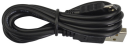        |
| Breadboard*1             | Breadboard wire                      | F-M Dupont Lines                                  | Micro USB Cable*1               |

**3. Schematic Diagram：**

**4.Wiring Graph：**

**5. Test Code：**

**Code 1：**

Wire up through the connection diagram, DHT11 humidity and temperature sensor is linked with P0. Link computer with Micro:bit board. Then enable the on-line programming tool to design the code.

**How to add the library file of DHT11 temperature and humidity sensor:**

Enter the Micro:bit online programming page and click“Advanced”then“Extensions”.

Input DHT11 to search (as shown below). Click library file to download and install automatically.

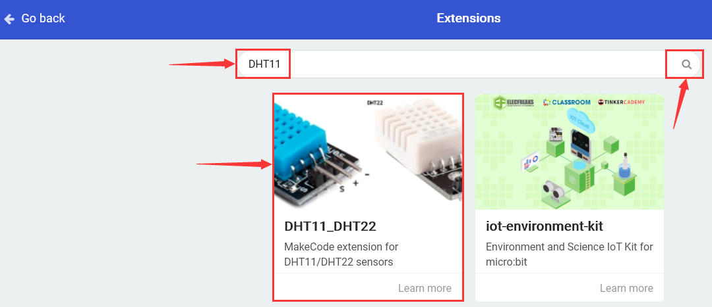

After installing library file successfully, the corresponding blocks are shown in the code editing area.

(1)

1.  Click “Led”→”more”to get block“led enable false”, and combine it with “on start”.

\*\*\*\*\*\*\*\*\*\*\*\*\*\*\*\*\*\*\*\*\*\*\*\*\*\*\*\*\*\*\*\*\*\*\*\*\*\*\*\*\*\*\*\*\*\*\*\*\*\*\*\*\*\*\*\*\*\*\*\*\*\*\*\*

2.  Click“DHT11/DHT22”to move out blocks“Query DHT11Data pin P0 Pin pull up true Serial output false and wait 2 sec after query true”.
    
3.  Place it into“forever” block

\*\*\*\*\*\*\*\*\*\*\*\*\*\*\*\*\*\*\*\*\*\*\*\*\*\*\*\*\*\*\*\*\*\*\*\*\*\*\*\*\*\*\*\*\*\*\*\*\*\*\*\*\*\*\*\*\*\*\*\*\*\*\*\*

(2)

1.  Enter “Advanced”→“Serial”to drag out “serial write value“ ”= 0”.

2.  Put it beneath“wait 2 sec after query true”,

3.  Go to“DHT11/DHT22”to find out“Read humidity”block.

4.  Place it to the right box of “=”. Click the drop-down triangle button to select “temperature”.
    
5.  Input“temperature”character string at left box of“=”block.

\*\*\*\*\*\*\*\*\*\*\*\*\*\*\*\*\*\*\*\*\*\*\*\*\*\*\*\*\*\*\*\*\*\*\*\*\*\*\*\*\*\*\*\*\*\*\*\*\*\*\*\*\*\*\*\*\*\*\*\*\*\*\*\*

(3)

1.  Copy“serial......“temperature”=Read temperature” once and place it into“forever”block.
    
2.  Change temperature into“humidity”

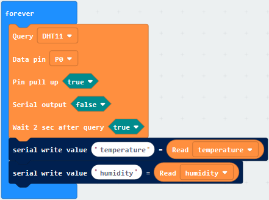

\*\*\*\*\*\*\*\*\*\*\*\*\*\*\*\*\*\*\*\*\*\*\*\*\*\*\*\*\*\*\*\*\*\*\*\*\*\*\*\*\*\*\*\*\*\*\*\*\*\*\*\*\*\*\*\*\*\*\*\*\*\*\*\*

Click“Basic”to drag out “pause (ms) 100” below the block “serial...Read humidity”, and set to 200ms

Complete Program:

|  | “on start”: command block runs once to start program. Turn off LED dot matrix   The program under the block “forever” runs cyclically.  Query data from DHT11/DHT22 sensor,  if you are using 4 pins/no PCN board versions,  you’ll need to pull up the data pin.   It is also recommended to wait 1(DHT11)  or 2(DHT22) seconds between each query.  Serial write value “temperature ”=Read temperature Serial write value“humidity ”=Read humidity Delay in 200ms |
| ----------------------------------------------- | ------------------------------------------------------------ |
|                                                 |                                                 |

Click“JavaScript", you will view the corresponding JavaScript code:

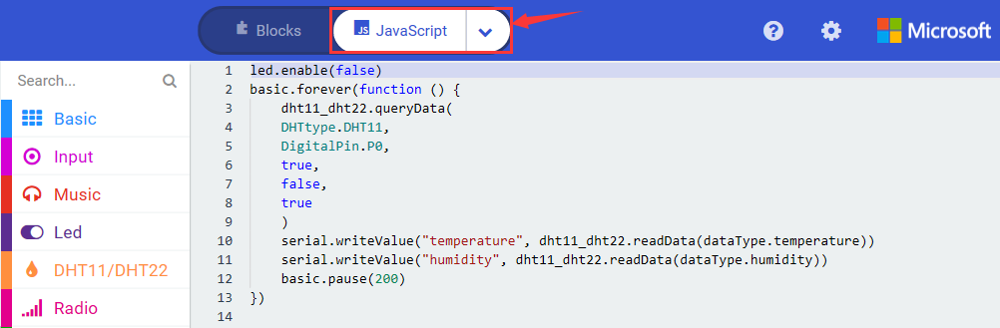

Then click drop-down triangle button to select“Python”to see the Python language code:

Wire up through the connection diagram, upload code, power on and open CoolTerm, click Options to select SerialPort. Set COM port and baud rate is 115200(the baud rate of USB serial communication of Micro:bit is 115200 through the test).

Click “OK” and “Connect”.

DHT11 temperature and humidity sensor detect the ambient temperature and humidity value and the test result will be shown on serial monitor. As shown below:

**Code 2：**

Hook up according to the above connection diagram, S end of DHT11 humidity is attached to P0, SDA and SCL pins of OLED module are linked with P20 and P19. Link computer with micro:bit board. Then enable the online programming tool to
design the code.

Click “Led”→”more”to get block“led enable false”, combine it with “on start”.

\*\*\*\*\*\*\*\*\*\*\*\*\*\*\*\*\*\*\*\*\*\*\*\*\*\*\*\*\*\*\*\*\*\*\*\*\*\*\*\*\*\*\*\*\*\*\*\*\*\*\*\*\*\*\*\*\*\*\*\*\*\*\*\*

Click“OLED”to find out“initialize OLED with width 128 height 64”, and place it below“led enable false”block

\*\*\*\*\*\*\*\*\*\*\*\*\*\*\*\*\*\*\*\*\*\*\*\*\*\*\*\*\*\*\*\*\*\*\*\*\*\*\*\*\*\*\*\*\*\*\*\*\*\*\*\*\*\*\*\*\*\*\*\*\*\*\*\*

Click“DHT11/DHT22”to find out“Query DHT11 Data pin P0 Pin pull up true Serial output false Wait 2 sec after query true”, and move them into “forever”.

Enter“OLED”to move“clear OLED display”block below “Wait 2 sec after query true”.

\*\*\*\*\*\*\*\*\*\*\*\*\*\*\*\*\*\*\*\*\*\*\*\*\*\*\*\*\*\*\*\*\*\*\*\*\*\*\*\*\*\*\*\*\*\*\*\*\*\*\*\*\*\*\*\*\*\*\*\*\*\*\*\*

Click“OLED”to drag out“show number 0”into“forever”, then tap“DHT11/DHT22”module and drag out“Read humidity”into“show number 0”.

Click“OLED”to drag out“show string”””block and place it beneath the block“show number Read humidity”. Then enter “%”into“show string”””block

\*\*\*\*\*\*\*\*\*\*\*\*\*\*\*\*\*\*\*\*\*\*\*\*\*\*\*\*\*\*\*\*\*\*\*\*\*\*\*\*\*\*\*\*\*\*\*\*\*\*\*\*\*\*\*\*\*\*\*\*\*\*\*\*

Copy code string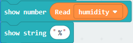once and change“%”into“C”, humidity into “temperature”. Then place it below the “show string“%””block.

Complete Program：

|  | “on start”: command block runs once to start program. Turn off LED dot matrix Initialize the OLED,64 in height,128 in width.    The program under the block “forever” runs cyclically.  Query data from DHT11/DHT22 sensor,  if you are using 4 pins/no PCN board versions,  you’ll need to pull up the data pin.   It is also recommended to wait 1(DHT11)  or 2(DHT22) seconds between each query.  Clear OLED display.  Show the read humidity. Display“%”.  OLED displays the temperature read by P0. OLED shows “C” |
| ----------------------------------------------- | ------------------------------------------------------------ |
|                                                 |                                                 |

Click“JavaScript", you will view the corresponding JavaScript code:

Then click drop-down triangle button to select“Python”to see the Python language code:

**6. Test Results：**

Upload program and power on. OLED displays the detected ambient temperature and humidity value.

### Project 42： IR Remote Control

1.  **Description：**

In our life, we often see people use infrared remote control to control various home appliances, such as refrigerators, stereos, and video recorders.

Infrared remote control is composed of infrared transmitting and receiving systems, that is, an IR remote control, IR receiver and a single-chip microcomputer that can be decoded.

The 38K infrared carrier signal emitted by the IR remote control is encoded by the encoding chip.

When the remote control button is pressed, an infrared carrier signal is sent out. And the IR receiver receives the signal to decode it, and judges which key is pressed by the difference of the data code.

In this project,we connect the IR receiver to the P16 of the Micro:bit board and upload the corresponding test code. After powering on, point at the IR receiver and press the button of infrared remote control , and then we can see the corresponding button key value on the serial monitor.

We can control other external sensor modules according to these key values. In this experiment, we connect external RGB, and use the infrared remote control to control the RGB.

2.  **Components List:**

|  |              |  |  |
| ------------------------ | ------------------------------------ | ------------------------ | ------------------------ |
| Micro:bit motherboard*1  | keyestudio Micro:bit T Type Shield*1 | RGB*1                    | Breadboard*1             |
|  |              |  |  |
| 220ΩResistor*3           | IR remote control*1                  | Breadboard wire          | Micro USB cable*1        |
|  |                                      |                          |                          |
| IR receiver Breadboard*1 |                                      |                          |                          |

3.  **Schematic Diagram：**

    

4.  **Wiring Graph：**

**5. Test Code：**

**Code 1：**

Hook up according to the above connection diagram, IR receiver is attached to P16. Link computer with micro:bit board. Then enable the online programming tool to design the code.

**How to add library file of IR receiver:**

Enter the Micro:bit online programming page and click“Advanced”then“Extensions”

Input the library file link：https://github.com/mworkfun/pxt-RI-receiver.gitand search, as shown below, click to install the library file.

After Installing the library file of IR receiver successfully, then the corresponding blocks are displayed in edit column.

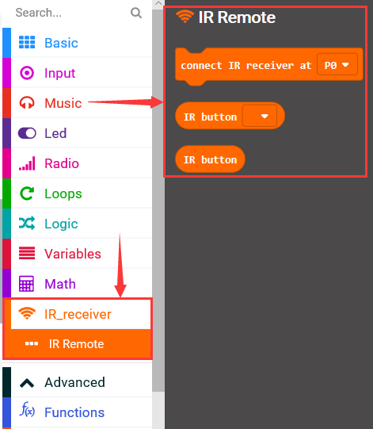

(1)

Click “Led”→“more”→“led enable false”

Put it into“on start”block.

\*\*\*\*\*\*\*\*\*\*\*\*\*\*\*\*\*\*\*\*\*\*\*\*\*\*\*\*\*\*\*\*\*\*\*\*\*\*\*\*\*\*\*\*\*\*\*\*\*\*\*\*\*\*\*\*\*\*\*\*\*\*\*\*

(2)

A. Go to“IR Remote”and move out “connect IR receiver at P0”block below the block“led enable false”.

B. IR receiver is linked with P16, so click the drop-down triangle button to select P16.

\*\*\*\*\*\*\*\*\*\*\*\*\*\*\*\*\*\*\*\*\*\*\*\*\*\*\*\*\*\*\*\*\*\*\*\*\*\*\*\*\*\*\*\*\*\*\*\*\*\*\*\*\*\*\*\*\*\*\*\*\*\*\*\*
(3)

A. Enter“Variables”→“Make a Variable...”→“New variable name：”，

B. Enter“val”and click “OK”. Thereby, the variable“val” is created.

C. Go to “Variables”to drag“set val to 0”into“forever”block

\*\*\*\*\*\*\*\*\*\*\*\*\*\*\*\*\*\*\*\*\*\*\*\*\*\*\*\*\*\*\*\*\*\*\*\*\*\*\*\*\*\*\*\*\*\*\*\*\*\*\*\*\*\*\*\*\*\*\*\*\*\*\*\*

(4) Click“IR Remote”to move“IR button”into“0”box.

(5)

1.  Go to“Advanced”→“Serial”→“serial write value“x”=0”

2.  Place it below the block “set val to IR button”

3.  Change “x” into “IR”

4.  Move out “val”from“Variables”into “0”box

\*\*\*\*\*\*\*\*\*\*\*\*\*\*\*\*\*\*\*\*\*\*\*\*\*\*\*\*\*\*\*\*\*\*\*\*\*\*\*\*\*\*\*\*\*\*\*\*\*\*\*\*\*\*\*\*\*\*\*\*\*\*\*\*

(6)A. Click“Basic”→“pause (ms) 100”

B. Place it into“forever”, set to 1000ms.

Complete Program：

|  | “on start”: command block runs once to start program.  Turn off LED dot matrix  Connect IR receiver to P16   The program under the block “forever” runs cyclically.  Set val to IR button  Serial write value “IR”= val  Delay in 1000ms |
| ----------------------------------------------- | ------------------------------------------------------------ |
|                                                 |                                                 |

Click“JavaScript", you will view the corresponding JavaScript code:

Then click drop-down triangle button to select“Python”to see the Python language code:

**6. Code explanation：**

When the button is unpressed, the serial monitor refresh the number 0 constantly; When pressed, the serial monitor shows the corresponding key values

**Special Note:**

1.  Some IR remote control doesn’t come with battery, therefore you need to purchase it yourself. The battery mode is CR2025.
    
2.  Need to make sure IR remote control is OK:

First step: Open camera of cellphone, point IR remote control at camera.

Second step: if there is purple light is flashing, which it indicates “OK”

Wire up through the connection diagram, upload code, power on and open CoolTerm, click Options to select SerialPort. Set COM port and baud rate is 115200(the baud rate of USB serial communication of Micro:bit is 115200 through the test).
Click “OK” and “Connect”.

IR remote control points at IR receiver, press the keys. Then the corresponding key values are shown on serial monitor, as shown below:

We make a key value table by these key values

**Code 2：**

The IR receiver is connected to P16, the pins of RGB are linked with P0, P1 and P2. Link computer with micro:bit board. Then enable the online programming tool to design the code.

1.  Click “Led”→”more”to get block“led enable false”, combine it with “on start”.

\*\*\*\*\*\*\*\*\*\*\*\*\*\*\*\*\*\*\*\*\*\*\*\*\*\*\*\*\*\*\*\*\*\*\*\*\*\*\*\*\*\*\*\*\*\*\*\*\*\*\*\*\*\*\*\*\*\*\*\*\*\*\*\*

2.  Go to “IR Remote”to lay down the block “connect IR receiver at P0” into “on start”. IR receiver is linked with P16, so set to P16.

\*\*\*\*\*\*\*\*\*\*\*\*\*\*\*\*\*\*\*\*\*\*\*\*\*\*\*\*\*\*\*\*\*\*\*\*\*\*\*\*\*\*\*\*\*\*\*\*\*\*\*\*\*\*\*\*\*\*\*\*\*\*\*\*

(3)

1.  Click“Variables”→“Make a Variable...”→“New variable name：”

2.  Enter“val”in the blank box and click“OK”to produce variable“val”.

3.  Variable“val2”is created in same way. Then respectively move out“set val to 0”and“set val2 to 0”into“on start”.

\*\*\*\*\*\*\*\*\*\*\*\*\*\*\*\*\*\*\*\*\*\*\*\*\*\*\*\*\*\*\*\*\*\*\*\*\*\*\*\*\*\*\*\*\*\*\*\*\*\*\*\*\*\*\*\*\*\*\*\*\*\*\*\*

(4) Click“Variables”to drag out“set val to 0”into “forever”, then tap“IR. Remote”to move the“IR button”into 0 box

\*\*\*\*\*\*\*\*\*\*\*\*\*\*\*\*\*\*\*\*\*\*\*\*\*\*\*\*\*\*\*\*\*\*\*\*\*\*\*\*\*\*\*\*\*\*\*\*\*\*\*\*\*\*\*\*\*\*\*\*\*\*\*\*

(5) Go to “Logic”and find“if. true..then”block. Lay down it into “forever”and drag “=” into“true”box.

(6) Click“Variables”and move out variable“val”to the left box , then click the drop-down triangle button to choose “≠”.

\*\*\*\*\*\*\*\*\*\*\*\*\*\*\*\*\*\*\*\*\*\*\*\*\*\*\*\*\*\*\*\*\*\*\*\*\*\*\*\*\*\*\*\*\*\*\*\*\*\*\*\*\*\*\*\*\*\*\*\*\*\*\*\*
(7) A. Enter“Variables”again and find out“set val2 to 0”, put it beneath“if...0..then”block.

B. Drag variable“val” into“0”box of block“set val2 to 0”

\*\*\*\*\*\*\*\*\*\*\*\*\*\*\*\*\*\*\*\*\*\*\*\*\*\*\*\*\*\*\*\*\*\*\*\*\*\*\*\*\*\*\*\*\*\*\*\*\*\*\*\*\*\*\*\*\*\*\*\*\*\*\*\*

(8)A. Tap“Logic”module and move out“if...then...else”to the beneath of“set val2 to val”.

B. Then click“”icon for 3 times

C. Move out“=” block from“Logic” into“true”box.

\*\*\*\*\*\*\*\*\*\*\*\*\*\*\*\*\*\*\*\*\*\*\*\*\*\*\*\*\*\*\*\*\*\*\*\*\*\*\*\*\*\*\*\*\*\*\*\*\*\*\*\*\*\*\*\*\*\*\*\*\*\*\*\*

(9)Go to“Variable”to drag ou“val2”and place it to left “0”box of “=”, change right“0”into 70.

(10)

1.  Go to“Advanced”→“Pins”→“analog write pin P0 to 1023”

2.  Leave it below the“if...val2...then”block and copy it for 2 times.

3.  RGB is linked with P0, P1 and P2. So set to P0, P1 and P2. Set P1 and P2 to 0, and keep P0 unchanged.

(11)

1.  Copy block“val2=70”once and place it into the blank box behind the first“else if..then”, change 70 into 68.
    
2.  Then copy the code stringonce and leave it beneath the first “else if ...then”block.
    
3.  Set P0 to 0, P1 to 1023.

(12)

1.  Duplicate block“val2=68”once and place it into the blank box behind the second“else if...then”block, change 68 into 67.
    
2.  Then copy the code stringonce and leave it beneath the second“else if ...then”block.
    
3.  Set P1 to 0 and P2 to 1023.

(13)

1.  Replicate block“val2=67”once and place it into the blank box behind the third“else if...then”block, change 67 into 64.
    
2.  Then copy the code stringonce and leave it beneath the third“else if ...then”block.
    
3.  Set P0 to 1023.

(14)

Copy the code stringonce and keep it below the “else” block. Set P0, P1 and P2 to 1023.

Complete Program：

|   | “on start”: command block runs once to start program.  Turn off LED dot matrix  Connect IR receiver to P16  Set val and val2 to 0     The program under the block “forever” runs cyclically.  Set val to IR button.   When val≠0,  the program under “if val1...then”block will be executed.  Set val2 to val  When val2=70,  the program under “if val2...then” block will be executed.  Set P0, P1 and P2 to 1023,0 and 0  When val2=68,  the program under “if val2.68..then” block will be executed.  Set P0, P1 and P2 to 0, 1023 and 0  When val2=67, the program under “if val2.67..then” block will be executed.  Set P0, P1 and P2 to 0, 0 and 1023   When val2=64,  the program under “if val2.64..then” block will be executed.  Set P0, P1 and P2 to 1023, 0 and 1023   Otherwise,  the program under the else block will be executed   Set P0, P1 and P2 to 1023 |
| ------------------------------------------------------------ | ------------------------------------------------------------ |
|                                                 |                                                 |

Click“JavaScript", you will view the corresponding JavaScript code:

Then click drop-down triangle button and select“Python”to see the Python language code:

7.  **Test Results：**

Wire up through the connection diagram, upload the program and plug in power. Point IR remote control at IR receiver. Then press the corresponding keys. When press keys separately, RGB LED shows red, green, blue and purple color. When other keys are pressed, RGB displays white color.

8.  **Extension Project：**

Point IR remote control at IR receiver. Then press the corresponding keys. When press,, keys separately, RGB LED shows red, green, blue and purple color. When  is pressed, RGB displays white color

### Project 43： Electronic Clock

1.  **Description：**

The DS1302 trickle-charge timekeeping chip contains a real-time clock/calendar and 31 bytes of static RAM. It communicates with a microprocessor via a simple serial interface. The real-time clock/calendar provides seconds, minutes, hours, day, date, month, and year information. The end of the month date is automatically adjusted for months with fewer than 31 days, including corrections for leap year. The clock operates in either the 24-hour or 12-hour format with an AM/PM indicator.  

Interfacing the DS1302 with a microprocessor is simplified by using synchronous serial communication. Only three wires are required to communicate with the clock/RAM: CE, I/O (data line), and SCLK (serial clock). Data can be transferred to and from the clock/RAM 1 byte at a time or in a burst of up to 31 bytes. The DS1302 is designed to operate on very low power and retain data and clock information on less than 1µW.  

The DS1302 is the successor to the DS1202. In addition to the basic timekeeping functions of the DS1202, the DS1302 has the additional features of dual power pins for primary and backup power supplies, programmable trickle charger for VCC1, and seven additional bytes of scratchpad memory. ，

The DS1302 and the MCU can simply communicate in a synchronous serial manner, and only three ports are needed: RST reset, DAT data line and CLK serial clock. The module comes with a positioning hole, which is convenient for you to fix it to other equipment.

DS1302 is practically clock module. When setting time, it cam move.

2. **Components needed**

|  |              |  |           |
| ------------------------ | ------------------------------------ | ------------------------ | --------------------------------- |
| Micro:bit *1             | keyestudio Micro:bit T Type Shield*1 | DS1302 Clock Module*1    | Keyestudio 4-digit Tube Module *1 |
|  |              |  |           |
| Breadboard*1             | Breadboard Wire                      | F-M Dupont lines         | Micro USB Cable*1                 |

**3. Schematic Diagram：**

**4. Wiring Graph：**

**5. Test Code：**

**Code 1：** **(Note: The DAT pin on the DS1302Clock module equals to the DIO pin, the RST pin is the CS pin, and the CLK pin is the CLK pin )**

Wire up through the connection diagram, DS1302Clock module is connected to P13, P14 and P15. Link computer with Micro:bit board. Then enable the online programming tool to design the code.

**How to add the library file of DS1302Clock module:**

Enter the Micro:bit online programming page then click”Variables”and“Extensions”

Input DS1302 to search, as shown below , click to download and install the library file.

After installing the library file successfully, the corresponding blocks are displayed in the code editing column.

(1)

1.  Click“Led”→“more”，and find out“led enable false”

2.  Put it into the block“on start”

\*\*\*\*\*\*\*\*\*\*\*\*\*\*\*\*\*\*\*\*\*\*\*\*\*\*\*\*\*\*\*\*\*\*\*\*\*\*\*\*\*\*\*\*\*\*\*\*\*\*\*\*\*\*\*\*\*\*\*\*\*\*\*\*

(2)

1.  Click“Variables”→“Make a Variable...”→“New variable name：”，

2.  Input“ds”and click“OK”, then variable“ds”is generated. C. Drag“set ds to 0”from“Variables”into block“on start”
    

**(Note: The DAT pin on the DS1302Clock module equals to the DIO pin, the RST pin is the CS pin, and the CLK pin is the CLK pin )**

\*\*\*\*\*\*\*\*\*\*\*\*\*\*\*\*\*\*\*\*\*\*\*\*\*\*\*\*\*\*\*\*\*\*\*\*\*\*\*\*\*\*\*\*\*\*\*\*\*\*\*\*\*\*\*\*\*\*\*\*\*\*\*\*

(3)

1.  Enter“RTC DS1302”→“CLK P13 DIO P14 CS P15 ”；

2.  Move it into 0 box of“set ds to 0”block.

3.  DS1302Clock module is connected to P13, P14 and P15.

\*\*\*\*\*\*\*\*\*\*\*\*\*\*\*\*\*\*\*\*\*\*\*\*\*\*\*\*\*\*\*\*\*\*\*\*\*\*\*\*\*\*\*\*\*\*\*\*\*\*\*\*\*\*\*\*\*\*\*\*\*\*\*\*

(4)

1.  Go to“Advanced”→“Serial”→“serial write value“x”=0”；

2.  Place it into“forever”block

3.  Move out“ds get year”from“RTC DS1302”and leave it into “0”box.

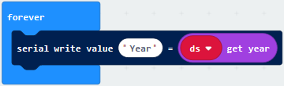

(5)

A. Then duplicate“serial write value“Year”=ds get year”for 6 times and place them into“forever”;

B. Separately change“Year”into “Month, “Weekday”,“Day”,“Hour”,“Minute”,“Second”.

C. Then drag out the corresponding blocks“ds get month”,“ds get weekday”,“ds get day”,“ds get hour”,“ds get minute”,“ds get second”from “RTC DS1302”.

D. Set code string as follows:

\*\*\*\*\*\*\*\*\*\*\*\*\*\*\*\*\*\*\*\*\*\*\*\*\*\*\*\*\*\*\*\*\*\*\*\*\*\*\*\*\*\*\*\*\*\*\*\*\*\*\*\*\*\*\*\*\*\*\*\*\*\*\*\*

(6) Click“Basic”to move “pause (ms) 100”block below“serial .....second”block

Complete Program：

|  | “on start”: command block runs once to start program.  Turn off LED dot matrix  Set “ds” to “CLK P13 DIO P14 CS P15”   The program under the block “forever” runs cyclically.  Serial write value Year=ds get year Serial write value Month=ds get month Serial write value Day=ds get day Serial write value Weekday=ds get weekday Serial write value Hour=ds get hour Serial write value Weekday=ds get weekday Serial write value Hour=ds get hour  Delay in 100ms |
| ----------------------------------------------- | ------------------------------------------------------------ |
|                                                 |                                                 |

Click“JavaScript", you will view the corresponding JavaScript code:

Then click drop-down triangle button to select“Python”to see the Python language code:

Wire up through the connection diagram, upload code, power on and open CoolTerm, click Options to select SerialPort. Set COM port and baud rate is 115200(the baud rate of USB serial communication of Micro:bit is 115200 through the test).

The serial monitor shows the time（year, month, day, week, hour, minute, second)，as shown below.

**Code 2：**

**(Note: The DAT pin on the DS1302Clock module equals to the DIO pin, the RST pin is the CS pin, and the CLK pin is the CLK pin )**

Wire up through the connection diagram, the pin CLK, DAT and DAT of DS1302Clock module are attached to P13, P14 andP15

nk computer with Micro:bit board. Then enable the online programming tool to design the code as follows:

Add the library file of DS1302Clock module first, and refer to the“Code 1”. In addition, we also need to import the library file of 4-digit tube module(Project18)

(1)

1.  Click“Led”→“more”，and find out“led enable false”

2.  Put it into the block“on start”

\*\*\*\*\*\*\*\*\*\*\*\*\*\*\*\*\*\*\*\*\*\*\*\*\*\*\*\*\*\*\*\*\*\*\*\*\*\*\*\*\*\*\*\*\*\*\*\*\*\*\*\*\*\*\*\*\*\*\*\*\*\*\*\*

(2)

1.  Click “Variables”→“Make a Variable...”→“New variable name：”

2.  Input“ds”and click“OK”, then variable“ds”is generated.

3.  Generate the variable“tm”in same way.

4.  Drag“set tm to 0”from“Variables”into block“on start” , and copy it for once. Then click the triangle button to select “ts”

(3)

1.  Enter“RTC DS1302”→“CLK P13 DIO P14 CS P15 ”；

2.  Place it into“0”box of“set ds to 0”block.

3.  Click“TM1637”to get “CLK P1 DIO P2 intensity 7 LED count 4”and leave it into “0” box of“set tm to 0”block.

\*\*\*\*\*\*\*\*\*\*\*\*\*\*\*\*\*\*\*\*\*\*\*\*\*\*\*\*\*\*\*\*\*\*\*\*\*\*\*\*\*\*\*\*\*\*\*\*\*\*\*\*\*\*\*\*\*\*\*\*\*\*\*\*

(4)

1.  Go to“TM1637”to get“tm show digit 5 at 0”and place it into“forever”block.

2.  Enter“Math”to move out“÷”block into“5”box

3.  Click“RTC DS1302”to drag“ds get hour”into left“0”box

4.  Then set“ds get hour÷ 10”

(5)

1.  Copy block “tm show digit ds get hour÷10 at 0”block.

2.  Remove“ds get hour÷ 10”block

3.  Enter“Math”to move out“remainder of 0 ÷ 1”block into “5”box.

4.  Go to“RTC DS1302”to drag“ds get hour”into “0”box of“remainder of 0 ÷ 1”, then set to“tm show digit reminder of get hour÷ 10 at 1”.

\*\*\*\*\*\*\*\*\*\*\*\*\*\*\*\*\*\*\*\*\*\*\*\*\*\*\*\*\*\*\*\*\*\*\*\*\*\*\*\*\*\*\*\*\*\*\*\*\*\*\*\*\*\*\*\*\*\*\*\*\*\*\*\*

(6) Copy code stringonce and place it into“forever”block，

Then go to“RTC DS1302”to move out“ds get minute”and replace“ds get hour”block，separately change 0 into 2 and 1 into 3:

\*\*\*\*\*\*\*\*\*\*\*\*\*\*\*\*\*\*\*\*\*\*\*\*\*\*\*\*\*\*\*\*\*\*\*\*\*\*\*\*\*\*\*\*\*\*\*\*\*\*\*\*\*\*\*\*\*\*\*\*\*\*\*\*

(7)Enter“8 TM1637”to get“item DotPoint at 1 show true”and leave it into“forever”block

\*\*\*\*\*\*\*\*\*\*\*\*\*\*\*\*\*\*\*\*\*\*\*\*\*\*\*\*\*\*\*\*\*\*\*\*\*\*\*\*\*\*\*\*\*\*\*\*\*\*\*\*\*\*\*\*\*\*\*\*\*\*\*\*

(8) Click“Basic”to drag“pause (ms) 100”below the block “item DotPoint at 1 show true”, and set to 500ms.

\*\*\*\*\*\*\*\*\*\*\*\*\*\*\*\*\*\*\*\*\*\*\*\*\*\*\*\*\*\*\*\*\*\*\*\*\*\*\*\*\*\*\*\*\*\*\*\*\*\*\*\*\*\*\*\*\*\*\*\*\*\*\*\*

(9)Duplicate code stringagain, and place it into“forever”block，click the triangle button to select “false”.

Complete Program：

Click“JavaScript", you will view the corresponding JavaScript code:

Then click drop-down triangle button and select“Python”to see the Python language code：

6.  **Tests Results：**

Wire up through the connection diagram, upload the program and power on, the time is shown on 4-digit tube module

### Project 44：Micro: bit Somatosensory Gloves

1.  **Description：**

Integrating 3-axis magnetometer and accelerator, micro:bit board can measure the rotation speed of 3-axis, detect the acceleration, tilt and free fall, etc.

3-axis magnetometer communicate with the outside by I2C port. Its range can be set to ±2g, ±4g, ±8g, and the maximum data update rate is 800Hz.

When the Micro:bit board is in static or uniform motion, it can only detect gravitational acceleration. When in slight vibration, the detected acceleration is far smaller than the acceleration of gravity. Thereby, in a sense, we primarily detect change of gravitational acceleration at x, y and z axis when using Micro:bit board.

**2. Components List:**

|  |              |  |  |
| ------------------------ | ------------------------------------ | ------------------------ | ------------------------ |
| Micro:bit *1             | keyestudio Micro:bit T Type Shield*1 | RGB*1                    | 220Ω Resistor*3          |
|  |              |  |                          |
| Breadboard*1             | Breadboard wire                      | Micro USB Cable*1        |                          |

3.  **Schematic Diagram：**

    

4.  **Wiring Graph：**

    

**5. Test Code：**

**Code 1:**

**Micro:bit motherboard primarily demonstrates 3 axis magnetometer (electronic compass) function**

Wire up through the connection diagram, upload code, the pins of RGB are connected to P0, P1 and P2. Link computer with Micro:bit board. Then enable the online programming tool to design the code as follows

(1)

Click“Led”→“more”to get block“led enable false”;

Combine it with“on start”.

\*\*\*\*\*\*\*\*\*\*\*\*\*\*\*\*\*\*\*\*\*\*\*\*\*\*\*\*\*\*\*\*\*\*\*\*\*\*\*\*\*\*\*\*\*\*\*\*\*\*\*\*\*\*\*\*\*\*\*\*\*\*\*\*

(2) Go to“Input”to get“on shake”, then click the triangle button to select“logo up”.

1.  Click“Advanced”→“Pins”→“analog write pin P0 to 1023”

2.  Place it into“on logo up”block

3.  Copy“analog write pin P0 to 1023”for 2 times.

4.  RGB are connected to P0, P1 and P3, therefore, set to P0, P1, P2.

5.  Then set P1 and P2 to 0, keep P0 unchanged.

(3)

1.  Duplicate code string for 6 times.
    
2.  Separately set to“logo down”,“screen up”,“screen down”,“tilt left ”,“tilt right”and“shake”
    
3.  Then set P0 to 0, 0, 1023, 1023,0,1023; P1 to 1023, 0, 1023, 0, 1023, 1023; P2 to 0, 1023, 0, 1023, 1023,1023.

Complete Program：

|   | “on start”: command block runs once to start program. Turn off LED dot matrix  The logo of Micro:bit board is toward up. Set P0, P1and P2 to 1023, 0,0   The logo of Micro:bit board is toward down. Set P0, P1and P2 to 0, 1023, 0  The screen of Micro:bit board is toward up. Set P0, P1and P2 to 0, 0, 1023  The screen of Micro:bit board is toward down. Set P0, P1and P2 to 1023, 1023, 0  Micro:bit board is inclined to left side. Set P0, P1and P2 to 1023, 0,1023  Micro:bit board is inclined to right side. Set P0, P1and P2 to 0,1023, 1023  Vibrate Micro:bit board Set P0, P1and P2 to 1023,1023, 1023 |
| ------------------------------------------------------------ | ------------------------------------------------------------ |
|                                                 |                                                 |

Click“JavaScript", you will view the corresponding JavaScript code:

Then click drop-down triangle button and select“Python”to see the Python language code:

Wire up, upload the code and plug in power power. When the logo of micro:bit board is up and down, RGB lights up red and green green.

When the screen of micro:bit board is up and down, RGB respectively displays blue and yellow color; when micro:bit board is tilted to left and right side, purple and whit color are displayed.

**Code 2：**

**Micro:bit motherboard primarily demonstrates 3 axis magnetometer (electronic compass) function**

Hook up according to the above connection diagram, link computer with micro:bit board. Then enable the online programming tool to design the code.

1.  Click “Led”→”more”to get block“led enable false”, and combine it with“on start”.
2.  

\*\*\*\*\*\*\*\*\*\*\*\*\*\*\*\*\*\*\*\*\*\*\*\*\*\*\*\*\*\*\*\*\*\*\*\*\*\*\*\*\*\*\*\*\*\*\*\*\*\*\*\*\*\*\*\*\*\*\*\*\*\*\*\*

(2)

1.  Click“Variables”→“Make a Variable...”→“New variable name：”

2.  Enter“X” and click“OK”, then variable “X”is produced.

3.  Then go to“Variables”to drag out“set X to 0”into“forever” block.

4.  Create variable“Y”and“Z”in same way.

\*\*\*\*\*\*\*\*\*\*\*\*\*\*\*\*\*\*\*\*\*\*\*\*\*\*\*\*\*\*\*\*\*\*\*\*\*\*\*\*\*\*\*\*\*\*\*\*\*\*\*\*\*\*\*\*\*\*\*\*\*\*\*\*

(3) Enter“Input”to drag out “acceleration(mg) x”out and place it into “0”box

\*\*\*\*\*\*\*\*\*\*\*\*\*\*\*\*\*\*\*\*\*\*\*\*\*\*\*\*\*\*\*\*\*\*\*\*\*\*\*\*\*\*\*\*\*\*\*\*\*\*\*\*\*\*\*\*\*\*\*\*\*\*\*\*

(4) Copy“set X to acceleration(mg) x”block for 2 times. Then click triangle button to set to Y and Z.

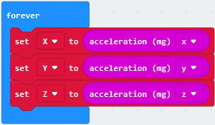

\*\*\*\*\*\*\*\*\*\*\*\*\*\*\*\*\*\*\*\*\*\*\*\*\*\*\*\*\*\*\*\*\*\*\*\*\*\*\*\*\*\*\*\*\*\*\*\*\*\*\*\*\*\*\*\*\*\*\*\*\*\*\*\*

(5)

1.  Click“Advanced”→“Serial”→“serial write line”””

2.  Place it into“forever”

3.  Go to“Advanced”→“Text”→“join Hello World”

4.  Move it into“serial write line”””

5.  Drag variable “X” into “world” box, and change “Hello”into“X====” .

\*\*\*\*\*\*\*\*\*\*\*\*\*\*\*\*\*\*\*\*\*\*\*\*\*\*\*\*\*\*\*\*\*\*\*\*\*\*\*\*\*\*\*\*\*\*\*\*\*\*\*\*\*\*\*\*\*\*\*\*\*\*\*\*

(6)

1.  Copy block“serial write line join X====X”for 2 times

2.  Respectively change“X====”into“Y====”and“Z====”

3.  Click the triangle button to select“y”and“z”

Complete Program：

|  | “on start”: command block runs once to start program.  Turn off LED dot matrix   The program under the block “forever” runs cyclically.  Set X to acceleration(mg) x Set Y to acceleration(mg) y Set Z to acceleration(mg) z  Write a character string “X\==\==x” on serial   Write a character string “Y\==\==y”on serial  Write a character string “Z==\==z” on serial |
| ----------------------------------------------- | ------------------------------------------------------------ |
|                                                 |                                                 |

Click“JavaScript", you will view the corresponding JavaScript code:

Then click drop-down triangle button and select“Python”to see the Python language code:

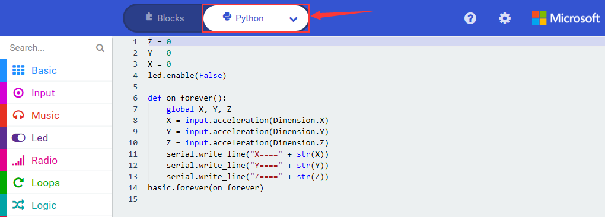

Wire up through the connection diagram, upload code, power on and open CoolTerm, click Options to select SerialPort. Set COM port and baud rate is 115200(the baud rate of USB serial communication of Micro:bit is 115200 through the test).

Click “OK” and “Connect”.

With the angles change of micro:bit board, the values of X, Y and Z vary as well, as shown below:

### Project 45：Joystick Control

1.  **Description：**

The joystick sensor module uses original high-quality metal PS2 joystick potentiometer, with (X, Y) 2-axis analog output and (Z) 1-channel button digital output. Combing with sensor shield, you can make a remote control or other interactive projects.

It is compatible with various MCU, like Micro:bit board. We connect keyestudio Micro:bit T Type Shield and Micro:bit board and this module together. The X, Y and Z end of joystick module are connected to the Pin 0, Pin1 and Pin2 of Micro:bit board. The results are shown on serial monitor.

2.  **Components List:**

|  |              |      |  |
| ------------------------ | ------------------------------------ | ---------------------------- | ------------------------ |
| Micro:bit *1             | keyestudio Micro:bit T Type Shield*1 | Keyestudio Joystick Module*1 | Breadboard wire          |
|  |              |      |                          |
| Micro USB Cable*1        | Breadboard*1                         | F-M DuPont wires             |                          |

3.  **Schematic Diagram：**

4.  **Wiring Graph：**

**5. Test Code：**

Wire up through the connection diagram, connect joystick module to P0, P1 and P2. Link computer with Micro:bit board. Then enable the online programming tool to design the code.

(1)

 Click“Led”→”more”to get block“led enable false”, and combine it with“on start”

\*\*\*\*\*\*\*\*\*\*\*\*\*\*\*\*\*\*\*\*\*\*\*\*\*\*\*\*\*\*\*\*\*\*\*\*\*\*\*\*\*\*\*\*\*\*\*\*\*\*\*\*\*\*\*\*\*\*\*\*\*\*\*\*

(2)

1.  Click“Advanced”→“Serial”→“serial write value “x”=0”;

2.  Move it into“forever”block

\*\*\*\*\*\*\*\*\*\*\*\*\*\*\*\*\*\*\*\*\*\*\*\*\*\*\*\*\*\*\*\*\*\*\*\*\*\*\*\*\*\*\*\*\*\*\*\*\*\*\*\*\*\*\*\*\*\*\*\*\*\*\*\*

(3)

1.  Enter“Advanced”→“Pins”→“analog read pin P0”；

2.  Leave it into“0”box

3.  Change“x”into“X”

\*\*\*\*\*\*\*\*\*\*\*\*\*\*\*\*\*\*\*\*\*\*\*\*\*\*\*\*\*\*\*\*\*\*\*\*\*\*\*\*\*\*\*\*\*\*\*\*\*\*\*\*\*\*\*\*\*\*\*\*\*\*\*\*

(4) A.Copy block“serial write value “X”=analog read pin P0”for 2 times.

B. Separately set“X”to P0,“Y”to“P1 and“B”to P2.

(5) Click “Basic” to move “pause (ms) 100” block below “serial..”B”..P2” block.

Complete Program：

|  | “on start”: command block runs once to start program. Turn off LED dot matrix  The program under the block “forever” runs cyclically.  Serial write value “X”= analog read pin P0 Serial write value “Y”= analog read pin P1 Serial write value “Z”= analog read pin P2  Delay in 100ms |
| ----------------------------------------------- | ------------------------------------------------------------ |
|                                                 |                                                 |

Click “JavaScript", you will view the corresponding JavaScript code:

Then click drop-down triangle button and select“Python”to see the Python language code:

6.  **Test Results：**

Wire up through the connection diagram, upload code, power on and open CoolTerm, click Options to select SerialPort. Set COM port and baud rate is 115200(the baud rate of USB serial communication of Micro:bit is 115200 through the test).

Click “OK”and “Connect”.(the baud rate of USB serial communication of Micro:bit is 115200 through the test)

Control Joystick Module then we could see the corresponding the displayed result on serial monitor

### Project 46： Analog Car Movement

1.  **Description：**

In previous project, we’ve learned the control principle of joystick. In this lesson, we put the theory to the practice and simulate the car movement by joystick.

Let’s connect the x and y ends of joystick module to P3 and P4 of Micro:bit board. B is linked with P5.

**2. Components List:**

|  |                          |              |           |  |
| ------------------------ | ------------------------------------------------ | ------------------------------------ | --------------------------------- | ------------------------ |
| Micro:bit *1             | Keyestudio Micro:bit T Type Shield*1             | ULN2003 Stepper Motor Driver Board*1 | Keyestudio5-wire Stepper motor *1 | RGB*1                    |
|  |                          |              |           |  |
| Joystick module *1       | Keyestudio Breadboard Specialized Power Module*1 | AA Battery Holder*6                  | Breadboard wire                   | 220ΩResistor*3           |
|  |                          |              |           |                          |
| F-M dupont Lines         | Breadboard*1                                     | Micro USB Cable*1                    | 6-Slot AA Battery Holder*1        |                          |

3.  **Schematic Diagram：**

4.  **Wiring Graph：**

**Note: the ends of specialized power module should be connected to breadboard, and the DIP switch on power module should be dialed to +3V end**

**5. Test Code：**

Wire up through the connection diagram, link computer with Micro:bit board. Then enable the online programming tool to design the code.

|         Joystick module         |      |   Connected Pin   |
| :-----------------------------: | ---- | :---------------: |
|                X                |      |        P3         |
|                Y                |      |        P4         |
|                B                |      |        P5         |
|                                 |      |                   |
| **Stepper motor driver module** |      | **Connected Pin** |
|               IN1               |      |        P0         |
|               1N2               |      |        P1         |
|               IN3               |      |        P2         |
|               IN4               |      |        P8         |
|                                 |      |                   |
|             **RGB**             |      | **Connected Pin** |
|             RED pin             |      |        P6         |
|            GREEN PIN            |      |        P7         |
|            Blue pin             |      |        P9         |

For adding the library file of stepper motor driver module, refer to the method of project 34 please.

(1)

1.  Click “Led”→”more”→“led enable false”,
2.  Combine it with “on start”block.
2.  

(2) A. Enter“Ckmake-Base”→“StepperMotor Init in0 P0 in1 P1 in2 P2 in3 P8”;

B. Drag it below the block“led enable false”

\*\*\*\*\*\*\*\*\*\*\*\*\*\*\*\*\*\*\*\*\*\*\*\*\*\*\*\*\*\*\*\*\*\*\*\*\*\*\*\*\*\*\*\*\*\*\*\*\*\*\*\*\*\*\*\*\*\*\*\*\*\*\*\*

(3)A. Enter“Ckmake-Base”→“set stepper Speed SPEED1”

B. Place it into“on start”block, click the drop-down triangle button to choose SPEED3.

(4)

A. Go to“Logic”→“if..true..then”

B. Move it into “forever”, then drag“=”block into“true”box.

\*\*\*\*\*\*\*\*\*\*\*\*\*\*\*\*\*\*\*\*\*\*\*\*\*\*\*\*\*\*\*\*\*\*\*\*\*\*\*\*\*\*\*\*\*\*\*\*\*\*\*\*\*\*\*\*\*\*\*\*\*\*\*\*

(5)

1.  Go to“Advanced”→“pins”→“analog read pin P0”.

2.  Put“analog read pin P0”to the left “0”box of “=”block;

3.  Joystick module is attached to P4, so click the triangle button to select P4. Change “=” into “\>”, 0 into 1000.

\*\*\*\*\*\*\*\*\*\*\*\*\*\*\*\*\*\*\*\*\*\*\*\*\*\*\*\*\*\*\*\*\*\*\*\*\*\*\*\*\*\*\*\*\*\*\*\*\*\*\*\*\*\*\*\*\*\*\*\*\*\*\*\*

(6)

1.  Go to“Advanced”→“Pins”→“digital write pin P0 to 0”

Lay down it below“analog read pin 4\>1000 then”block and duplicate three times.

2.  RED,GREEN and BLUE pins of RGB are separately linked with P6, P7 and P9. Therefore, set P6 , P7 and P9. Alter 0 into 1 for P6.

\*\*\*\*\*\*\*\*\*\*\*\*\*\*\*\*\*\*\*\*\*\*\*\*\*\*\*\*\*\*\*\*\*\*\*\*\*\*\*\*\*\*\*\*\*\*\*\*\*\*\*\*\*\*\*\*\*\*\*\*\*\*\*\*

(7)

1.  Click “Ckmake-Base”→“stepper Turn 0”.

2. Keep it beneath“digital write pin P9 to 0”block. 0 is altered into 1.

(8)

1.  Duplicate code string 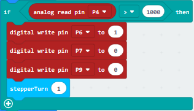once,

2.  Put it into “forever”, change “\>”into “\<”, 1000 into 500. Set P6 to 0, P7 to 1 and“stepper turn” to -1.

\*\*\*\*\*\*\*\*\*\*\*\*\*\*\*\*\*\*\*\*\*\*\*\*\*\*\*\*\*\*\*\*\*\*\*\*\*\*\*\*\*\*\*\*\*\*\*\*\*\*\*\*\*\*\*\*\*\*\*\*\*\*\*\*

(9)

1.  Replicate the code string once and move it into“forever”，delete.
    
2.  Go to“Advanced”→“Pins”→“digital write pin P0”.

3.  B end of joystick module is linked with P5, so set to“digital write pin P5”, then replace“analog read pin P4”with it.
    
4.  Set to “=”, change 1000 into 1, 1 into 0 for P6 and 0 into 1 for P9;

5.  Delete“stepper Turn 1”block.

Complete Program：

|   | “on start”: command block runs once to start program.  Turn off LED dot matrix  Set the speed of stepper motor to SPEED3    The program under the block “forever” runs cyclically.  When the analog signal read by P4>1000,  the next program will be executed  Set P6 to high level(1), RGB lights up red color Set P7 to low level(0) Set P9 to low level(0)  Stepper motor revolves anticlockwise for 1 circle.  When the analog signal read by P4<500,  the next program will be executed.  Set P6 to low level(0) Set P7 to high level(1), RGB lights up green color. Set P9 to low level(0)  Stepper motor revolves clockwise for 1 circle  When P5 is high level(1),  the program undre “if...1...then”will be executed.  Set P6 to low level(0) Set P7 to low level(0), RGB lights up blue color. Set P9 to low level(0) |
| ------------------------------------------------------------ | ------------------------------------------------------------ |
|                                                 |                                                 |

Click“JavaScript", you will view the corresponding JavaScript code:

Then click drop-down triangle button and select“Python”to see the Python language code:

**6. Test Results：**

Upload the program and power on. When pushing joystick forward, RGB lights up red color and stepper motor revolves anticlockwise for 1 circle; when pushing it backward, RGB lights up green color and stepper motor revolves clockwise for 1
circle. However, when it is pressed, RGB displays blue color.

**7. Extension Project：**

When the joystick is moved to the left, RGB lights up red color, and the stepper motor rotates 180° counterclockwise; when it is moved to the right, RGB lights up green color, and the stepper motor turns 180° clockwise; when the joystick is pressed, RGB displays white light.

### Project 47： Ultrasonic Ranging

1.  **Description：**

Ultrasonic sensors emit short, high-frequency sound pulses at regular intervals. These propagate in the air at the velocity of sound. If they strike an object, then they are reflected back as echo signals to the sensor, which itself computes the distance to the target based on the time-span between emitting the signal and receiving the echo.

In this lesson, we will firstly link the HC-SR04 ultrasonic sensor with the keyestudio mini T-shaped shield, which is used to test the distance between the ultrasonic sensor and the obstacle in front and display it on the CoolTerm serial port. Then connect the OLED display module so as to show the obstacle distance.

**2. Components List:**

|                          |              |     |  |
| ------------------------------------------------ | ------------------------------------ | --------------------------- | ------------------------ |
| Micro:bit *1                                     | keyestudio Micro:bit T Type Shield*1 | HC-SR04 Ultrasonic Sensor*1 | F-M dupont Lines         |
|                          |              |     |  |
| Keyestudio OLED Display Module*1                 | Breadboard*1                         | 6 AA Battery Holder*1       | BreadboardWire           |
|                          |              |                             |                          |
| Keyestudio Breadboard Specialized power module*1 | AA Battery Holder*6                  |                             |                          |

**3. Schematic Diagram：**

**(Note: the ends of specialized power module should be connected to breadboard, and the DIP switch on power module should be dialed to +5V end)**

**4. Wiring Graph：**

**(Note: the ends of specialized power module should be connected to breadboard, and the DIP switch on power module should be dialed to +5V end)**

**5. Test Code：**

**Code 1：**

Wire according to connection diagram. Connect HC-SR04 ultrasonic sensor to P2 and P1. Link computer with Micro:bit board. Then enable the online programming tool to design the code.

(1)  

1.  Click“Led”→“more”→“led enable false”
2.  Put it in the block“on start”block

\*\*\*\*\*\*\*\*\*\*\*\*\*\*\*\*\*\*\*\*\*\*\*\*\*\*\*\*\*\*\*\*\*\*\*\*\*\*\*\*\*\*\*\*\*\*\*\*\*\*\*\*\*\*\*\*\*\*\*\*\*\*\*\*

(2)Enter“Advanced”→“Pins”→“digital write pin P0 to 0”

1.  Leave it into“forever”block

2.  HC-SR04 ultrasonic sensor is linked with P2, so click the triangle button to choose P2.

\*\*\*\*\*\*\*\*\*\*\*\*\*\*\*\*\*\*\*\*\*\*\*\*\*\*\*\*\*\*\*\*\*\*\*\*\*\*\*\*\*\*\*\*\*\*\*\*\*\*\*\*\*\*\*\*\*\*\*\*\*\*\*\*

(3)

1.  Click“Advanced”→Control”→“wait (us) 4”;

2.  Put it below“digital..P2..0”block and change 4 into 2.

    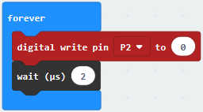

\*\*\*\*\*\*\*\*\*\*\*\*\*\*\*\*\*\*\*\*\*\*\*\*\*\*\*\*\*\*\*\*\*\*\*\*\*\*\*\*\*\*\*\*\*\*\*\*\*\*\*\*\*\*\*\*\*\*\*\*\*\*\*\*

(4)Copy code stringonce and drag it into“forever”block，set the code string as follows:

\*\*\*\*\*\*\*\*\*\*\*\*\*\*\*\*\*\*\*\*\*\*\*\*\*\*\*\*\*\*\*\*\*\*\*\*\*\*\*\*\*\*\*\*\*\*\*\*\*\*\*\*\*\*\*\*\*\*\*\*\*\*\*\*

(5）Duplicate“digital write pin P2 to 0”once and leave it below “wait (us) 10”block：

\*\*\*\*\*\*\*\*\*\*\*\*\*\*\*\*\*\*\*\*\*\*\*\*\*\*\*\*\*\*\*\*\*\*\*\*\*\*\*\*\*\*\*\*\*\*\*\*\*\*\*\*\*\*\*\*\*\*\*\*\*\*\*\*

(6)

1.  Enter ”Variables”→“Make a Variable...”→“New variable name：”

2.  Enter“distance” in the dialog box and click“OK”, then the variable“distance” is generated.
    
3.  Move block“set distance to 0”from“Variables”and keep it below “digital...P2..0”block, as shown below

\*\*\*\*\*\*\*\*\*\*\*\*\*\*\*\*\*\*\*\*\*\*\*\*\*\*\*\*\*\*\*\*\*\*\*\*\*\*\*\*\*\*\*\*\*\*\*\*\*\*\*\*\*\*\*\*\*\*\*\*\*\*\*\*

(7)

1.  Go to“Math”→ “square root 0”

2.  Place it into“0”box of “set distance to 0”block

3.  Click the triangle button to select“integer÷”.

(8) Enter“Advanced”→“Pins”→“more”→“pulse in (us) pin P0 pulsed high”. Place it into the left“0”of“integer÷”block

1. HC-SR04 ultrasonic sensor is attached to P1，so click the drop-down triangle button to set P1，

2. And change the right“0”of“integer÷”into 58.

   

\*\*\*\*\*\*\*\*\*\*\*\*\*\*\*\*\*\*\*\*\*\*\*\*\*\*\*\*\*\*\*\*\*\*\*\*\*\*\*\*\*\*\*\*\*\*\*\*\*\*\*\*\*\*\*\*\*\*\*\*\*\*\*\*

(9)

1.  Enter“Advanced”→“Serial”→“serial write value“x”=0”

2.  Put it into “forever” block

3.  Tap“Variables”→“distance”and keep it at the right box of “=”, and change “x” into“distance(cm)”
    
    

\*\*\*\*\*\*\*\*\*\*\*\*\*\*\*\*\*\*\*\*\*\*\*\*\*\*\*\*\*\*\*\*\*\*\*\*\*\*\*\*\*\*\*\*\*\*\*\*\*\*\*\*\*\*\*\*\*\*\*\*\*\*\*\*

(10) Click“Basic”to drag out“pause (ms) 100”, then leave it into “forever”block. And set to 50ms.

Complete Program：

|  | “on start”: command block runs  once to start program. Turn off LED dot matrix  The program under the block “forever”runs cyclically.   Set P2 to low level(0) Delay in 2ms  Set 2 to high level (1)  Delay in 10ms  Set P2 to low level(0) Set distance to pulse in(us)pin P1 high integer÷58 Serial write distance(cm) = distance  Delay in 50ms |
| ----------------------------------------------- | ------------------------------------------------------------ |
|                                                 |                                                 |

Click“JavaScript", you will view the corresponding JavaScript code:

Then click drop-down triangle button and select“Python”to see the Python language code:

**Code 2：**

Wire up through the connection diagram, HC-SR04 ultrasonic sensor is linked with P2 and P1. Link computer with Micro:bit board. Then enable the online programming tool to design the code.

**How to add the library file of ultrasonic sensor:**

Enter the Micro:bit online programming page then click”Variables”and“Extensions”

Input sonar to search, as shown below, click the library file to download and install automatically.

After installing the library file of ultrasonic sensor successfully and view the corresponding the module in the editing area.

(1)A. Click “Led”→“more”→“led enable false”,

B. Combine it with “on start”.

\*\*\*\*\*\*\*\*\*\*\*\*\*\*\*\*\*\*\*\*\*\*\*\*\*\*\*\*\*\*\*\*\*\*\*\*\*\*\*\*\*\*\*\*\*\*\*\*\*\*\*\*\*\*\*\*\*\*\*\*\*\*\*\*

(2)

1.  Click“Variables”→“Make a Variable...”→“New variable name：”.

2.  Input “distance”in the dialog box to click “OK”, then the variable “distance” is created.
    
3.  Go to“Variables”to move“set distance to 0”into“forever”block.

\*\*\*\*\*\*\*\*\*\*\*\*\*\*\*\*\*\*\*\*\*\*\*\*\*\*\*\*\*\*\*\*\*\*\*\*\*\*\*\*\*\*\*\*\*\*\*\*\*\*\*\*\*\*\*\*\*\*\*\*\*\*\*\*

(3)

1.  Click“Sonar”to find out“ping trig P0 echo P0 unit us”

  Put it into “0”box.

1.  HC-SR04 ultrasonic sensor is linked with P2 and P1, therefore set to trig P2 echo P1 then click triangle button to select“cm”

(4)

1.  Enter“Basic”→“pause (ms) 100”

2.  Put it into“forever”and set to 50ms.

\*\*\*\*\*\*\*\*\*\*\*\*\*\*\*\*\*\*\*\*\*\*\*\*\*\*\*\*\*\*\*\*\*\*\*\*\*\*\*\*\*\*\*\*\*\*\*\*\*\*\*\*\*\*\*\*\*\*\*\*\*\*\*\*

(5)

1.  Go to“Advanced”→“Serial”→“serial write value“x”=0”.

2.  Keep it into“forever”.

3.  Click“Variables”to drag“distance”into“0”box .

4.  Change“x”into“distance(cm)”.

Complete Program：

|  | “on start”: command block runs once to start program.  Turn off LED dot matrix   The program under the block “forever” runs cyclically.  Set distance to“ping trig P2 echo P1 unit cm”  Delay in 50ms  Serial write value “distance(cm)”=distance |
| ----------------------------------------------- | ------------------------------------------------------------ |
|                                                 |                                                 |

Click“JavaScript", you will view the corresponding JavaScript code:

Then click drop-down triangle button to select“Python”to see the Python language code:

Wire up through the connection diagram, upload code, power on and open CoolTerm, click Options to select SerialPort. Set COM port and baud rate is 115200(the baud rate of USB serial communication of Micro:bit is 115200 through the test). Click “OK” and“Connect”. The result is shown on serial monitor.

**Code 3：**

Hook up through the Wiring Graph. The pins of HC-SR04 ultrasonic sensor are linked with P2 and P1. The pins of OLED are connected to P20 and P19. Link computer with Micro:bit board. Then enable the online programming tool to design the code.

(1)A. Click“OLED”→“initialize OLED with width 128 height 64”

B. Place it into“on start”block.

\*\*\*\*\*\*\*\*\*\*\*\*\*\*\*\*\*\*\*\*\*\*\*\*\*\*\*\*\*\*\*\*\*\*\*\*\*\*\*\*\*\*\*\*\*\*\*\*\*\*\*\*\*\*\*\*\*\*\*\*\*\*\*\*

(2) 

A. Enter“Led”module→“more”→“led enable false”

B. Move“led enable false”below the block “initialize OLED with width 128 height 64”

\*\*\*\*\*\*\*\*\*\*\*\*\*\*\*\*\*\*\*\*\*\*\*\*\*\*\*\*\*\*\*\*\*\*\*\*\*\*\*\*\*\*\*\*\*\*\*\*\*\*\*\*\*\*\*\*\*\*\*\*\*\*\*\*

(3)

1.  Tap“OLED”→“clear OLED display”

2.  Drag it into“forever”block

(4)

1.  Click“Variables”→“Make a Variable...”→“New variable name：”

2.  Enter“distance”in the dialog box and click“OK”. Then the variable“distance”is created and move out“set distance to 0”
    
3.  Lay down it into“forever”block

\*\*\*\*\*\*\*\*\*\*\*\*\*\*\*\*\*\*\*\*\*\*\*\*\*\*\*\*\*\*\*\*\*\*\*\*\*\*\*\*\*\*\*\*\*\*\*\*\*\*\*\*\*\*\*\*\*\*\*\*\*\*\*\*

(5)

1.  Go to“Sonar”→“ping trig P0 echo P0 unit us”

2.  Put it down into“0”box

3.  HC-SR04 ultrasonic sensor is linked with P2 and P1, so set to “Ping trig P2 echo P1 unit cm”
    
4.  Change“us”into“cm”

(6)

1.  Click“OLED”→“show number 0”

2.  Put it into“forever”

3.  Tap“Variables”→“distance”, and place it into “0” box of “show number 0”

\*\*\*\*\*\*\*\*\*\*\*\*\*\*\*\*\*\*\*\*\*\*\*\*\*\*\*\*\*\*\*\*\*\*\*\*\*\*\*\*\*\*\*\*\*\*\*\*\*\*\*\*\*\*\*\*\*\*\*\*\*\*\*\*

(7)

1.  Enter“OLED”→“show string“ ””

2.  Place it into“forever”and input“cm”

(8)

1.  Click“Basic”→“pause (ms) 100”

2.  Put it into“forever”, set to 200ms

Complete Program：

|  | “on start”: command block runs once to start program.  Initialize OLED, 128 width and 64 in height  Turn off LED dot matrix   The program under the block “forever” runs cyclically.  Clear OLED screen  Set distance to“ping trig P2 echo P1 unit cm” OLED shows“distance value”  Display character string  Delay in 200ms |
| ----------------------------------------------- | ------------------------------------------------------------ |
|                                                 |                                                 |

Click“JavaScript", you will view the corresponding JavaScript code:

Then click drop-down triangle button and select“Python”to see the Python language code:

**6. Test Results：**

Wire up through the connection diagram, upload the program and plug in power. OLED shows the distance from obstacle detected by ultrasonic sensor.

### Project 48：Smart Home

1.  **Description：**

Smart home is the trend in the future. Imagine that you lie on the sofa and control everything with an ordinary cellphone. So 

incredible! The curtains can be switched automatically, the water temperature can turn into temperate mode when you’re ready 

for a cozy bath. Alternatively, you could obtain the distinct light scene in your home. I believe that you can’t wait to live life like this.

In this lesson, we simulate the smart home to make a DIY smart home kit with Arduino software. Follow us to enjoy the joy of DIY!

2.  **Components List:**

|          |              |         |  |
| -------------------------------- | ------------------------------------ | ------------------------------- | ------------------------ |
| Micro:bit *1                     | keyestudio Micro:bit T Type Shield*1 | S8050 Triode*1                  | 220ΩResistor*1           |
|          |              |         |  |
| Keyestudio OLED Display Module*1 | Keyestudio 1-channel Relay Module*1  | Keyestudio Micro Servo Motor *1 | 2.4KΩResistor*1          |
|          |              |         |  |
| DC motor*1                       | F-M dupont lines                     | 6 AA Battery Holder*1           | Photoresistor*1          |
|          |              |         |  |
| IR Receiver*1                    | IR remote Control*1                  | Fan *1                          | AA Battery Holder*6      |
|          |              |         |  |
| Red LED*1                        | PIR motion Sensor*1                  | Breadboard*1                    | Passive Buzzer*1         |
|          |              |         |  |
| 10KΩ Resistor*1                  | LM35DZ Temperature sensor*1          | 51ΩResistor*1                   | Breadboard wire          |
|          |              |                                 |                          |
| Micro USB cable*1                | Keyestudio Breadboard Power module*1 |                                 |                          |

3.  **Schematic Diagram：**

**(Special note: both ends of breadboard specialized power module must be inserted into breadboard, and dial the DIP switch to +3V on power module )**

4. **Wiring Graph：**

**(Special note: both ends of breadboard specialized power module must be inserted into breadboard, and dial the DIP switch to +3V on power module )**

5.  **Test Code：**

Hook up through the Wiring Graph, Link computer with Micro:bit board. Then enable the online programming tool to design the code.

We’ve added the library files of IR receiver and OLED module, refer to project 39 and 31.

(1)

1.  Click “Led”→“more”→“led enable false”

2.  Put it into“on start”

\*\*\*\*\*\*\*\*\*\*\*\*\*\*\*\*\*\*\*\*\*\*\*\*\*\*\*\*\*\*\*\*\*\*\*\*\*\*\*\*\*\*\*\*\*\*\*\*\*\*\*\*\*\*\*\*\*\*\*\*\*\*\*\*

(2)

1.  Enter“Advanced”→“Pins”→“servo write pin P0 to 180”

2.  Keep it into“forever”

3.  Servo motor is connected to P11, therefore, click the triangle button to select “P11(write only)”, change 180 into 0.

(3)

A. Click “OLED”and drag out“initialize OLED with width 128 height 64”

B. Lay down it into“on start”

\*\*\*\*\*\*\*\*\*\*\*\*\*\*\*\*\*\*\*\*\*\*\*\*\*\*\*\*\*\*\*\*\*\*\*\*\*\*\*\*\*\*\*\*\*\*\*\*\*\*\*\*\*\*\*\*\*\*\*\*\*\*\*\*

(4)

1.  Click “Variables”→“Make a Variable...”→“New variable name：”

2.  Input“open_door1”and click“OK”. Then variable“open_door1”is generated.

3.  Enter“Variables to drag“set open_door1 to 0”into“on start”block;

4.  Click“Logic”to drag“false”into“0”box of“set open_door1 to 0”.

\*\*\*\*\*\*\*\*\*\*\*\*\*\*\*\*\*\*\*\*\*\*\*\*\*\*\*\*\*\*\*\*\*\*\*\*\*\*\*\*\*\*\*\*\*\*\*\*\*\*\*\*\*\*\*\*\*\*\*\*\*\*\*\*

(5)

Click “IR Remote”→“connect IR receiver at P0”

Put it into“on start”

IR receiver is linked with P10, click the triangle button to select P10.

\*\*\*\*\*\*\*\*\*\*\*\*\*\*\*\*\*\*\*\*\*\*\*\*\*\*\*\*\*\*\*\*\*\*\*\*\*\*\*\*\*\*\*\*\*\*\*\*\*\*\*\*\*\*\*\*\*\*\*\*\*\*\*\*

(6)

A. Click“Variables”→“Make a Variable...”→“New variable name：”

Type“val”in the blank box and click“OK”, the variable “val”is created.

Drag“set val to 0”from“Variables”into“on start”

\*\*\*\*\*\*\*\*\*\*\*\*\*\*\*\*\*\*\*\*\*\*\*\*\*\*\*\*\*\*\*\*\*\*\*\*\*\*\*\*\*\*\*\*\*\*\*\*\*\*\*\*\*\*\*\*\*\*\*\*\*\*\*\*

(7)A. Copy“set val to 0”once and leave it into“forever”;

B. Go to“IR Remote”→“IR button”

C. Drag it into“0”box of“set val to 0”

\*\*\*\*\*\*\*\*\*\*\*\*\*\*\*\*\*\*\*\*\*\*\*\*\*\*\*\*\*\*\*\*\*\*\*\*\*\*\*\*\*\*\*\*\*\*\*\*\*\*\*\*\*\*\*\*\*\*\*\*\*\*\*\*

(8)

We generate the variable“light intensity”in same way.

1.  Click “Variables” to move “set light intensity to 0” into “forever” block.

2.  Go to“Advanced”→“Pins”→“analog read pin P0”

3.  Place it into“0”box

4.  The photoresistor is connected to P1, so click the triangle to set to P1.

\*\*\*\*\*\*\*\*\*\*\*\*\*\*\*\*\*\*\*\*\*\*\*\*\*\*\*\*\*\*\*\*\*\*\*\*\*\*\*\*\*\*\*\*\*\*\*\*\*\*\*\*\*\*\*\*\*\*\*\*\*\*\*\*

(9)

1.  Go to“Logic”→“if.true..then...else”

2.  Place it into“forever”block

3.  Drag“=”into“true”box.

\*\*\*\*\*\*\*\*\*\*\*\*\*\*\*\*\*\*\*\*\*\*\*\*\*\*\*\*\*\*\*\*\*\*\*\*\*\*\*\*\*\*\*\*\*\*\*\*\*\*\*\*\*\*\*\*\*\*\*\*\*\*\*\*

(10)

1.  Enter“Variables”→“light intensity”

2.  Move it to the left “0” box of “=”, click the triangle button to set“\>”. Change 0 into 800

\*\*\*\*\*\*\*\*\*\*\*\*\*\*\*\*\*\*\*\*\*\*\*\*\*\*\*\*\*\*\*\*\*\*\*\*\*\*\*\*\*\*\*\*\*\*\*\*\*\*\*\*\*\*\*\*\*\*\*\*\*\*\*\*

(11)

1.  Go to“Logic”→“if..true.then”

2.  Place it below the“if..\>800..then”block

3.  Drag“=”into “true” box

4.  Click“Variables”to get“val”and leave it to the left “0”box. Alter 0 into 70.

\*\*\*\*\*\*\*\*\*\*\*\*\*\*\*\*\*\*\*\*\*\*\*\*\*\*\*\*\*\*\*\*\*\*\*\*\*\*\*\*\*\*\*\*\*\*\*\*\*\*\*\*\*\*\*\*\*\*\*\*\*\*\*\*

(11)A. Click“Advanced”→“Pins”→“digital write pin P0 to 0”

B. Keep it beneath the“if val=70 then”block

C. Red LED is attached to P8, so click the triangle button to set P8, change 0 into 1.

(12)

A. Enter“Basic”→“pause (ms) 100”

B. Leave it beneath the“digital write P8 to 1”block, set to 5000ms

C. Duplicate“digital write P8 to 1”once and remain it below the “pause (ms) 5000”block, change 1 into 0

\*\*\*\*\*\*\*\*\*\*\*\*\*\*\*\*\*\*\*\*\*\*\*\*\*\*\*\*\*\*\*\*\*\*\*\*\*\*\*\*\*\*\*\*\*\*\*\*\*\*\*\*\*\*\*\*\*\*\*\*\*\*\*\*

(13) Copy“digital write pin P8 to 0”once and move it into“else” block

\*\*\*\*\*\*\*\*\*\*\*\*\*\*\*\*\*\*\*\*\*\*\*\*\*\*\*\*\*\*\*\*\*\*\*\*\*\*\*\*\*\*\*\*\*\*\*\*\*\*\*\*\*\*\*\*\*\*\*\*\*\*\*\*

(14)

1.  Then we produce the variable“temp”in same way.

2.  Click“Variables”to get“set temp to 0”and leave it into“forever”block.

3.  Click“Math”→“÷”block

4.  Move it“0”box of“set temp to 0”

5.  Tap“Math”→“\*”，and put it into the left“0”box of“÷”block

    

\*\*\*\*\*\*\*\*\*\*\*\*\*\*\*\*\*\*\*\*\*\*\*\*\*\*\*\*\*\*\*\*\*\*\*\*\*\*\*\*\*\*\*\*\*\*\*\*\*\*\*\*\*\*\*\*\*\*\*\*\*\*\*\*

(15)Tap“Advanced”→”Pins”→“analog read pin P0”

1.  Put it at the second “0” box

2.  LM35DZ sensor is connected P4, therefore click the triangle button to set P4.
    
3.  Change the first 0 into 300, the third 0 into 1023

\*\*\*\*\*\*\*\*\*\*\*\*\*\*\*\*\*\*\*\*\*\*\*\*\*\*\*\*\*\*\*\*\*\*\*\*\*\*\*\*\*\*\*\*\*\*\*\*\*\*\*\*\*\*\*\*\*\*\*\*\*\*\*\*

(16)

1.  Tap“OLED”→“clear OLED display”

2.  Place it into“forever” block

\*\*\*\*\*\*\*\*\*\*\*\*\*\*\*\*\*\*\*\*\*\*\*\*\*\*\*\*\*\*\*\*\*\*\*\*\*\*\*\*\*\*\*\*\*\*\*\*\*\*\*\*\*\*\*\*\*\*\*\*\*\*\*\*

(17)

1.  Click“OLED”→“show (without newline) string“ ””

2.  Move it into“forever”, and input “Temperature”character.

3.  Drag“show (without newline) number 0”into“forever”.

4.  Click“Variables”to get block“temp”

5.  Leave it into the 0 box of“show (without newline) number 0”

(18)

1.  Click“Basic”→“pause (ms) 100”

2.  Place it into“forever”and delay in 500ms.

3.  Tap“Logic”→“if..true....then...else”

4.  Move it into below“pause (ms) 500”and drag“=”block into“true”box.

\*\*\*\*\*\*\*\*\*\*\*\*\*\*\*\*\*\*\*\*\*\*\*\*\*\*\*\*\*\*\*\*\*\*\*\*\*\*\*\*\*\*\*\*\*\*\*\*\*\*\*\*\*\*\*\*\*\*\*\*\*\*\*\*

(19)

1.  Click“Variables”→“temp”

2.  Drag it into the left 0 of“=”block

3.  Click the triangle button to select“\>”and change 0 into 30

(20)

1.  Tap“Music”→“play tone Middle C for 1 beat”

2.  Place it below the block“if temp\>30 then”block

3.  Change“Middle C”into “High C”, set to 1/4 beat.

\*\*\*\*\*\*\*\*\*\*\*\*\*\*\*\*\*\*\*\*\*\*\*\*\*\*\*\*\*\*\*\*\*\*\*\*\*\*\*\*\*\*\*\*\*\*\*\*\*\*\*\*\*\*\*\*\*\*\*\*\*\*\*\*

(21)

1.  Copy code string once and alter 7 into 68, relay is linked with P6, so change P8 into P6.
    
2.  Replicate“pause (ms)5000”block once and leave it below “digital..P6..0”block

\*\*\*\*\*\*\*\*\*\*\*\*\*\*\*\*\*\*\*\*\*\*\*\*\*\*\*\*\*\*\*\*\*\*\*\*\*\*\*\*\*\*\*\*\*\*\*\*\*\*\*\*\*\*\*\*\*\*\*\*\*\*\*\*

(22) Copy“digital...P6 to 0”once and put into“else” block

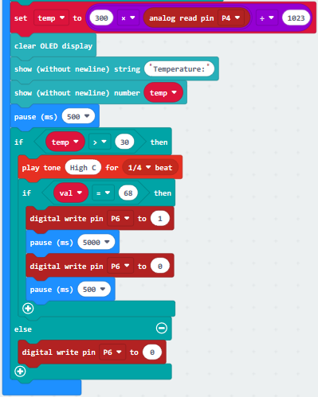

\*\*\*\*\*\*\*\*\*\*\*\*\*\*\*\*\*\*\*\*\*\*\*\*\*\*\*\*\*\*\*\*\*\*\*\*\*\*\*\*\*\*\*\*\*\*\*\*\*\*\*\*\*\*\*\*\*\*\*\*\*\*\*\*

(23)

1.  Click “Logic”→“if..true..then...else”

2.  Place it into“forever”and drag “=”into “true” box

\*\*\*\*\*\*\*\*\*\*\*\*\*\*\*\*\*\*\*\*\*\*\*\*\*\*\*\*\*\*\*\*\*\*\*\*\*\*\*\*\*\*\*\*\*\*\*\*\*\*\*\*\*\*\*\*\*\*\*\*\*\*\*\*

(24)

1.  Click“Advanced”→”Pins”→“digital read pin P0”

2.  Move it into the left“0”box

3.  PIR motion sensor is linked with P2, so click the triangle button to select P2, change 0 into 1.

\*\*\*\*\*\*\*\*\*\*\*\*\*\*\*\*\*\*\*\*\*\*\*\*\*\*\*\*\*\*\*\*\*\*\*\*\*\*\*\*\*\*\*\*\*\*\*\*\*\*\*\*\*\*\*\*\*\*\*\*\*\*\*\*

(25)A. Click“OLED”→“insert newline”

B. Duplicate 2 times and keep them below the“digital .. P2=1..then”

C. Then find out“show (without newline) string“ ””and move it below“insert newline”

D. Enter character“somebody”character.

\*\*\*\*\*\*\*\*\*\*\*\*\*\*\*\*\*\*\*\*\*\*\*\*\*\*\*\*\*\*\*\*\*\*\*\*\*\*\*\*\*\*\*\*\*\*\*\*\*\*\*\*\*\*\*\*\*\*\*\*\*\*\*\*

(26)

1.  Click“Logic”→“if.true..then”

2.  Keep it below the block“show(without newline)string “somebody”

3.  Enter“Variables”→“val”

4.  Leave it to the left “0”box and set to 67

\*\*\*\*\*\*\*\*\*\*\*\*\*\*\*\*\*\*\*\*\*\*\*\*\*\*\*\*\*\*\*\*\*\*\*\*\*\*\*\*\*\*\*\*\*\*\*\*\*\*\*\*\*\*\*\*\*\*\*\*\*\*\*\*

(27)

1.  Enter “Variables”→“set temp to 0”

2.  Lay down it below the“if val=67 then”and click the triangle button to set “open_door1”
    
3.  Enter“Logic”to get“true”block and move it into “0” box of “set open_door1 to 0”block.

\*\*\*\*\*\*\*\*\*\*\*\*\*\*\*\*\*\*\*\*\*\*\*\*\*\*\*\*\*\*\*\*\*\*\*\*\*\*\*\*\*\*\*\*\*\*\*\*\*\*\*\*\*\*\*\*\*\*\*\*\*\*\*\*

(28)

1.  Click “Logic”→”if...true..then”block

2.  Go to“Variables”to move “=”block into “true” box;

3.  Copy“open_door1”and“true”blocks once and respectively leave them at two sides of “=’

\*\*\*\*\*\*\*\*\*\*\*\*\*\*\*\*\*\*\*\*\*\*\*\*\*\*\*\*\*\*\*\*\*\*\*\*\*\*\*\*\*\*\*\*\*\*\*\*\*\*\*\*\*\*\*\*\*\*\*\*\*\*\*\*

(29)

1.  Enter“Advanced”→“Pins”→“servo write pin P0 to 180”

2.  Leave it below the block “if...open_door=...then”block;

3.  Servo motor is linked with P11, and click the drop-down triangle button to choose “P11(write only)”, then change 180 into 120.

\*\*\*\*\*\*\*\*\*\*\*\*\*\*\*\*\*\*\*\*\*\*\*\*\*\*\*\*\*\*\*\*\*\*\*\*\*\*\*\*\*\*\*\*\*\*\*\*\*\*\*\*\*\*\*\*\*\*\*\*\*\*\*\*

(30)

1.  Go to“Basic”to move block“pause (ms) 100”beneath the block“servo...120”

2.  Cop“set open to true”once and click the drop-down triangle button to set“false”
    
3.  Then keep“set open to true”beneath“pause (ms) 100”block.

\*\*\*\*\*\*\*\*\*\*\*\*\*\*\*\*\*\*\*\*\*\*\*\*\*\*\*\*\*\*\*\*\*\*\*\*\*\*\*\*\*\*\*\*\*\*\*\*\*\*\*\*\*\*\*\*\*\*\*\*\*\*\*\*

(31)

1.  Duplicate code stringand once
    
2.  Combine this two code strings together.

3.  Drag into“else”block，then alter“somebody”into“nobody”and 120 into 0

Complete Program：

|    | “on start”: command block runs once to start program.  Turn off LED dot matrix Rotate servo motor to 0° Initialize OLED, 128 in width, 64 in height Set open1 to false Connect IR receiver to P10 Set val to 0  The program under the block “forever” runs cyclically.  Set val to IR button Set light intensity to analog signal read by P1  When“light intensity>800”is met,  the next program will be executed  When val=70,  the next program will be executed  Set P8 to high level(1), light up red LED Delay in 5000ms Set P8 to low level(1), red LED goes off  When “light intensity>800”isn’t met,  the program under the “else” block will be executed  Set P8 to low level(1), red LED goes off Set temp to“300*integer read by P4÷1023 Clear OLED screen  OLED shows “Temperature:” OLED shows temperature Delay in 500ms  When“temp>30”is met,  the next program will be executed“High C”last for 1/4beat  When“val=68”is met,  the next program will be executed  Set P6 to high level(1), relay is connected Delay in 5000ms  Set P6 to low level(1), relay is disconnected Delay in 5000ms  When“temp>30”isn’t met,  the program under the “else” block will be executed  Set P6 to low level(1), relay is disconnected  When the level read by P2 is 1,  the next program will be executed.  OLED inserts newline OLED inserts newline OLED shows “somebody”  When“val=67” is met,  the next program will be executed.  Set open1 to true  When“open1=true”， the next program will be executed.  Rotate servo motor to 120° Delay in 100ms  Set open1 to false  When the level read by P2 isn’t equal to 1,  the program under the “else” block will be executed  OLED inserts newline OLED inserts newline OLED shows “nobody”  Rotate servo motor to 0° Delay in 100ms |
| ------------------------------------------------------------ | ------------------------------------------------------------ |
|                                                 |                                                 |

Click“JavaScript", you will view the corresponding JavaScript code:

Then click drop-down triangle button to select“Python”to see the Python language code:

6.  **Test Results：**

Wire up through the connection diagram, upload code, power on.

OLED display module will display the ambient temperature and if there is person around. When the light intensity is weak, and press on IR remote control，Red LED will be on.

When the temperature is greater than 30℃，passive Buzzer rings and press，relay drive motor rotates

When PIR motion sensor detects people around，OLED display module shows“somebody”, then press，servo motor rotates from 0° to 120°；on the contrary,“nobody”appears up，and servo motor rotates from120° to 0°.

## 7. Resources

1\. Keyestudio official website:

<http://www.keyestudio.com/>

2\. Download program code, CoolTerm and driver:

https://fs.keyestudio.com/KS4007-4008

3\. CoolTerm program:

<https://freeware.the-meiers.org/>

4.Micro:bit online programming:

[https://makecode.Micro:bit.org/](https://makecode.microbit.org/)

